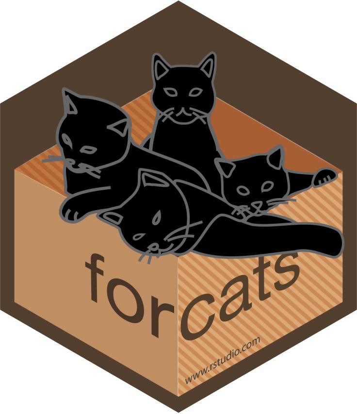

<style>
img.center {
    display: block;
    margin-left: auto;
    margin-right: auto;
}

img.float-left {
    float: left;
    margin: 20px;
}
</style>

```{r libraries, include=FALSE}
library(learnr)
library(gradethis)
library(digest)
```

```{r tidyverse-setup, include=FALSE}
library(tidyverse)
```

```{r setup, include=FALSE}
knitr::opts_chunk$set(paged.print = FALSE)
learnr::tutorial_options(
  exercise.timelimit = 15,
  exercise.checker = gradethis::grade_learnr,
  exercise.eval = FALSE
)
```

# Data Manipulation with dplyr

```{r, echo=FALSE, out.width="75%", out.extra="class='center'"}
knitr::include_graphics("images/data-science-explore.png")
```
<center>
Caption: Image from ["R for Data Science"](https://r4ds.had.co.nz/explore-intro.html)
</center>
<br>
A model of the data life cycle from the free online book ["R for Data Science"](https://r4ds.had.co.nz/explore-intro.html) is shown above. The whirlpool in the middle, besides making you dizzy I'm sure, is one of the most rewarding parts of the process - data exploration! There are some important take home points from the "Explore" portion of the diagram:
 
 (1) Data might require **transformation** before proper **visualization**.
 (2) It is best to visualize your data _before_ you do statistical analysis (also known as statistical modeling).
 (3) Rarely if ever will you complete this cycle only once.
 (4) Iterate towards perfection. In other words, don't worry about perfectly formatted publication quality graphs and results. Exploration should be full of fun and curiosity. Save the publication quality results for the "Communicate" step.

In this tutorial, we will introduce you to the tidyverse and start with the **Transform** part of the life cycle, exploring the tidyverse data manipulation (also known as *data wrangling*) package `dplyr`.

## Introduction to the Tidyverse

Now that you've gained some experience using base R techniques, we will take our first steps into the [tidyverse](https://www.tidyverse.org/) way of doing data science.

```{r, echo=FALSE, out.height="100px",  out.extra="class='float-left'"}
knitr::include_graphics("images/hex-tidyverse.png")
```

> "The <strong>tidyverse</strong> is an opinionated collection of R packages designed for data science. All packages share an underlying design philosophy, grammar, and data structures." <br> <span style="float:right;"> - tidyverse.org</span>

<div style="clear: both;"></div>

Let's load the `tidyverse` library and see what packages are included. 

```{r}
library(tidyverse)
```

You'll note that the `tidyverse` package (which is really just a set of packages plus additional helpful functions) is wordier than most packages - even on load! This is one of the philosophies of the tidyverse - more warnings, errors, and messages to help make your data science pipeline run more smoothly and keep you informed.

The core packages mentioned in the attachment message above are automatically loaded in your workspace with the `library(tidyverse)` command. On installation, the `tidyverse` package installs additional packages that are not auto-loaded into your workspace which you can load when needed (e.g. the `lubridate` package which helps with dates and times).

### Package Descriptions {.tabset}

Feel free to click on a tab to read the package descriptions. In this lab, we will get quick introductions to `tibble` and `readr`, with a more in-depth exploration of the `dplyr` package.

#### tibble

```{r, echo=FALSE, out.height="100px",  out.extra="class='float-left'"}
knitr::include_graphics("images/hex-tibble.png")
```

> "tibble is a modern re-imagining of the data frame, keeping what time has proven to be effective, and throwing out what it has not. Tibbles are data.frames that are lazy and surly: they do less and complain more, forcing you to confront problems earlier, typically leading to cleaner, more expressive code." <br> <span style="float:right;"> - tidyverse.org</span>
<div style="clear: both;"></div>

#### readr

```{r, echo=FALSE, out.height="100px",  out.extra="class='float-left'"}
knitr::include_graphics("images/hex-readr.png")
```

> "readr provides a fast and friendly way to read rectangular data (like csv, tsv, and fwf). It is designed to flexibly parse many types of data found in the wild, while still cleanly failing when data unexpectedly changes." <br> <span style="float:right;"> - tidyverse.org</span>
<div style="clear: both;"></div>

#### dplyr

```{r, echo=FALSE, out.height="100px",  out.extra="class='float-left'"}
knitr::include_graphics("images/hex-dplyr.png")
```

> "dplyr provides a grammar of data manipulation, providing a consistent set of verbs that solve the most common data manipulation challenges." <br> <span style="float:right;"> - tidyverse.org</span>
<div style="clear: both;"></div>

#### tidyr

```{r, echo=FALSE, out.height="100px",  out.extra="class='float-left'"}
knitr::include_graphics("images/hex-tidyr.png")
```

> "tidyr provides a set of functions that help you get to tidy data. Tidy data is data with a consistent form: in brief, every variable goes in a column, and every column is a variable." <br> <span style="float:right;"> - tidyverse.org</span>
<div style="clear: both;"></div>

#### ggplot2

```{r, echo=FALSE, out.height="100px",  out.extra="class='float-left'"}
knitr::include_graphics("images/hex-ggplot2.png")
```

> "ggplot2 is a system for declaratively creating graphics, based on The Grammar of Graphics. You provide the data, tell ggplot2 how to map variables to aesthetics, what graphical primitives to use, and it takes care of the details." <br> <span style="float:right;"> - tidyverse.org</span>
<div style="clear: both;"></div>

#### purrr

```{r, echo=FALSE, out.height="100px",  out.extra="class='float-left'"}
knitr::include_graphics("images/hex-purrr.png")
```

> "purrr enhances R’s functional programming (FP) toolkit by providing a complete and consistent set of tools for working with functions and vectors. Once you master the basic concepts, purrr allows you to replace many for loops with code that is easier to write and more expressive." <br> <span style="float:right;"> - tidyverse.org</span>
<div style="clear: both;"></div>

#### stringr

```{r, echo=FALSE, out.height="100px",  out.extra="class='float-left'"}
knitr::include_graphics("images/hex-stringr.png")
```

> "stringr provides a cohesive set of functions designed to make working with strings as easy as possible. It is built on top of stringi, which uses the ICU C library to provide fast, correct implementations of common string manipulations." <br> <span style="float:right;"> - tidyverse.org</span>
<div style="clear: both;"></div>

#### forcats

```{r, echo=FALSE, out.height="100px",  out.extra="class='float-left'"}

```

> "forcats provides a suite of useful tools that solve common problems with factors. R uses factors to handle categorical variables, variables that have a fixed and known set of possible values." <br> <span style="float:right;"> - tidyverse.org</span>
<div style="clear: both;"></div>

### Tibble: A modern re-imagining of the data frame

This tutorial will focus mainly on the package `dplyr` which is dedicated to **data manipulation**. Before we get there, however, we need to introduce one of the building blocks of the tidyverse: the `tibble`.

As mentioned in the `tibble` tab above, `tibble`s are updated versions of the data frame in R. The most important differences between tibbles and data frames are:

 - **Printing**: Printing a `tibble` combines some perks of the `head` command and the `str` command.
 - **Subsetting**: Tibbles are more opinionated when subsetting. In particular, tibbles do NOT do _partial matching_ (which we'll explain later).
 - **Variable naming**: On creation, tibbles will NOT change your requested variable names. Data frames, by default, may change them based on whether they are _syntactically valid variable names_.

### Tibble: Printing

Tibbles will by default show the first 10 rows of data, and will also include the data type for each column. Additional columns that don't fit on screen will be listed at the bottom (albeit without glimpses into the data).

#### Exercise: Show me the data!
*Using the built-in* `iris` *dataset, check the data type by using the* `class` *function, and then use the* `print` *function to print the object.* 
```{r show-data-ex-1, exercise=TRUE, paged.print=FALSE}

```

```{r show-data-ex-1-solution}
class(iris)
print(iris)
```

```{r show-data-ex-1-check}
gradethis::grade_code()
```

Notice that it prints ALL the data, which can become a problem with very large datasets.

#### Exercise: Too much data!
*Now use the* `head` *command to limit the number of rows printed to 10, and the* `str` *command to show the data types of the variables.*
```{r show-data-ex-2, exercise=TRUE, paged.print=FALSE}

```

```{r show-data-ex-2-solution}
head(iris, 10)
str(iris)
```

```{r show-data-ex-2-check}
gradethis::grade_code()
```

The command `as_tibble` will convert a data frame to a tibble. Run the following command to see how a tibble version of the `iris` dataset gets printed.
```{r show-data-ex-3, exercise=TRUE, paged.print=FALSE, exercise.setup="tidyverse-setup"}
as_tibble(iris)
```

As you can see, the printed output includes both a truncated view (like given by the `head` command) and additional information that the `str` function gives, including number of rows and columns, as well as data types of all columns.

If you want to use the resulting tibble in future code, you will need to store the result of `as_tibble`, either overwriting the `iris` variable or creating a new one, such as:
```{r paged.print=FALSE}
iris_tibble <- as_tibble(iris)
iris_tibble
```
Remember that naming your variables informative names is very important!

```{r question, echo=FALSE}
question(
  sprintf("What data type is the Species variable?"),
  answer("Double"),
  answer("Factor", correct=TRUE),
  answer("String")
)
```

### Tibble: Subsetting

We haven't explored this before with data frames, but data frames will use _partial matching_ when accessing a variable using the subsetting operator `$`. To see this, remember the variables in the `iris` dataset.
```{r}
names(iris)
```

Run the following code and see what happens.
```{r partial-matching, exercise=TRUE}
iris$Sp
```

Huh, so it looks like R will assume you are wanting the `Species` variable by matching (partially) the letters from left-to-right. The problem here is that it is doing it automatically _without even a warning_, which can be problematic if you have a complicated script and this is NOT what you intended it to do. Try the code above with other partial matches and see what happens.

Tibbles DO NOT have partial matching, as can be seen below.
```{r no-partial-matching}
iris_tibble$Sp
```

Finally, tibbles inherit all of the data frame properties of the other subsetting operators `[...]` and `[[...]]`.

### Tibble: Variable naming

As mentioned above, data frames, by default, may change your requested variable names if they are not syntactically valid.  A _syntactically valid_ name consists of letters, numbers and the dot or underline characters and starts with a letter or the dot not followed by a number. Good luck remembering that one! Run the following code to see what happens to our requested variable names.

```{r syntactical-ex-1, exercise=TRUE, paged.print=FALSE}
data.frame('height (m)' = c(3, 2), 
           '2nd largest branch width (cm)' = c(15, 20))
```

It looks like data frames replace spaces and parentheses with '.', and we aren't allowed to start a name with a number, so it adds an 'X' at the front.

#### Exercise: Make it a tibble
*Create the same data frame above, but this time as a* `tibble`*. You create a tibble the same way you create a data frame: just replace the command* `data.frame` *with the command* `tibble`.

```{r syntactical-ex-2, exercise=TRUE, paged.print=FALSE, exercise.setup="tidyverse-setup"}

```

```{r syntactical-ex-2-solution}
tibble('height (m)' = c(3, 2), 
       '2nd largest branch width (cm)' = c(15, 20))
```

```{r syntactical-ex-2-check}
gradethis::grade_code("Notice that the tibble keeps the variable names exactly as they were inputed.")
```

This behavior follows the tidyverse philosophy of making minimal unnecessary changes or assumptions. There is one important caveat, though: in order to access variable names that are syntactically invalid (such as these) with the `$` subsetting operator, you must surround the variable names with \`\` (_backticks_), '' (_single quotes_), or "" (_double quotes_), which you can already see in the names of the variables in the tibble declaration above (default is to use ``).

#### Exercise: Tibble me this
*Access the* `height (m)` *variable using the* `$` *operator by surrounding the name with* \`\` *. The tibble is stored in your workspace under the name* `tree_tbl` *.*

```{r syntactical-ex-3-setup, echo=FALSE}
library(tidyverse)
tree_tbl <- tibble('height (m)' = c(3, 2), 
                   '2nd largest branch width (cm)' = c(15, 20))
```

```{r syntactical-ex-3, exercise=TRUE, exercise.setup="syntactical-ex-3-setup"}

```

```{r syntactical-ex-3-solution}
tree_tbl$`height (m)`
```

```{r syntactical-ex-3-check}
gradethis::grade_code()
```

Note that you can also extract a variable from a tibble using the `[[...]]` operator as well - just keep in mind this always requires a string for the variable name.

#### Exercise: Tibble me that
*Access the same variable* `height (m)`*, but this time using the* `[[...]]` *subsetting operator.*

```{r syntactical-ex-4, exercise=TRUE, exercise.setup="syntactical-ex-3-setup"}

```

```{r syntactical-ex-4-solution}
tree_tbl[["height (m)"]]
```

```{r syntactical-ex-4-check}
gradethis::grade_code("Let's move on to the next chapter to get to know the dataset we'll be using to learn about data manipulation.")
```

## Getting to know the data

<div style="display: flex;">
<div style="flex: 1 0 50%;">
```{r, echo=FALSE, out.width="100%", out.extra="style='display:inline-block'"}

```
<br>Caption: Monarch butterfly on swamp milkweed.<br>JIM HUDGINS / USFWS MIDWEST REGION
</div>
<div style="flex: 1 0 50%;">
```{r, echo=FALSE, out.width="100%", out.extra="style='display:inline-block'"}

```
<br>Caption: Study sites across Virginia for milkweed trait measurements (Mary Seward, W&M)
</div>
</div>

The milkweed plant is the sole food source for the monarch butterfly. Milkweed is a long-lived perennial plant that can reproduce sexually and clonally through adventitious root sprouting. Though the belowground root system is perennial, the aboveground ramet population dies back annually. The plot on the right shows sites across Virginia where Professor Dalgleish's lab collected multiple measurements on milkweed over a five year period from 2013-2017. We will use this data over the remainder of this tutorial.

The following describes a subset of the variables in the data that we will explore in this tutorial:

 - `year`: Year at which the data was collected.
 - `site`: Unique site key denoting where in Virginia the data was collected, including Blandy Experimental Farm (**BLD1**, **BLD2**), Sky Meadows State Park (**SKY**), Presquile Wildlife Refuge (**PWR**), and Yorktown Battlefield Park (**YTB**).
 - `transect`: Each site had a varying number of transects that were 1 m wide, with variable lengths depending on the size of the milkweed patch.
 - `plantID`: Unique plant ID.
 - `h_apical`: Stem height to the apical meristem (cm), measured in June.
 - `h_apical.next`: Stem height to the apical meristem (cm), measured in September.
 - `herb_avg`: Herbivory severity score on a modified Daubenmire scale of 0–6 according to percent tissue removed (0 = intact, 1 = 1–5% removed, 2 = 6–24% removed, 3 = 25–50% removed, 4 = 51–75% removed, 5 = 76– 99% removed, 6 = only the petiole remains).
 
The remaining variables will be explored in future tutorials.

### Importing CSV files the tidy way

We'll do one more stop at the **import** part of the life cycle before venturing to the **transform** process. By now, you have been introduced to the base R `read.csv` command for loading CSV files. Recall that CSV stands for *comma separated values*, which is a plain text file where all values in your data are separated by, well, commas. The tidyverse has a function in the `readr` package called `read_csv` that behaves very similarly to `read.csv`, albeit with added juicy bits incorporating aspects of the tidyverse philosophy. In particular:

 (1) `read_csv` creates a *tibble* rather than a *data frame*.
 (2) `read_csv` will NOT convert strings to factors. Prior to R 4.0, `read.csv` converted all strings to factors by default ([for the curious souls wanting to learn why this is important](https://developer.r-project.org/Blog/public/2020/02/16/stringsasfactors/)).
 (3) `read_csv` will NOT change your column/variable names. Similar to data frame vs tibble creation, `read.csv` doesn't like syntactically invalid names and would modify them accordingly (without warning!) which can cause confusion.
 (4) Speaking of warnings, `read_csv` is usefully verbose and will tell you when modifications to your data have been made by importing.

Run the following `read_csv` command, which will load the milkweed data.

```{r load-stemdata-setup}
library(tidyverse)
stemdata <- read_csv("https://qubeshub.org/community/groups/introbiostats/File:/uploads/stemdata.csv")
```

```{r load-stemdata, exercise=TRUE, paged.print=FALSE, exercise.setup="tidyverse-setup"}
stemdata <- read_csv("https://qubeshub.org/community/groups/introbiostats/File:/uploads/stemdata.csv")
```

Look at all that helpful information! Without even printing the tibble, we immediately know 

 (1) there was a missing column name which it named 'X1', 
 (2) the data types it assigned/guessed from reading in the file (along with variable names), and 
 (3) there were some problems in reading in the file, with a ton of useful information (we'll get back to this at the end of this tutorial).

```{r which-line-qu, echo=FALSE}
question(
  sprintf("Which line in the file did the first parsing failure occur?"),
  answer("1"),
  answer("612"),
  answer("1176", correct=TRUE),
  answer("1195")
)
```

Let's take a closer look at the tibble to get more information:

```{r closer-look, exercise=TRUE, exercise.setup="load-stemdata-setup", paged.print=FALSE}
stemdata
```

```{r how-many-rows, echo=FALSE}
question(
  sprintf("How many observations (rows) does this dataset have?"),
  answer("10"),
  answer("15"),
  answer("5013"),
  answer("5023", correct=TRUE)
)
```

```{r how-many-columns, echo=FALSE}
question(
  sprintf("How many variables does this dataset have?"),
  answer("8"),
  answer("15", correct=TRUE)
)
```

## Data Manipulation with dplyr

The most important data manipulation operations are handled by the following five _verbs_ (functions) of the `dplyr` package (see [R for Data Science](https://r4ds.had.co.nz/transform.html#dplyr-basics)):

 - `filter()`: Pick observations (rows) by their values.
 - `arrange()`: Reorder the observations.
 - `select()`: Pick variables (columns) by their names.
 - `mutate()`: Create new variables with functions of existing variables.
 - `summarise()`: Collapse many values down to a single summary.

An additional action that can be used in conjunction with these functions is `group_by()`, which will change the scope of the five actions from all of the data to groups (or levels) of a categorical variable.

There is quite a lot more that `dplyr` can do. Click on the link below to access a data manipulation cheatsheet.

<a href="https://github.com/rstudio/cheatsheets/raw/master/data-transformation.pdf">
```{r, echo=FALSE, out.width="50%", out.extra="class='center'"}
knitr::include_graphics("images/data-transformation.png")
```
</a>
<center>
[R Data Manipulation Cheatsheet](https://github.com/rstudio/cheatsheets/raw/master/data-transformation.pdf)
</center>

All of these functions have the following similarities:

 (1) The first argument is a data frame or tibble.
 (2) The result is a new tibble.
 (3) The subsequent arguments describe what to do with the data frame/tibble, using the variable names (**without quotes**).

The first two properties are so that the functions behave well with the pipe operator `%>%`, allowing us to chain these functions together to make the workflow easily readable. Remember that the pipe operator by default assigns the output of the left-hand side to the first argument of the function on the right-hand side. See Chapter 3: Functions of the [Intermediate R Tutorial](https://mdllama.shinyapps.io/Intermediate_R_Part_2) for an introduction to the pipe operator. For now, let's have a quick refresher.

#### Exercise: Remember the pipe!
*Use the pipe operator* `%>%` *as an alternative way to evaluate the function* `subtract_from(4, 5)`*.*

```{r remember-pipe-setup}
subtract_from <- function(a, b) {
  return(b - a)
}
subtract_from(4, 5)
```

```{r remember-pipe-ex-1, exercise=TRUE, exercise.setup="tidyverse-setup"}
subtract_from <- function(a, b) {
  return(b - a)
}
# Insert pipe version of `subtract_from(4,5)` here
```

```{r remember-pipe-ex-1-solution}
subtract_from <- function(a, b) {
  return(b - a)
}
4 %>% subtract_from(5)
```

```{r remember-pipe-ex-1-check}
gradethis::grade_code()
```

### dplyr: filter()

```{r chunk-change, echo=FALSE}
knitr::opts_chunk$set(paged.print = TRUE)
```

The first action that we explore is the `filter()` command. When we _filter_ our data, we are subsetting our observations (or rows) based on one or multiple conditions on the variables. This is analogous to subsetting data frames via the `[condition, ]` operator in base R. For example, if we wanted to subset the data so that it only included measurements from 2015, we could do

```{r base-R-subsetting-setup, echo=FALSE, message=FALSE, warning=FALSE}
stemdata <- read_csv("https://qubeshub.org/community/groups/introbiostats/File:/uploads/stemdata.csv")
```

```{r base-R-subsetting}
stemdata[stemdata$year == 2015,]
```

_Note: We've switched the output of a tibble to display in the browser using "pagination", i.e. show more of the data (up to 1000 rows), so that you may explore the result and make sure the filtering worked._ 

To do the equivalent in `dplyr`, we use the verb `filter()`, which has the following form:

```{r, eval=FALSE}
filter(mydata, condition)

# or with the pipe

mydata %>%
  filter(condition)
```

Here's the same example as above using the `filter()` function:

```{r filter-ex}
stemdata %>%
  filter(year == "2015")
```

#### Exercise: Filter one site
*Use the* `filter()` *function to filter the data to only those measurements from the site "BLD1".*

```{r filter-site-ex-1, exercise=TRUE, exercise.setup="load-stemdata-setup"}

```

```{r filter-site-ex-1-solution}
stemdata %>%
  filter(site == "BLD1")
```

```{r filter-site-ex-1-check}
gradethis::grade_code()
```

It is likely that we will need to filter on more than one condition. You can combine conditionals in any way you like using the logical operators that we've explored previously: `|` (OR), `&` (AND), and `!` (NOT). The conditionals themselves will most likely utilize the comparison operators discussed previously: `<`, `>`, `<=`, `>=`, `==`, and `!=`.

One special case of combining conditionals that you might see is when using the AND operator. Note that the following forms are equivalent:
```{r equiv-cond, eval=FALSE}
filter(mydata, condition1 & condition2 & ...)

# is equivalent to

filter(mydata, condition1, condition2, ...)
```

As an example, suppose we wanted all observations that were measured at Yorktown Battlefield Park (YTB) in the year 2016.
```{r ytb-2016}
stemdata %>%
  filter(site == "YTB" & year == 2016)
```
This is equivalent to:
```{r ytb-2016-2}
stemdata %>%
  filter(site == "YTB", year == 2016)
```

#### Exercise: Filter more than one site
_Filter the data for only measurements from both Blandy Experimental Farm sites (BLD1 or BLD2)._

```{r filter-site-ex-2, exercise=TRUE, exercise.setup="load-stemdata-setup"}

```

```{r filter-site-ex-2-solution}
stemdata %>%
  filter(site == "BLD1" | site == "BLD2")
```

```{r filter-site-ex-2-check}
gradethis::grade_code()
```

With OR operators, another convenient way to perform the same operation is to utilize the `%in%` operator. This will cut down on the amount of typing, as the previous technique will have you repeating the variable for every additional condition in the OR operation. As an example, suppose we wanted all measurements from Sky Meadows State Park (SKY) for the years 2015-2017.
```{r sky-obs}
stemdata %>%
  filter(site == "SKY", year %in% c(2015:2017))
```
#### Exercise: Filter more than one site (using `%in%`)
*Filter the data for only measurements from both Blandy Experimental Farm sites (BLD1 or BLD2), but this time using the* `%in%` *operator.*

```{r fiter-site-ex-3, exercise=TRUE, exercise.setup="load-stemdata-setup"}

```

```{r fiter-site-ex-3-solution}
stemdata %>%
  filter(site %in% c("BLD1", "BLD2"))
```

```{r fiter-site-ex-3-check}
gradethis::grade_code()
```

#### Exercise: Filter site and year
*Filter the data for only measurements from Presquile Wildlife Refuge (PWR) in the year 2017.*

```{r filter-ex-4, exercise=TRUE, exercise.setup="load-stemdata-setup"}

```

```{r filter-ex-4-solution}
stemdata %>%
  filter(site == "PWR" & year == 2017)
```

```{r filter-ex-4-check}
gradethis::grade_code()
```

Before heading over to the next section on ordering your data, we'll leave with two very important thoughts:

**First**:<br>
Missing values (NA) may cause an observation to be unintentionally left out of a filter. If you want to include observations with NAs in the filter condition of interest, make sure to explicitly ask for them using something like `is.na()`.

**Second**:<br>
Here's one from the "R for Data Science" bible:

> "Whenever you start using complicated, multipart expressions in `filter()`, consider making them explicit variables instead. That makes it much easier to check your work. You’ll learn how to create new variables shortly." <br> <span style="float:right;"> - [R for Data Science](https://r4ds.had.co.nz/)</span>

### dplyr: arrange()

The `arrange()` action reorders the observations based on one or more variables in either ascending (the default) or descending order. Just like `filter()`, you can specify more than one variable. In this case, the next specified variable will be used to signify the ordering when the previous variable has ties. This behavior is called the *dictionary ordering*, which is an archaic pre-internet expression based on when people had to search for words manually through a paper copy of the dictionary (*the horror!*) Just kidding, I'm sure alphabetical ordering is understood by all...  I hope (I feel old all of a sudden).

As an example, let's order our observations by apical height (_h_apical_).
```{r arrange-transect, paged.print=TRUE}
stemdata %>%
  arrange(h_apical)
```
#### Exercise: Arrange by year (ascending)
*Arrange the observations in ascending order by year.*

```{r arrange-ex-1, exercise=TRUE, exercise.setup="load-stemdata-setup"}

```

```{r arrange-ex-1-solution}
stemdata %>%
  arrange(year)
```

```{r arrange-ex-1-check}
gradethis::grade_code()
```

If you would like descending order instead, just wrap the variable of interest in the `desc()` function. For example, to get a descending order on apical height, we do the following.
```{r desc-transect}
stemdata %>%
  arrange(desc(h_apical))
```

#### Exercise: Arrange by year (descending)
*Reorder the observations by year in descending order.*

```{r arrange-ex-2, exercise=TRUE, exercise.setup="load-stemdata-setup"}

```

```{r arrange-ex-2-solution}
stemdata %>%
  arrange(desc(year))
```

```{r arrange-ex-2-check}
gradethis::grade_code()
```

In two of the previous examples, we reordered the observations by apical height, in both ascending and descending order. One problem with this is it mixes up the results by year. As we know, environmental conditions can vary from year to year, which might effect the growth of milkweed. In this case, it might be best to first order by year (say descending if we have more interest in recent years), and then order by apical height (descending as well if we are interested in larger plants). Here's an example of how to do just that.
```{r order-year-apical}
stemdata %>%
  arrange(desc(year), desc(h_apical))
```

Each additional ordering variable can be given as an additional argument. Many of these variables are nested in nature, which lend themselves perfectly to ordering via multiple variables. For example, we could order first by year, then site, then transect, and finally apical height. That way we can get local ordering information at the transect level (the finest spatial/time resolution). Well, I guess the individual plant is the finest resolution, but ordering on one plant is no fun.

#### Exercise: Nested orderings
*Perform the previously mentioned nested ordering: first by* `year` *(descending), then by* `site` *(ascending, i.e. alphabetical), then by* `transect` *(ascending), then by* `h_apical` *(descending).*

```{r arrange-ex-3, exercise=TRUE, exercise.setup="load-stemdata-setup"}

```

```{r arrange-ex-3-solution}
stemdata %>%
  arrange(desc(year), site, transect, desc(h_apical))
```

```{r arrange-ex-3-check}
gradethis::grade_code("Make sure you explore the data to see the effects of your ordering!")
```

Okay, well this is all well and good, but arranging 5,000+ plants (well, 1,000 - your browser is limiting the results to conserve memory) in a particular order isn't too helpful. How about we focus our attention on a specific site and then order the result. Time to combine two verbs into one data pipeline! Get excited!!

#### Exercise: Two verbs are better than one
*First, filter the data to only include measurements from BLD1, and then pipe the result into the* `arrange()` *function, ordering first by descending year and then by descending apical height.*

```{r arrange-ex-5, exercise=TRUE, exercise.setup="load-stemdata-setup"}

```

```{r arrange-ex-5-solution}
stemdata %>%
  filter(site == "BLD1") %>%
  arrange(desc(year), desc(h_apical))
```

```{r arrange-ex-5-check}
gradethis::grade_code("You've just created your first dplyr data pipeline! Go celebrate - but not for too long. There's more work to do in the next section.")
```

### dplyr: select()

```{r knitr-opts-2, echo=FALSE}
knitr::opts_chunk$set(paged.print = FALSE)
```

There are some applications in biology where one can get hundreds or even thousands of variables in a dataset. Wouldn't it be nice to focus our attention on a much smaller number by choosing the variables we want to work with? That's where the `select()` function comes into play. Here are some examples showing some common uses.

| Use case | Syntax |
|--------------------------------------------|-------------------------------------|
| **Select by explicit naming**              | `select(var1, var2, ...)` |
| **Use helper functions to match variable names** | `select(helper(<string>))` |
| **Select all variables between var1 and var2** | `select(var1:var2)` |
| **Unselect by explicit naming (with `-`)** | `select(-var1, -var2, ...)` |

Let's look at each one individually. First, we'll look at selecting via explicit naming.
```{r select-one}
stemdata %>%
  select(plantID, herb_avg)
```

#### Exercise: Select h_apical and h_apical.next
*Select the variables* `h_apical` *and* `h_apical.next`*.*

```{r select-ex-1, exercise=TRUE, exercise.setup="load-stemdata-setup"}

```

```{r select-ex-1-solution}
stemdata %>%
  select(h_apical, h_apical.next)
```

```{r select-ex-1-check}
gradethis::grade_code()
```

There are many helper functions to assist you in finding variables to select based on different conditions. Here are a few useful ones (see the [dplyr cheatsheet](https://github.com/rstudio/cheatsheets/raw/master/data-transformation.pdf) for more examples):

| Helper function | What it does |
| --------------- | ------------ |
| `starts_with("abc")` | Matches variables that begin with "abc" |
| `ends_with("abc")` | Matches names that begin with "abc" |
| `contains("ijk")` | Matches names that contain "ijk" |

```{r select-helper}
stemdata %>%
  select(starts_with("h_apical"))
```

#### Exercise: Select again using contains
*Perform the same selection as the previous example (i.e. select* `h_apical` *and* `h_apical.next`*), but this time use the helper function* `contains()`*.*

```{r select-ex-2, exercise=TRUE, exercise.setup="load-stemdata-setup"}

```

```{r select-ex-2-solution}
stemdata %>%
  select(contains("h_apical"))
```

```{r select-ex-2-check}
gradethis::grade_code("Notice that many different versions will work here, for example `contains('h_apical')`, or `contains('apical')`.")
```

#### Exercise: Add year, site, transect, and plantID
*Starting with the* `select` *command below, add the variables* `year`, `site`, `transect`, *and* `plantID` *so they appear in the output tibble before the* `h_apical` *variables.*

```{r select-ex-3, exercise=TRUE, exercise.setup="load-stemdata-setup"}
stemdata %>%
  select(contains("h_apical"))
```

```{r select-ex-3-solution}
stemdata %>%
  select(year, site, transect, plantID, contains("h_apical"))
```

```{r select-ex-3-check}
gradethis::grade_code()
```

If you are selecting a set of variables that are contiguous in the data frame, you can embrace your laziness (er, um, efficiency) by using the **range operator** `:`.

```{r select-range}
stemdata %>%
  select(h_apical:stem_width)
```

#### Exercise: Again but more lazy
*Select all variables from* `year` *to* `h_apical.next`.
```{r select-ex-4, exercise=TRUE, exercise.setup="load-stemdata-setup"}

```

```{r select-ex-4-solution}
stemdata %>%
  select(year:h_apical.next)
```

```{r select-ex-4-check}
gradethis::grade_code()
```

Rather than starting with no variables and selecting them one at a time, sometimes you want to start with all variables and remove them one at a time. You can _unselect_ variables by adding a minus sign in front of the variable names that you want to unselect.

```{r unselect}
stemdata %>%
  select(-h_apical, -h_apical.next)
```

Remember WAY back when we loaded the data using the `read_csv` command and it warned us that there were parsing errors? Let's load it again to refresh your memory.
```{r reload-data}
stemdata <- read_csv("https://qubeshub.org/community/groups/introbiostats/File:/uploads/stemdata.csv")
```

As instructed, we can get more information on the problems that occurred in parsing by running the following command:
```{r parsing-problems, parsed.print=FALSE}
stemdata_issues <- problems(stemdata)
stemdata_issues
```

Oh, cool, so it looks like it returns a tibble with all of the problem rows and columns. Rather than facing our problems head on, let's put our head in the sands and just remove the one problem variable we can see: `per.leaves.dam`.

#### Exercise: Remove problematic variable
_Select every variable **except**_ `per.leaves.dam`.
```{r select-ex-5, exercise=TRUE, exercise.setup="load-stemdata-setup", paged.print=FALSE}

```

```{r select-ex-5-solution}
stemdata %>%
  select(-per.leaves.dam)
```

```{r select-ex-5-check}
gradethis::grade_code("Did it work? Look at the output to make sure the variable was removed!")
```

There's one more trick where `select()` can be useful: putting a favorite variable (or set of variables) at the front of a data frame. There is a helper function called `everything()` that will refer to all variables that were not previously referenced in the current select context.

For example, let's put herbivory average `herb_avg` at the front of the data.
```{r select-reorder}
stemdata %>%
  select(herb_avg, everything())
```

#### Exercise: A little housekeeping
*Perform the following on the data.*

* *Unselect the* `X` *and* `X1` *variables*.
* *Move* `plantID` *to the front of the data frame. Make sure you use the* `everything()` *helper function*.

```{r select-move-ex-1, exercise=TRUE, exercise.setup="load-stemdata-setup"}

```

```{r select-move-ex-1-solution}
stemdata %>%
  select(plantID, everything(), -starts_with("X"))
```

```{r select-move-ex-1-check}
gradethis::grade_code()
```

You may have performed the previous step differently than the solution. Notice that the solution combines the *unselect* operator `-` with a helper function, which may not have been obvious would work at first glance. Also note: it appears that `select()` performs the selection operations from left to right. While the solution works, this does not:
```{r select-move-incorrect}
stemdata %>%
  select(plantID, -starts_with("X"), everything())
```
The `select()` command uses the first argument to decide whether to start with no variables and add or all variables and subtract. If the first argument has the minus sign, it starts with all variables (like having an invisible `everything()` in the front); if the first argument does not have a minus sign, it starts with no variables. Thus, the select command `select(plantID, -starts_with("X"), everything())` starts with no variables and adds `plantID`. The second argument `-starts_with("X")` doesn't do anything since `plantID` is the only variable in the tibble at that point.

Okay, on to the next `dplyr` action: mutation!

### dplyr: mutate()

```{r knitr-opts-mutate, echo=FALSE}
knitr::opts_chunk$set(paged.print = TRUE)
```

The `mutate()` verb gives us the power to create *new* derived variables in our data from existing variables. This will become particularly important when we get to Chapter 13 on "Handling violations of assumptions". New variables created with the `mutate()` function are inserted at the end of your data. Let's focus our attention on a small subset of our data so we can make sure to see the results of our commands.
```{r "subdata-setup", warning=FALSE}
library(tidyverse)
subdata <- read_csv("https://qubeshub.org/community/groups/introbiostats/File:/uploads/stemdata.csv") %>%
  select(herb_avg, contains("h_apical"))
```

Let's start by plotting a scatter plot of `h_apical` against `h_apical.next`, i.e. the apical height of the milkweed plants in September vs. June.
```{r hist-apical}
plot(subdata$h_apical.next ~ subdata$h_apical,
     xlab = "Apical height in June (cm)",
     ylab = "Apical height in September (cm)",
     main = "")          
```

Ummm, wow. So it looks like there might be some outliers. Let's dig a little deeper with some exercises.

#### Exercise: Sort by apical height in September
*Use the* `arrange()` *function to sort* `subdata` *by decreasing apical height in September*.

```{r mutate-apical-ex-1, exercise=TRUE, exercise.setup="subdata-setup"}

```

```{r mutate-apical-ex-1-solution}
subdata %>%
  arrange(desc(h_apical.next))
```

```{r mutate-apical-ex-1-check}
gradethis::grade_code()
```

It looks like the first two rows are standing out.  Let's remove them, storing the result in the same tibble `subdata`.

#### Exercise: Remove the outliers
*Perform a filter that will remove the outliers, storing the resulting tibble in the same variable* `subdata`*. Arrange the result by decreasing* `h_apical.next` *and print the resulting tibble to make sure the outliers were removed*.

```{r mutate-apical-ex-2, exercise=TRUE, exercise.setup="subdata-setup"}

```

```{r mutate-apical-ex-2-hint}
subdata <- subdata %>%
  filter(h_apical.next < 200) %>%
  arrange(desc(h_apical.next))
subdata
```

You will likely use a different upper bound for your filter.

```{r subdata-modify, echo=FALSE, message=FALSE}
library(tidyverse)
subdata <- read_csv("https://qubeshub.org/community/groups/introbiostats/File:/uploads/stemdata.csv") %>%
  select(herb_avg, contains("h_apical")) %>%
  arrange(desc(h_apical.next)) %>%
  filter(h_apical.next < 200)
```

```{r, echo=FALSE}
subdata <- subdata %>%
  filter(h_apical.next < 200)
```

If we replot the scatter plot, we get the following.
```{r replot-hist}
plot(subdata$h_apical.next ~ subdata$h_apical,
     xlab = "Apical height in June (cm)",
     ylab = "Apical height in September (cm)",
     main = "")   
```

Much better!

We are set to use `mutate()` for the first time. Besides knowing the height of the milkweed plants in June and September, sometimes it is useful to see the growth differential between June and September, i.e. `growth = h_apical.next - h_apical`. The following use of `mutate()` will create this new `growth` variable in our dataset, which we will then arrange in descending growth order.

```{r mutate-growth}
subdata %>%
  mutate(growth = h_apical.next - h_apical) %>%
  arrange(desc(growth))
```

There are two things to note from this pipeline.

 (1) We are allowed to reference the new variable in later functions in the pipeline.
 (2) Since we are not saving the result, the new `growth` variable will be lost! So, either save the result in a new tibble (or override the original), or use the result immediately.
 
Let's use point (2) above to introduce a new helper function called `pull()`. Remember that in `dplyr`, the first argument of the data manipulation verbs are data frames or tibbles, and the output are tibbles. Suppose at the end of a pipeline you don't want the whole dataset and only one of the variables? That's where `pull()` comes in - it will _pull_ the requested variable out of the data frame. Here's the general syntax of `pull()`.

```{r eval=FALSE}
pull(data frame, variable)
```

Run the next example that performs the previous pipeline and display a histogram of the `growth` variable.

```{r mutate-subdata-ex-1, exercise=TRUE, exercise.setup="subdata-modify"}
subdata %>%
  mutate(growth = h_apical.next - h_apical) %>%
  pull(growth) %>%
  hist(xlab = "Apical height in September (cm)",
       main = "")
```

Huh - negative growth. How do you think that might happen? Let's see how many plants had negative growth.

#### Exercise: Shrinkage
*Create a tibble that consists of all the plants that shrunk in size from June to September. Start with the original* `stemdata` *dataset to make sure we get identifying information.*

```{r mutate-apical-ex-42, exercise=TRUE, exercise.setup="load-stemdata-setup"}

```

```{r mutate-apical-ex-42-solution}
stemdata %>%
  mutate(growth = h_apical.next - h_apical) %>%
  filter(growth < 0)
```

```{r mutate-apical-ex-42-check}
gradethis::grade_code()
```

Note that you could skip the `mutate()` step and go straight for the filter, like so.
```{r, eval=FALSE}
stemdata %>%
  filter(h_apical.next < h_apical)
```

Whether or not you do a straight `filter()` vs create the intermediate variable `growth` depends on (1) how readable you want your code to be, and (2) whether you want to save the new variable for future use, either for future actions in the same pipeline, or for future pipelines.

```{r shrinkage-qu, echo=FALSE}
question(
  sprintf("How many plants shrunk in size from June to September?"),
  answer("200"),
  answer("163", correct=TRUE),
  answer("171")
)
```

A special case of creating a new variable in your dataset is *renaming a variable*. There is a special command for this called `rename()`, which has the following syntax for renaming `old_variable` to `new_variable`:
```{r, eval=FALSE}
rename(data frame, new_variable = old_variable)
```

#### Exercise: Rename a column
*Rename the* `herb_avg` *variable in the* `subdata` *tibble to* `herbivory`.
```{r mutate-ex-4, exercise=TRUE, exercise.setup="subdata-modify", paged.print=FALSE}

```

```{r mutate-ex-4-solution}
subdata %>%
  rename(herbivory = herb_avg)
```

```{r mutate-ex-4-check}
gradethis::grade_code("Notice that it leaves the other variables alone.")
```

As the last exercise of this section, let's create some new variables that capture some important information.

#### Exercise: Create munched and survival
*Create the following two variables in the* `subdata` *tibble using the* `mutate()` *command.*

* *Create a variable called* `munched` *that is 1 if* `herb_avg` *is greater than zero, and 0 otherwise.*
* *Create a variable called* `survived` *that is 0 if* `h_apical.next` *is NA and, 1 otherwise.*

*Hint: Use the* `as.integer()` *function to change a logical TRUE/FALSE condition to an integer, which uses the fact that TRUE gets coerced to 1 and FALSE to 0.*

```{r mutate-ex-5, exercise=TRUE, exercise.setup="subdata-modify"}

```

```{r mutate-ex-5-solution}
subdata %>%
  mutate(munched = as.integer(herb_avg > 0),
         survived = as.integer(!is.na(h_apical.next)))
```

```{r mutate-ex-5-check}
gradethis::grade_code("Head on over to the next section to learn about our final main dplyr verb: summarize!")
```

### dplyr: summarise() [with group_by()]

```{r summarise-knitr-setup, echo=FALSE}
knitr::opts_chunk$set(paged.print = FALSE)
```

Now that we can create variables with the `mutate()` command, it would be great to be able to compute summary statistics on our data. That is where the `summarise()` verb comes into play.

In this section, we will go back to using the full `stemdata` dataset.

Let's look at a quick example computing the average apical height in June using the `summarise()` command, making sure to utilize the `na.rm` command when we calculate the mean.

```{r summarize-height}
stemdata %>%
  summarise(mean_h_apical = mean(h_apical, na.rm = TRUE))
```
Again, note that the result is a tibble even though it is just a number. The real power of `summarise()` is when it is used in conjunction with the `group_by()` verb, which will specify subgroups of the data to perform summary statistics on. As an example, let's compute the average apical height in June separately for each of the sites.

```{r summarize-height-by-site}
stemdata %>%
  group_by(site) %>%
  summarise(mean_h_apical = mean(h_apical, na.rm = TRUE))
```

Now that's cool! Now we have a nice way to compute statistics in the tidyverse over the levels of a categorical variable. This action is similar to using the `tapply` command that you used previously, except more powerful (as you'll see shortly).

The `group_by()` function essentially adds metadata to your tibble that tells future verbs that actions should be performed "by group". Let's short-circuit the pipeline above and see the output of the `group_by()` action.

```{r group-by-site}
stemdata %>%
  group_by(site)
```

As you can see, the data itself is unchanged when passed through `group_by()` - only the metadata is added and the remark `# Groups:   site [5]` is displayed. It's nice that it gives you a heads up on the number of resulting groups future actions will be performed on.

We haven't addressed this yet, but there was a message from the `summarise()` command:
```
## `summarise()` ungrouping output (override with `.groups` argument)
```
All this is saying is that the output tibble has the grouping metadata removed by default, but that this behavior can be changed be specifying the `.groups` argument of the `summarise()` command.

There is a very handy helper/statistic function `n()` that will count the number of observations in each group. This is a very important statistic when you need the sample size for each group in computing additional statistics.

```{r summarize-size-by-site}
stemdata %>%
  group_by(site) %>%
  summarize(N = n())
```

Just like with `mutate()`, you can create multiple summary statistics at the same time, and can even use newly created statistics to create other statistics. The following example computes the mean, standard deviation, and coefficient of variation for the apical height in June over all sites. Here's a reminder of the formula for the (population) coefficient of variation:
$$
\mathrm{CV} = \frac{\sigma}{\mu}\times100\%
$$

```{r summarize-stuff-by-site}
stemdata %>%
  group_by(site) %>%
  summarise(mean_h_apical = mean(h_apical, na.rm = TRUE),
            sd_h_apical = sd(h_apical, na.rm = TRUE),
            CV_h_apical = 100*sd_h_apical/mean_h_apical)
```

Let's do some exercises!

#### Exercise: Quantifying uncertainty
*Compute the mean, standard deviation, and standard error for the apical height in June for all sites*.

```{r summarize-ex-1, exercise=TRUE, exercise.setup="load-stemdata-setup"}

```

```{r summarize-ex-1-solution}
stemdata %>%
  group_by(site) %>%
  summarize(mean_h_apical = mean(h_apical, na.rm = TRUE),
            sd_h_apical = sd(h_apical, na.rm = TRUE),
            se_h_apical = sd_h_apical/n())
```

```{r summarize-ex-1-check}
gradethis::grade_code()
```

Careful, though! While `n()` does indeed correspond to sample size, remember that observations have been removed with the `na.rm = TRUE`, so the actual sample size is smaller than `n()`. You can deal with this by using `sum(!is.na(h_apical))` in place of `n()`.

#### Exercise: Quantifying uncertainty - correct sample size
*Correct the previous pipeline (included below) by substituting* `sum(!is.na(h_apical))` *in place of* `n()`.

```{r summarize-ex-2, exercise=TRUE, exercise.setup="load-stemdata-setup"}
stemdata %>%
  group_by(site) %>%
  summarize(mean_h_apical = mean(h_apical, na.rm = TRUE),
            sd_h_apical = sd(h_apical, na.rm = TRUE),
            se_h_apical = sd_h_apical/n())
```

```{r summarize-ex-2-solution}
stemdata %>%
  group_by(site) %>%
  summarize(mean_h_apical = mean(h_apical, na.rm = TRUE),
            sd_h_apical = sd(h_apical, na.rm = TRUE),
            se_h_apical = sd_h_apical/sum(!is.na(h_apical)))
```

```{r summarize-ex-2-check}
gradethis::grade_code()
```

#### Exercise: Same statistic over multiple columns
*Compute the average over the sites for the variables* `h_apical`, `h_apical.next`, *and* `herb_avg`*. Store the averages in the variables* `mean_h_apical`, `mean_h_apical.next`, and `mean_herb_avg`.

```{r summarize-ex-4, exercise=TRUE, exercise.setup="load-stemdata-setup"}

```

```{r summarize-ex-4-solution}
stemdata %>%
  group_by(site) %>%
  summarize(mean_h_apical = mean(h_apical, na.rm = TRUE),
            mean_h_apical.next = mean(h_apical.next, na.rm = TRUE),
            mean_herb_avg = mean(herb_avg, na.rm = TRUE))
```

```{r summarize-ex-4-check}
gradethis::grade_code()
```

When you want to compute the same statistic over many columns (say computing an average), you will be doing a lot of repetitive typing. There is a nice helper function called `across()` that can save you here. Here's the general syntax.

```{r, eval=FALSE}
mydata %>%
  group_by(grouping_variable) %>%
  summarize(
    across(vector of variables,
           statistic,
           ... # additional arguments, like na.rm = TRUE
    )
  )
```

Be careful! Now the statistic and its arguments are arguments to the `across()` function and NOT the `summarise()` function as they were before. As an example, we can compute the standard deviation over year for `h_apical` and `stem_width`.

```{r across-vars}
stemdata %>%
  group_by(year) %>%
  summarise(
    across(c(h_apical, stem_width),
           sd,
           na.rm = TRUE
    )
  )
```

Note that it reuses the names of the variables by default. Run `?across` to see just how powerful this function can be.

#### Exercise: Same statistic over multiple columns using `across`
*Use* `across()` *to repeat the last exercise, i.e. compute the average over the sites for the variables* `h_apical`, `h_apical.next`, *and* `herb_avg`*.

```{r summarize-ex-5, exercise=TRUE, exercise.setup="load-stemdata-setup"}

```

```{r summarize-ex-5-solution}
stemdata %>%
  group_by(site) %>%
  summarize(
    across(c(h_apical, 
             h_apical.next,
             herb_avg,
             N_pods), 
           mean,
           na.rm = TRUE
    )
  )
```

```{r summarize-ex-5-check}
gradethis::grade_code()
```

The function `group_by()` really shines when you want to compute statistics over combined levels of more than one categorical variable - it handles the factorial combinations for you. Here's an example that simply counts the number of plants in each site over each year.

```{r count-site-and-year}
stemdata %>%
  group_by(site, year) %>%
  summarise(N = n())
```

#### Exercise: Multiple groups
*Compute the average of* `herb_avg` *over* `site` *first and then* `year`*, storing the result in the variable* `mean_herbivory`.

```{r summarize-ex-6, exercise=TRUE, exercise.setup="load-stemdata-setup"}

```

```{r summarize-ex-6-solution}
stemdata %>%
  group_by(site, year) %>%
  summarize(mean_herbivory = mean(herb_avg, na.rm=TRUE))
```

```{r summarize-ex-6-check}
gradethis::grade_code()
```

#### Exercise: Multiple groups (flip it!)
*Compute the average of* `herb_avg` *over* `year` *first and then* `site`*, storing the result in the variable* `mean_herbivory`.

```{r summarize-ex-7, exercise=TRUE, exercise.setup="load-stemdata-setup"}

```

```{r summarize-ex-7-solution}
stemdata %>%
  group_by(year, site) %>%
  summarize(mean_herbivory = mean(herb_avg, na.rm=TRUE))
```

```{r summarize-ex-7-check}
gradethis::grade_code()
```

Finally, note that especially with the `summarise()` command, we more often than not would like the resulting tibble to be displayed nicely for publication. There is a neat function in the `knitr` package called `kable` that creates nice tables for you. We will simply look at an example.

```{r kable}
summary_data <- stemdata %>%
  group_by(site) %>%
  summarize(
    across(c(h_apical, 
             h_apical.next,
             herb_avg,
             N_pods), 
           mean,
           na.rm = TRUE
    )
  )

colnames(summary_data) = c("Site",
                           "Apical height (June)",
                           "Apical height (September)",
                           "Herbivory",
                           "Number of pods")
knitr::kable(
  summary_data
)
```

### Congratulations! You have finished "Data Manipulation with dplyr"!

Please enter your name and then copy-and-paste the text in the box to the assignment on Blackboard.

```{r ui, echo=FALSE}
textInput("name", "Your name")
verbatimTextOutput("turnin")
```

```{r server, context="server"}
output$turnin <- renderText({
  stamp <- paste("Finished Data Manipulation with dplyr:", Sys.time(), input$name)
  paste0(stamp, "\n",
         digest::digest(stamp, "md5", serialize=FALSE))
})
```
