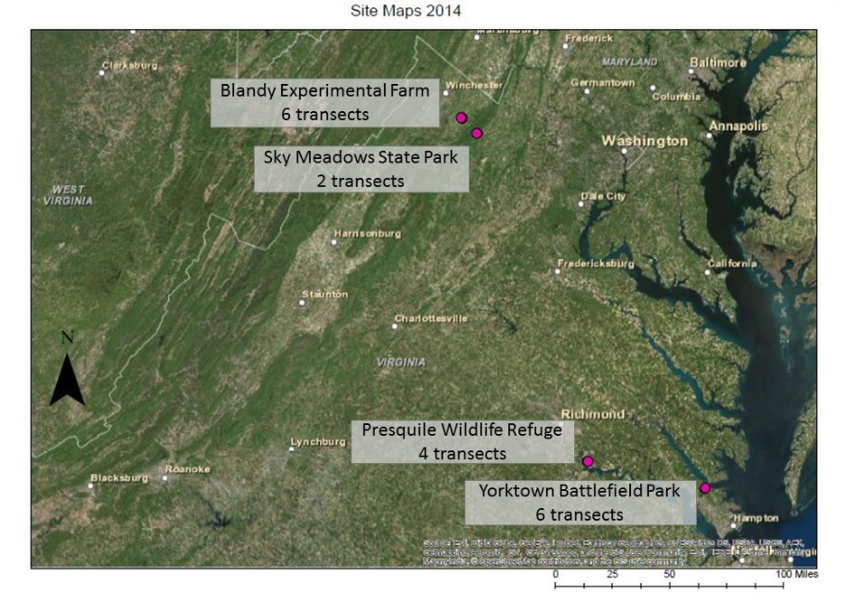
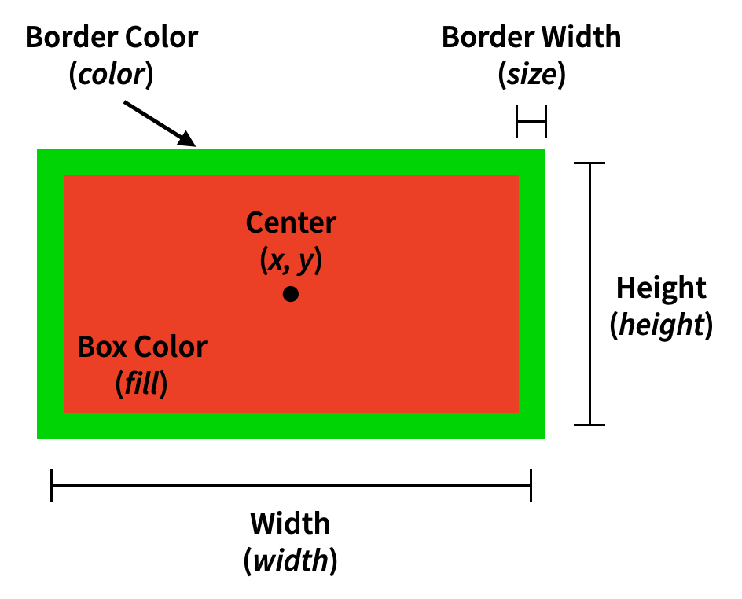
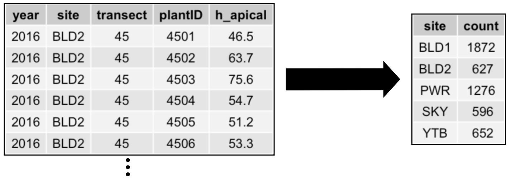
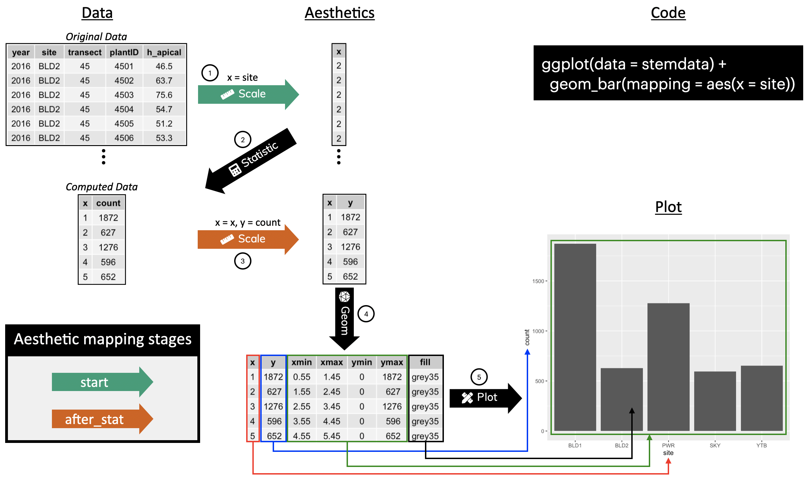
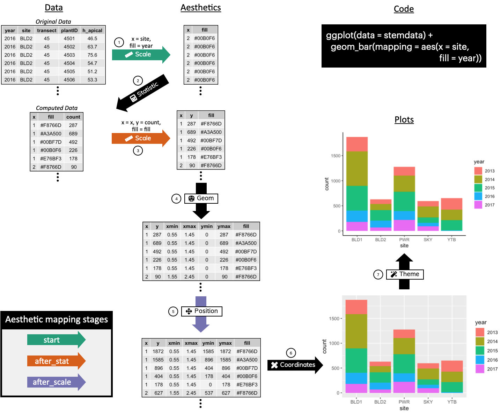

<style>
img.center {
    display: block;
    margin-left: auto;
    margin-right: auto;
}

img.float-left {
    float: left;
    margin: 20px;
}
</style>

```{r libraries, include=FALSE}
library(learnr)
library(gradethis)
library(digest)
```

```{r tidyverse-setup, include=FALSE}
library(tidyverse)
library(xkcd)
```

```{r stemdata-setup, include=FALSE}
library(tidyverse)
library(xkcd)
stemdata <- read_csv("https://qubeshub.org/community/groups/introbiostats/File:/uploads/stemdata.csv") %>%
  mutate(year = as.character(year))
```

```{r setup, include=FALSE}
learnr::tutorial_options(
  exercise.timelimit = 15,
  exercise.checker = gradethis::grade_learnr,
  exercise.eval = FALSE
)
```

# Data Visualization with ggplot2

```{r, echo=FALSE, out.width="75%", out.extra="class='center'"}
knitr::include_graphics("images/data-science-explore.png")
```
<center>
Caption: Image from ["R for Data Science"](https://r4ds.had.co.nz/explore-intro.html)
</center>
<br>
A model of the data life cycle from the free online book ["R for Data Science"](https://r4ds.had.co.nz/explore-intro.html) is shown above. The whirlpool in the middle, besides making you dizzy I'm sure, is one of the most rewarding parts of the process - data exploration! There are some important take home points from the "Explore" portion of the diagram:
 
 (1) Data might require **transformation** before proper **visualization**.
 (2) It is best to visualize your data _before_ you do statistical analysis (also known as statistical modeling).
 (3) Rarely if ever will you complete this cycle only once.
 (4) Iterate towards perfection. In other words, don't worry about perfectly formatted publication quality graphs and results. Exploration should be full of fun and curiosity. Save the publication quality results for the "Communicate" step.

In the previous tutorial, [Data Manipulation with dplyr](https://mdllama.shinyapps.io/Data_Manipulation), you learned about the tidyverse package `dplyr` and how to use it to **Transform** your data. In this tutorial, we will introduce you to the tidyverse package `ggplot2`, showing you how to use it to **Visualize** your data.

Helpful resources for this tutorial:

 - [ggplot2 Reference](https://ggplot2.tidyverse.org/index.html)
 - [ggplot2 Cheat Sheet](https://github.com/rstudio/cheatsheets/raw/master/data-visualization-2.1.pdf)
 - [R for Data Science: Data visualisation](https://r4ds.had.co.nz/data-visualisation.html) (Free online book chapter)
 - [ggplot2: Elegant Graphics for Data Analysis](https://ggplot2-book.org/) (Free online book)

## Introduction to ggplot2

```{r, echo=FALSE, out.width="100px", out.extra="class='float-left'"}
knitr::include_graphics("images/hex-ggplot2.png")
```

> "ggplot2 is a system for declaratively creating graphics, based on [The Grammar of Graphics](https://amzn.to/2ef1eWp). You provide the data, tell ggplot2 how to map variables to aesthetics, what graphical primitives to use, and it takes care of the details." <br> <span style="float:right;"> - tidyverse.org</span>
<div style="clear: both;"></div>

<div style="clear: both;"></div>

Using `ggplot2` for your data visualization needs is akin to using a powerful photo or image editor, like Adobe Photoshop. When using modern image editors, there is a common process and language: The end result is composed of *layers* of overlapping content, one layer drawn on top of the other, with each layer utilizing aesthetics like color, position, space, and shape. This same language and creation paradigm can be applied to creating plots from data, which is exactly what **The Grammar of Graphics** aims to do. We get the added awesomeness, however, of learning how to map raw data to the visual aesthetics that we see in the final plot.

Most of the time, part of this mapping of data to visual objects requires some type of *data manipulation* or transformation, as Figure 1 illustrates. In order to truly understand and interpret a visual representation of data, one must know exactly how data is modified and mapped to the resulting plot. Some plots, such as *scatter plots*, are a direct mapping of the data to the image, while others like the bar plot may require some data processing before constructing the plot (e.g. computing frequencies of occurrences of levels for a categorical variable).

With The Grammar of Graphics, we break down the creation of a data visualization into 6 main components:

1. **Data**: Data used for the plot.
2. **Aesthetics**: Data generates geometric objects via _mapping_ data to general plot aesthetics (space, color, shape, size, etc.)
3. **Geoms**: Geometric objects, drawn in layers, that represent the data (points, lines, rectangles, curves, etc.)
4. **Statistics**: Processing of data into statistical summaries to show properties of your data, including uncertainty quantification and statistical models.
5. **Coordinates**: Coordinate systems and their properties (cartesian, polar, aspect ratios, axes limits, etc.)
6. **Themes**: Non-data elements of the plot (gridlines, ticks, labels, etc.)

As mentioned above, one of the key ideas of _The Grammar of Graphics_ is that visualizations can be composed of multiple layers, with each layer consisting of data, aesthetics, and geometric objects. As mentioned in the 3rd edition of the book [_ggplot2: Elegant Graphics for Data Analysis_](https://ggplot2-book.org/), by Hadley Wickham, Danielle Navarro, and Thomas Lin Pedersen, it is useful to think of each layer of a plot displayed for a purpose:

 (1) Plot **raw data** to show unprocessed patterns and structures in the data.
 (2) Plot **statistical summaries** to show central tendencies, uncertainty quantification, and summarized trends in the data.
 (3) Plot **metadata** to show annotations and helpful content to aid the reader in understanding and interpretation.

We map data to geometric objects through _aesthetics_, which is the focus of the next chapter.

Let's first take a look at one of the datasets we will be using for this tutorial.

## The Data

<div style="display: flex;">
<div style="flex: 1 0 50%;">
```{r, echo=FALSE, out.width="100%", out.extra="style='display:inline-block'"}

```
<br>Caption: Monarch butterfly on swamp milkweed.<br>JIM HUDGINS / USFWS MIDWEST REGION
</div>
<div style="flex: 1 0 50%;">
```{r, echo=FALSE, out.width="100%", out.extra="style='display:inline-block'"}

```
<br>Caption: Study sites across Virginia for milkweed trait measurements (Mary Seward, W&M)
</div>
</div>

The milkweed plant is the sole food source for the monarch butterfly. Milkweed is a long-lived perennial plant that can reproduce sexually and clonally through adventitious root sprouting. Though the belowground root system is perennial, the aboveground ramet population dies back annually. The plot on the right shows sites across Virginia where Professor Dalgleish's lab collected multiple measurements on milkweed over a five year period from 2013-2017. We will use this data over the remainder of this tutorial.

The following describes a subset of the variables in the data that we will explore in this tutorial:

 - `year`: Year at which the data was collected.
 - `site`: Unique site key denoting where in Virginia the data was collected, including Blandy Experimental Farm (**BLD1**, **BLD2**), Sky Meadows State Park (**SKY**), Presquile Wildlife Refuge (**PWR**), and Yorktown Battlefield Park (**YTB**).
 - `transect`: Each site had a varying number of transects that were 1 m wide, with variable lengths depending on the size of the milkweed patch.
 - `plantID`: Unique plant ID.
 - `h_apical`: Stem height to the apical meristem (cm), measured in June.
 - `h_apical.next`: Stem height to the apical meristem (cm), measured in September.
 - `herb_avg`: Herbivory severity score on a modified Daubenmire scale of 0–6 according to percent tissue removed (0 = intact, 1 = 1–5% removed, 2 = 6–24% removed, 3 = 25–50% removed, 4 = 51–75% removed, 5 = 76– 99% removed, 6 = only the petiole remains).

## Aesthetics and Geoms

**Aesthetics** can be thought of as _dimensions_ of general plot objects. For example, the following rectangle has seven aesthetic dimensions: center coordinate (x and y), width, height, border color, box color, and border width.

```{r, echo=FALSE, out.width="300px",  out.extra="class='center'"}

```

The italicized words inside the parentheses correspond to aesthetic names used in `ggplot2`.

Here's our first `ggplot2` code that can display a rectangle just like the one above:

```{r geom-tile}
ggplot() + 
  geom_tile(mapping = aes(x = 0, y = 0), 
            width = 20, 
            height = 10,
            color = "green", 
            fill = "red", 
            size = 10)
```

The first command (`ggplot()`) creates a blank canvas and is required for all plots using `ggplot2`.

```{r blank-canvas}
ggplot()
```

The `+` command is similar to the data pipe `%>%` and can be thought of as either adding an additional layer to the plot (like in this case the tile geometric object) or adjusting parameters of the plot.

This is our first introduction to a **geom**, in this case `geom_tile`. 

> A **geom** is a plot algorithm that uses specified aesthetics to construct a geometric object in the coordinate plane.

In this case, the `geom_tile` function creates a rectangle using the aesthetics we specified above. Note that there is a similar geom, `geom_rect`, that will draw a rectangle using different aesthetics: in place of `x`, `y`, `width`, and `height`, `geom_rect` uses `xmin`, `xmax`, `ymin`, and `ymax`. For example, the same rectangle can be specified using the following bit of code.

```{r, fig.align="center"}
ggplot() + 
  geom_rect(mapping = aes(xmin = -10, xmax = 10, ymin = -5, ymax = 5),
            color = "green", 
            fill = "red",
            size = 10)
```

Which geom you use depends on which aesthetic specification is more convenient.

### Specifying aesthetics: Mappings or values?

In the commands above, you maybe have noticed some aesthetics are wrapped in the `aes()` function, which is then assigned to the `mapping` argument of the geom function, while others are specified as direct arguments to the geom function. Why the distinction? For right now, the rule is (1) required aesthetics for a geom need to be specified within the `aes()` function and assigned to the `mapping` variable, and (2) optional aesthetics for a geom can be specified as direct arguments to the geom function. We'll learn a more general rule later.

#### Exercise: Default aesthetics
*Plot a rectangle using* `geom_tile` *centered at (x,y) = (4, 7). Do not specify any other aesthetics.*

```{r one-tile-ex-1, exercise=TRUE, exercise.setup="tidyverse-setup"}

```

```{r one-tile-ex-1-hint-1}
ggplot() +
  geom_tile(___)
```

```{r one-tile-ex-1-hint-2}
ggplot() +
  geom_tile(mapping = aes(___))
```

```{r one-tile-ex-1-solution}
ggplot() +
  geom_tile(mapping = aes(x = 4, y = 7))
```

```{r one-tile-ex-1-check}
gradethis::grade_code()
```

It looks like the default aesthetics for a tile geom is a width and height of 1, no border, and a dark grey fill.

#### Exercise: Add some color
*Plot a rectangle using* `geom_rect` *with the bottom-left corner at (x,y) = (0,0) and upper-right corner at (2,4). Also set the fill to* `forestgreen` *and the color to* `goldenrod1`.

```{r one-tile-ex-2, exercise=TRUE, exercise.setup="tidyverse-setup"}

```

```{r one-tile-ex-2-hint-1}
ggplot() +
  geom_rect(mapping = aes(___))
```

```{r one-tile-ex-2-hint-2}
ggplot() +
  geom_rect(mapping = aes(xmin = ___, ymin = ___, xmax = ___, ymax = ___))
```

```{r one-tile-ex-2-hint-3}
ggplot() +
  geom_rect(mapping = aes(xmin = 0, ymin = 0, xmax = 2, ymax = 4),
            fill = ___,
            color = ___)
```

```{r one-tile-ex-2-solution}
ggplot() +
  geom_rect(mapping = aes(xmin = 0, ymin = 0, xmax = 2, ymax = 4),
            fill = "forestgreen",
            color = "goldenrod1")
```

```{r one-tile-ex-2-check}
gradethis::grade_code("Looks like a super small border size! The default is set to 0.1.")
```

### Multiple geoms: Using layers

Suppose we wanted two rectangles such that:

 (1) Rectangle #1 is the same as above, and
 (2) Rectangle #2 is centered at the upper right corner of Rectangle #1, with all other aesthetics the same except fill is black and the border is blue.
 
How can we create these? With `ggplot2`, all you have to do is combine two geom specifications with a `+` sign.

```{r}
ggplot() +
  geom_tile(mapping = aes(x = 0, y = 0), # red and green rectangle
            width = 20, 
            height = 10,
            color = "green", 
            fill = "red", 
            size = 10) +
  geom_tile(mapping = aes(x = 10, y = 5), # black and blue rectangle
            width = 20,
            height = 10,
            color = "blue",
            fill = "black",
            size = 10)
```

As you can see, the second layer (black and blue rectangle) is *on top of* the first layer (red and green rectangle).

#### Exercise: Change the order of the layers
*Repeat the code above that created the two rectangles, but this time call the black and blue* `geom_tile` *first. What do you expect to happen?*

```{r layers-ex-1, exercise=TRUE, exercise.setup="tidyverse-setup"}

```

```{r layers-ex-1-solution}
ggplot() +
  geom_tile(mapping = aes(x = 10, y = 5), # black and blue rectangle
            width = 20, 
            height = 10,
            color = "blue", 
            fill = "black", 
            size = 10) +
  geom_tile(mapping = aes(x = 0, y = 0), # red and green rectangle
            width = 20,
            height = 10,
            color = "green",
            fill = "red",
            size = 10)
```

```{r layers-ex-1-check}
gradethis::grade_code()
```

Remember the analogy to image processing programs like Photoshop: each geom is a *layer*, and the layers are drawn on top of each other in the order they are specified. What if we still want to see the object behind the other one? Each geom has an *alpha transparency* aesthetic, specified between 0 (fully transparent) and 1 (opaque), that allows you to _see through_ each layer.

#### Exercise: Specify transparency
*Set the value of the red and green rectangle's transparency (or aesthetic* `alpha`*) to 0.6.*

```{r transp-ex-1, exercise=TRUE, exercise.setup="tidyverse-setup", exercise.eval=TRUE}
ggplot() +
  geom_tile(mapping = aes(x = 10, y = 5), # black and blue rectangle
            width = 20, 
            height = 10,
            color = "blue", 
            fill = "black", 
            size = 10) +
  geom_tile(mapping = aes(x = 0, y = 0), # red and green rectangle
            width = 20,
            height = 10,
            color = "green",
            fill = "red",
            size = 10)
```

```{r transp-ex-1-solution}
ggplot() +
  geom_tile(mapping = aes(x = 10, y = 5), # red and green rectangle
            width = 20, 
            height = 10,
            color = "blue", 
            fill = "black", 
            size = 10) +
  geom_tile(mapping = aes(x = 0, y = 0), # black and blue rectangle
            width = 20,
            height = 10,
            color = "green",
            fill = "red",
            size = 10,
            alpha = 0.6)
```

```{r transp-ex-1-check}
gradethis::grade_code()
```

### Multiple geoms: Utilizing the data frame

What if we want to draw lots of tiles/rectangles at the same time, with many of them sharing the same aesthetics? We could add a new `geom_tile` layer every time we wanted a new tile, but this could quickly get out of hand. A shortcut is to create a data frame that stores the aesthetics that vary across rectangles. For example, if we wanted to draw the two rectangles above, but this time keep them both the same colors to make things easier, we could create a data frame or tibble with differing center coordinates as follows (see [this link](https://rstudio-education.github.io/tidyverse-cookbook/tidy.html#create-a-tibble-manually) for an introduction to tribbles):

```{r tribble}
tiles <- tribble(
  ~xcoord, ~ycoord,
  10, 5,
  0, 0
)
```

With this data frame, we can then pass the `tiles` data to `ggplot` and *map* the aesthetics to the corresponding variables in the data, as follows:

```{r map-aesthetics}
ggplot(data = tiles) +
  geom_tile(mapping = aes(x = xcoord, y = ycoord),
            width = 20,
            height = 10,
            size = 10,
            fill = "red",
            color = "green")
```

Nice! What we see is that rather than needing two `geom_tile` commands, we only need one by passing in the variable aesthetics as a data frame and mapping those variables to appropriate aesthetics. Each row of the data frame corresponds to aesthetics for an individual tile.

We can now discuss in full generality which aesthetics go in the `aes()` function and get assigned to the `mapping` argument, and which aesthetics go outside the `aes()` function as arguments to the geom.

> Aesthetics that are **mapped from variables** in a data frame or tibble should be set in the `aes()` function and assigned to the `mapping` argument. Aesthetics that are **not mapped from variables**, but are instead meant to be _constant_ across all geom instances, can be assigned as direct arguments to the geom. The only exception to the constant aesthetic rule is when the aesthetic is required - in this case, even if it is a constant, a required aesthetic needs to be specified within the `aes()` function.

Why did this example not have varying colors and fills, as the previous examples did? To specify varying colors in the data requires a discussion about **scales**, which we will get to in the next section of this tutorial.

#### Exercise: Go Tribe (x4)!
*Draw four rectangles with the following properties:*

 - *One rectangle each centered at (1,1), (1,-1), (-1,-1), and (-1,1).*
 - *Fill is* `forestgreen` *and border (*`color`*) is *`goldenrod1`*.*
 - *Width and height are both 1.*
 - *Size of border is 2.*
*Do this by first creating a data frame or tibble named* `tiles` *that stores the* `x` *and* `y` *values (which vary across rectangles), and then pass this data to the* `ggplot` *function. Note that the other aesthetics _do not vary_ across the four rectangles (i.e. are constants).*

```{r go-tribe-ex-1, exercise=TRUE, exercise.setup="tidyverse-setup"}

```

```{r go-tribe-ex-1-hint-1}
tiles <- tribble(
  ___
)

ggplot() +
  geom_tile(___)
```

```{r go-tribe-ex-1-hint-2}
tiles <- tribble(
  ~x, ~y,
  1, 1,
  1, -1,
  -1, -1,
  -1, 1
)

ggplot(data = ___) +
  geom_tile(mapping = aes(___))
```

```{r go-tribe-ex-1-hint-3}
tiles <- tribble(
  ~x, ~y,
  1, 1,
  1, -1,
  -1, -1,
  -1, 1
)

ggplot(data = tiles) +
  geom_tile(mapping = aes(x = x, y = y),
            ___)
```

```{r go-tribe-ex-1-solution}
tiles <- tribble(
  ~x, ~y,
  1, 1,
  1, -1,
  -1, -1,
  -1, 1)

ggplot(data = tiles) +
  geom_tile(mapping = aes(x = x, y = y),
            width = 1,
            height = 1,
            size = 2,
            fill = "forestgreen",
            color = "goldenrod1")
```

```{r go-tribe-ex-1-check}
gradethis::grade_code()
```

The `geom_rect` and `geom_tile` geoms are examples of *primitive geoms*. Primitive geoms map the aesthetics to the geometric objects *directly and without any additional transformations*. Primitive geoms are the "what-you-code-is-what-you-get" type of geoms. There are two other main primitive geoms for drawing one-dimensional objects (**line segments**) and zero-dimensional objects (**points**):

 - **Points** are drawn with `geom_point` and require the aesthetics `x` and `y`.
 - **Lines** are drawn with `geom_segment` and require the aesthetics `x`, `y`, `xend` and `yend`.
 
#### Exercise: Adding points
*Starting with the four rectangles from the previous exercise, add points of size 5 at the center of the rectangles.*

```{r adding-points-ex-1, exercise=TRUE, exercise.setup="tidyverse-setup", exercise.eval=TRUE}
tiles <- tribble(
  ~x, ~y,
  1, 1,
  1, -1,
  -1, -1,
  -1, 1)

ggplot(data = tiles) +
  geom_tile(mapping = aes(x = x, y = y),
            width = 1,
            height = 1,
            size = 2,
            fill = "forestgreen",
            color = "goldenrod1")
```

```{r adding-points-ex-1-hint-1}
tiles <- tribble(
  ~x, ~y,
  1, 1,
  1, -1,
  -1, -1,
  -1, 1)

ggplot(data = tiles) +
  geom_tile(mapping = aes(x = x, y = y),
            width = 1,
            height = 1,
            size = 2,
            fill = "forestgreen",
            color = "goldenrod1") +
  geom_point(___)
```

```{r adding-points-ex-1-hint-2}
tiles <- tribble(
  ~x, ~y,
  1, 1,
  1, -1,
  -1, -1,
  -1, 1)

ggplot(data = tiles) +
  geom_tile(mapping = aes(x = x, y = y),
            width = 1,
            height = 1,
            size = 2,
            fill = "forestgreen",
            color = "goldenrod1") +
  geom_point(mapping = aes(___))
```

```{r adding-points-ex-1-solution}
tiles <- tribble(
  ~x, ~y,
  1, 1,
  1, -1,
  -1, -1,
  -1, 1)

ggplot(data = tiles) +
  geom_tile(mapping = aes(x = x, y = y),
            width = 1,
            height = 1,
            size = 2,
            fill = "forestgreen",
            color = "goldenrod1") +
  geom_point(mapping = aes(x = x, y = y),
             size = 5)
```

```{r adding-points-ex-1-check}
gradethis::grade_code()
```

#### Exercise: Adding line segments
*Starting with the data and geoms from the previous two exercises (rectangles and points), add line segments of* `size` *1 that connect:*

 - *Point (1,1) to point (1,-1)*
 - *Point (1,-1) to point (-1,-1)*
 - *Point (-1,-1) to point (-1,1)*
 - *Point (-1,1) to point (1,1)*

*Start by adding two new variables to the* `tiles` *tibble called* `xend` *and* `yend`.

```{r adding-lines-ex-1, exercise=TRUE, exercise.setup="tidyverse-setup"}
tiles <- tribble(
  ~x, ~y,
  1, 1,
  1, -1,
  -1, -1,
  -1, 1)

ggplot(data = tiles) +
  geom_tile(mapping = aes(x = x, y = y),
            width = 1,
            height = 1,
            size = 2,
            fill = "forestgreen",
            color = "goldenrod1") +
  geom_point(mapping = aes(x = x, y = y),
             size = 5)
```

```{r adding-lines-ex-1-hint-1}
tiles <- tribble(
  ~x, ~y, ~xend, ~yend,
  1, 1, 1, -1,
  1, -1, -1, -1,
  -1, -1, -1, 1,
  -1, 1, 1, 1)

ggplot(data = tiles) +
  geom_tile(mapping = aes(x = x, y = y),
            width = 1,
            height = 1,
            size = 2,
            fill = "forestgreen",
            color = "goldenrod1") +
  geom_point(mapping = aes(x = x, y = y),
             size = 5) +
  geom_segment(mapping = aes(___),
               size = ___)
```

```{r adding-lines-ex-1-solution}
tiles <- tribble(
  ~x, ~y, ~xend, ~yend,
  1, 1, 1, -1,
  1, -1, -1, -1,
  -1, -1, -1, 1,
  -1, 1, 1, 1)

ggplot(data = tiles) +
  geom_tile(mapping = aes(x = x, y = y),
            width = 1,
            height = 1,
            size = 2,
            fill = "forestgreen",
            color = "goldenrod1") +
  geom_point(mapping = aes(x = x, y = y),
             size = 5) +
  geom_segment(mapping = aes(x = x, y = y, xend = xend, yend = yend),
               size = 1)
```

```{r adding-lines-ex-1-check}
gradethis::grade_code()
```

### Multiple geoms: Setting defaults

You may have noticed in the last exercise that there were some repetitive aesthetic mappings. Which aesthetics were mapped to the same variables in all geoms? The _x_ and _y_ aesthetics! In this case, we could specify these aesthetics in the `ggplot()` function.

```{r}
tiles <- tribble(
  ~x, ~y, ~xend, ~yend,
  1, 1, 1, -1,
  1, -1, -1, -1,
  -1, -1, -1, 1,
  -1, 1, 1, 1
)

ggplot(data = tiles,
       mapping = aes(x = x, y = y)) +
  geom_tile(width = 1,
            height = 1,
            size = 2,
            fill = "forestgreen",
            color = "goldenrod1") +
  geom_point(size = 5) +
  geom_segment(mapping = aes(xend = xend, yend = yend),
               size = 1)
```

Specifying aesthetic mappings in the `ggplot()` function is akin to _setting default aesthetic mappings for all of your geoms to follow_. If needed, you can override those defaults for any subsequent geom layer you specify.

There are lots of other geoms out there to explore! We will learn about many more of them in Part 2 of this course. First, however, we need to learn about _scales_.

## Scales and Statistics

The next two concepts, *scales* and *statistics*, dig a little deeper under the hood of `ggplot2` and detail how your original data is mapped to the visual aesthetics.

### Scales

```{r, echo=FALSE, out.width="100px",  out.extra="class='float-left'"}
knitr::include_graphics("images/hex-scales.png")
```

> Scales in `ggplot2` define how your data is mapped to visual aesthetics, including the handling of axes and legends.
<div style="clear: both;"></div>

Scales are somewhat unique in their actions and results, depending intimately on which aesthetic they correspond to. However, the two most important "scale types" include:

 - Location scales, like `x` and `y` (which get mapped to **axes**)
 - Color scales, like `fill` and `color` (which get mapped to **legends**) 
 - Other scales, like `size` and `linetype` (which also get mapped to **legends**)

All scales in `ggplot2` are functions of the form `scale_<aesthetic>_<scale name>()`. If an aesthetic is mapped, either explicitly in your code or implicitly by `ggplot2`, a default scale is used. Calling the appropriate scale function will allow the user to override the defaults.

Axes and legends are collectively known as **guides** in `ggplot2`. To control guides, every scale function has the three arguments in the table below:

| **Argument name** | **Axis**           | **Legend** |
| :---------------- | :----------------- | :--------- |
| `name`            | Label              | Title      |
| `breaks`          | Ticks & grid lines | Key        |
| `labels`          | Tick label         | Key label  |

```{r, echo=FALSE, out.width="400px", out.extra="class='center'"}
knitr::include_graphics("images/scale-guides.png")
```

Let's go into the two main types of scales individually, starting with _location scales_.

#### Location scales

Location scales perform the following:

 - **Set axes labels**
 - **Set tick marks and labels**
 - **Adjust axes limits**
 - **Axis transformations**

The most important scale functions for location aesthetics are `scale_x_discrete()`, `scale_x_continuous()`, `scale_y_discrete()`, and `scale_y_continuous()`. The choice of `discrete` or `continuous` should depend, of course, on whether the mapped variable is discrete or continuous.

##### Location scales: Set axes labels

To apply a scale for an aesthetic, you add the scale as if it were a geom with the `+` operator. Note that this is a little inaccurate - you are not adding a scale so much as you are modifying the existing default scale.

In the following example, we will modify the horizontal and vertical axis labels by setting the `name` argument in the `scale_x_continuous` and `scale_y_continuous` functions.

```{r}
ggplot(data = tiles,
       mapping = aes(x = x, y = y)) +
  geom_tile(width = 1,
            height = 1,
            size = 2,
            fill = "forestgreen",
            color = "goldenrod1") +
  geom_point(size = 5) +
  geom_segment(mapping = aes(xend = xend, yend = yend),
               size = 1) +
  scale_x_continuous(name = "Horizontal Axis") +
  scale_y_continuous(name = "Vertical Axis")
```

Note that there is a helper function in `ggplot2` for setting labels for all axes and legends: the `labs` function. You use the `labs` function as follows:

```{r, eval=FALSE}
labs(
  <aesthetic> = <label name>,
  <aesthetic> = <label name>,
  ...)
```

Here is an example that applies the same axes labels as before:
```{r}
ggplot(data = tiles,
       mapping = aes(x = x, y = y)) +
  geom_tile(width = 1,
            height = 1,
            size = 2,
            fill = "forestgreen",
            color = "goldenrod1") +
  geom_point(size = 5) +
  geom_segment(mapping = aes(xend = xend, yend = yend),
               size = 1) +
  labs(x = "Horizontal Axis",
       y = "Vertical Axis")
```

The `tiles` dataset below will be available for the next few exercises.

```{r tiles-setup, include=FALSE}
library(tidyverse)
tiles <- tribble(
  ~x, ~y, ~xend, ~yend,
  1, 1, 1, -1,
  1, -1, -1, -1,
  -1, -1, -1, 1,
  -1, 1, 1, 1
)
```

##### Exercise: Set tick marks
*Starting with the previous plot, change the tick marks by setting the* `breaks` *argument for each of the* `x` *and* `y` *scales. Create ticks that go from -1.5 to 1.5 in increments of 0.5. Hint: Use the* `seq` *function for the tick marks!*

> The `breaks` argument is a numeric vector of positions.

```{r tick-marks-ex-1, exercise=TRUE, exercise.setup="tiles-setup", exercise.eval = TRUE}
ggplot(data = tiles,
       mapping = aes(x = x, y = y)) +
  geom_tile(width = 1,
            height = 1,
            size = 2,
            fill = "forestgreen",
            color = "goldenrod1") +
  geom_point(size = 5) +
  geom_segment(mapping = aes(xend = xend, yend = yend),
               size = 1) +
  scale_x_continuous(name = "Horizontal Axis") +
  scale_y_continuous(name = "Vertical Axis")
```

```{r tick-marks-ex-1-solution}
ggplot(data = tiles,
       mapping = aes(x = x, y = y)) +
  geom_tile(width = 1,
            height = 1,
            size = 2,
            fill = "forestgreen",
            color = "goldenrod1") +
  geom_point(size = 5) +
  geom_segment(mapping = aes(xend = xend, yend = yend),
               size = 1) +
  scale_x_continuous(name = "Horizontal Axis",
                     breaks = seq(-1.5, 1.5, by = 0.5)) +
  scale_y_continuous(name = "Vertical Axis",
                     breaks = seq(-1.5, 1.5, by = 0.5))
```

```{r tick-marks-ex-1-check}
gradethis::grade_code()
```

##### Exercise: Set tick marks and labels
*Replicate the tick marks and labels for the following plot. Use the scale argument* `labels` *to set the labels as seen below.*

> The `labels` argument is a character vector giving labels (must be same length as `breaks`).

```{r, echo=FALSE, fig.width=4, fig.align="center"}
ggplot(data = tiles,
       mapping = aes(x = x, y = y)) +
  geom_tile(width = 1,
            height = 1,
            size = 2,
            fill = "forestgreen",
            color = "goldenrod1") +
  geom_point(size = 5) +
  geom_segment(mapping = aes(xend = xend, yend = yend),
               size = 1) +
  scale_x_continuous(name = "Horizontal Axis",
                     breaks = c(-1, 1),
                     labels = c("A", "B")) +
  scale_y_continuous(name = "Vertical Axis",
                     breaks = c(-1, 1),
                     labels = c("C", "D"))
```

```{r scale-labels-ex-1, exercise=TRUE, exercise.setup="tiles-setup", exercise.eval = TRUE}
ggplot(data = tiles,
       mapping = aes(x = x, y = y)) +
  geom_tile(width = 1,
            height = 1,
            size = 2,
            fill = "forestgreen",
            color = "goldenrod1") +
  geom_point(size = 5) +
  geom_segment(mapping = aes(xend = xend, yend = yend),
               size = 1)
```

```{r scale-labels-ex-1-hint-1}
ggplot(data = tiles,
       mapping = aes(x = x, y = y)) +
  geom_tile(width = 1,
            height = 1,
            size = 2,
            fill = "forestgreen",
            color = "goldenrod1") +
  geom_point(size = 5) +
  geom_segment(mapping = aes(xend = xend, yend = yend),
               size = 1) +
  scale_x_continuous(name = "Horizontal Axis",
                     breaks = c(__, __),
                     labels = c(__, __)) +
  scale_y_continuous(name = "Vertical Axis",
                     breaks = c(__, __),
                     labels = c(__, __))
```

```{r scale-labels-ex-1-solution}
ggplot(data = tiles,
       mapping = aes(x = x, y = y)) +
  geom_tile(width = 1,
            height = 1,
            size = 2,
            fill = "forestgreen",
            color = "goldenrod1") +
  geom_point(size = 5) +
  geom_segment(mapping = aes(xend = xend, yend = yend),
               size = 1) +
  scale_x_continuous(name = "Horizontal Axis",
                     breaks = c(-1, 1),
                     labels = c("A", "B")) +
  scale_y_continuous(name = "Vertical Axis",
                     breaks = c(-1, 1),
                     labels = c("C", "D"))
```

```{r scale-labels-ex-1-check}
gradethis::grade_code()
```

See ["Position scales and axes"](https://ggplot2-book.org/scale-position.html) for more advanced specifications.

##### Exercise: Adjust axes limits
*We can also modify a location aesthetic scale to change the limits of the axis by using the* `limits` *argument. Starting with the plot below, constrain the x axis so that* $0 \leq x \leq 2$*.*

> The `limits` argument is a numeric vector of length two providing limits of the scale. Use NA to refer to the existing minimum or maximum.

```{r limits-ex-1, exercise=TRUE, exercise.setup="tiles-setup", , exercise.eval = TRUE}
ggplot(data = tiles,
       mapping = aes(x = x, y = y)) +
  geom_tile(width = 1,
            height = 1,
            size = 2,
            fill = "forestgreen",
            color = "goldenrod1") +
  geom_point(size = 5) +
  geom_segment(mapping = aes(xend = xend, yend = yend),
               size = 1)
```

```{r limits-ex-1-solution}
ggplot(data = tiles,
       mapping = aes(x = x, y = y)) +
  geom_tile(width = 1,
            height = 1,
            size = 2,
            fill = "forestgreen",
            color = "goldenrod1") +
  geom_point(size = 5) +
  geom_segment(mapping = aes(xend = xend, yend = yend),
               size = 1) +
  scale_x_continuous(limits = c(0, 2))
```

```{r limits-ex-1-check}
gradethis::grade_code()
```

What, what?? What happened to our horizontal lines?! Setting the limits using the scale functions is different than just zooming in. By default, `ggplot2` will set the values of any data outside the limits to NA. Thus, the horizontal lines in this example will have one endpoint set to NA, and therefore _will not be drawn_. Thus, the default behavior in ggplot2 is to zoom **and** clip. 

What if you want to keep the values that are "out of bounds" (i.e. no clipping)? There is an argument to the scales function called `oob` that specifies this. By default, the argument is `oob = scales::oob_censor` which, as we stated previously, sets out of bound values to NA. This notation says _"use the_ `oob_censor()` _function in the_ `scales` _package to handle data that is out of bounds."_ 

[This reference sheet](https://scales.r-lib.org/reference/oob.html) lists all of the options for handling out of bound data. Probably the most important other `oob` function is `scales::oob_keep`, which will keep the data, thereby performing a more standard zoom.

#### Exercise: No clipping!
*Change the default out-of-bound behavior by setting the* `oob` *argument for the* `x` *scale to* `scales::oob_keep`*.*

```{r oob-ex-1, exercise=TRUE, exercise.setup="tiles-setup", , exercise.eval = TRUE}
ggplot(data = tiles,
       mapping = aes(x = x, y = y)) +
  geom_tile(width = 1,
            height = 1,
            size = 2,
            fill = "forestgreen",
            color = "goldenrod1") +
  geom_point(size = 5) +
  geom_segment(mapping = aes(xend = xend, yend = yend),
               size = 1) +
  scale_x_continuous(limits = c(0, 2))
```

```{r oob-ex-1-solution}
ggplot(data = tiles,
       mapping = aes(x = x, y = y)) +
  geom_tile(width = 1,
            height = 1,
            size = 2,
            fill = "forestgreen",
            color = "goldenrod1") +
  geom_point(size = 5) +
  geom_segment(mapping = aes(xend = xend, yend = yend),
               size = 1) +
  scale_x_continuous(limits = c(0, 2),
                     oob = scales::oob_keep)
```

```{r oob-ex-1-check}
gradethis::grade_code()
```

That's better! But wait - why is _zoom and clip_ (`oob_censor`) and not just _zoom_ (`oob_keep()`) the default behavior? Clipping will make more sense when we discuss statistics in Part 2 of this tutorial.

#### Location scales: Axis transformations

Besides setting axes labels, tick marks, and clipping/zooming, scales can also explicitly define the transformation from your data to the aesthetic (axis). By default, location scales do NOT perform a transformation, i.e. they perform an identity mapping between your data and the axes. There are times, however, when you will want to change this. We will cover one of the more common transformations - log transformations.

To illustrate transformations, let's revisit the milkweed data. The following creates a scatter plot of herbivory average versus apical stem height in June (cm). For simplicity, we first filter out where herbivory average is 0. In the code below, note that we can pipe the filtered data into the `ggplot()` function since the `data` argument is the first argument. We also do not explicitly specify the `mapping` argument in `geom_point` since it too is the first argument of all geoms.

```{r stemdata-scatter}
stemdata %>%
  filter(herb_avg > 0) %>%
  ggplot() +
  geom_point(aes(x = h_apical,
                 y = herb_avg))
```

Hmmm, it looks like most of the data is scrunched along the y-axis near 0. It might be nice to stretch the vertical axis near zero (kind of like a nonlinear zoom), while not stretching (or even shrinking) the vertical axis near the maximum of 6. A common way to do this is to use a log transformation. We can specify a log transformation by setting the `trans` argument of the y aesthetic scale to `log10`.

```{r stemdata-scatter-log}
stemdata %>%
  filter(herb_avg > 0) %>%
  ggplot() +
  geom_point(aes(x = h_apical,
                 y = herb_avg)) +
  scale_y_continuous(trans = "log10")
```

Note that the y axis label and values of the tick marks on the vertical axis are still showing the units of the data (herbivory average is measured from 0 to 6), and that while the tick marks are evenly spaced, the differences between tick marks are not!

> Rather than transforming the data, scale transformations are best thought of as nonlinear zooming along the relevant axis. 
 
It appears that 0-0.3 was _stretched_, whereas 0.3-6 was _squished_, and that the rate of stretching and squishing varies across the axis (proportional to the derivative of the transformation function at each point).

To illustrate the difference between transforming the data and transforming the axis, let's perform the same plot but calculate ourselves the log (base 10) of herbivory average.

```{r}
stemdata %>%
  filter(herb_avg > 0) %>%
  mutate(log_herb_avg = log10(herb_avg)) %>%
  ggplot() +
  geom_point(aes(x = h_apical,
                 y = log_herb_avg))
```

The points look the same, but you may notice that (1) the label is now `log_herb_avg`, and (2) the minimum is around -1.5 in this plot, which corresponds to $10^{-1.5} \approx 0.03$ on the previous plot. Thus, the vertical axis is now showing the exponents, which while accurately depicting the log scale can be harder to interpret.

Check out [Section 14.2: Scale transformation](https://ggplot2-book.org/scales-guides.html#scale-transformation) in _ggplot2: Elegant Graphics for Data Analysis_ for a list of common transformations.

##### Exercise: Can you spare a square root?
*Starting with the plot below and referring to Section 14.2 of the above link, use a square root mapping of herbivory average to the y aesthetic.*

```{r spare-square-root-ex-1, exercise=TRUE, exercise.setup="stemdata-setup", exercise.eval=TRUE}
stemdata %>%
  filter(herb_avg > 0) %>%
  ggplot() +
  geom_point(aes(x = h_apical,
                 y = herb_avg))
```

```{r spare-square-root-ex-1-solution}
stemdata %>%
  filter(herb_avg > 0) %>%
  ggplot() +
  geom_point(aes(x = h_apical,
                 y = herb_avg)) +
  scale_y_continuous(trans = "sqrt")
```

```{r spare-square-root-ex-1-check}
gradethis::grade_code("Not bad. For some data, square roots perform better than logs when you want to stretch values near zero (not in this case, though!).")
```

#### Color scales

Besides location aesthetics, the most commonly used aesthetic is based on color (via `color` or `fill`).

Color scales perform many of the same actions as location scales:

 - **Define palettes**
 - **Set legend titles**
 - **Set legend keys and key labels**
 - **Adjust key limits**
 - **Key transformations**

Here's the picture of a scatter plot with x, y, and a discrete color scale from before (for reference):
```{r, echo=FALSE, out.width="400px", out.extra="class='center'"}
knitr::include_graphics("images/scale-guides.png")
```

There are many different palettes available in `ggplot2`, each of which depends strongly on whether the data mapping to the aesthetic is discrete or continuous. The following table summarizes the main ggplot2 color scales:

| Palette | Discrete | Continuous | Resources |
| :------ | :------- | :--------- | :-------- |
| [HCL](https://ggplot2.tidyverse.org/reference/scale_hue.html) | `scale_*_hue` | - | [More info](http://hclwizard.org/) |
| [Viridis](https://ggplot2.tidyverse.org/reference/scale_viridis.html) | `scale_*_viridis_d` | `scale_*_viridis_c` | [More info](https://cran.r-project.org/web/packages/viridis/vignettes/intro-to-viridis.html) |
| [ColorBrewer](https://ggplot2.tidyverse.org/reference/scale_brewer.html) | `scale_*_brewer` | `scale_*_distiller` | [More info](https://colorbrewer2.org) |
| [Gradient](https://ggplot2.tidyverse.org/reference/scale_gradient.html) | - | `scale_*_gradient` | [More info](https://scales.r-lib.org//reference/seq_gradient_pal.html) |

##### Color scales: Define palettes

While location scales by default map data directly to their respective axes with no changes (i.e. they perform an identity mapping), this is not so for color. This is because there is no inherent natural way to map a continuous or discrete variable to a color scale. Which scale do we use? There are infinitely many of them!

By default, for discrete scales `ggplot2` maps to the [HCL color scale](http://hclwizard.org/#hcl-color-space) (H = Hue, C = Chroma, L = Luminance), which is a color scale that apparently maps well to human color perception.

Let's revisit our four rectangles to illustrate this. This time, though, we will allow the fill color for each rectangle to vary, and thus will include the fill as a variable in the `tiles` dataset.

###### Exercise: Mapping color
*Run the following code and then modify it by assigning the* `fill` *variable in the* `tiles` *data to the* `fill` *aesthetic.*

```{r mapping-color-ex-1, exercise=TRUE, exercise.setup="tidyverse-setup", exercise.eval=TRUE}
tiles <- tribble(
  ~x, ~y, ~fill,
  1, 1, "forestgreen",
  1, -1, "goldenrod1",
  -1, -1, "forestgreen",
  -1, 1, "goldenrod1")

ggplot(data = tiles) +
  geom_tile(mapping = aes(x = x, y = y),
            width = 1,
            height = 1,
            size = 2)
```

```{r mapping-color-ex-1-hint}
tiles <- tribble(
  ~x, ~y, ~fill,
  1, 1, "forestgreen",
  1, -1, "goldenrod1",
  -1, -1, "forestgreen",
  -1, 1, "goldenrod1")

ggplot(data = tiles) +
  geom_tile(mapping = aes(x = x, y = y, fill = ___),
            width = 1,
            height = 1,
            size = 2)
```

```{r mapping-color-ex-1-solution}
tiles <- tribble(
  ~x, ~y, ~fill,
  1, 1, "forestgreen",
  1, -1, "goldenrod1",
  -1, -1, "forestgreen",
  -1, 1, "goldenrod1")

ggplot(data = tiles) +
  geom_tile(mapping = aes(x = x, y = y, fill = fill),
            width = 1,
            height = 1,
            size = 2)
```

```{r mapping-color-ex-1-check}
gradethis::grade_code("Huh? That's not right at all! What are those colors? Impostors!!")
```

Okay, well, they're not so bad - they are two equally distant (in hue) colors in HCL color space and represent ggplot2's default discrete color palette. You can see these colors by using functions from the `scales` package as follows:

```{r}
scales::show_col(
  scales::hue_pal()(2)
)
```

It looks like "forestgreen" is mapped to "#F8766D" and "goldenrod1" is mapped to "#00BFC4". These hash-tag numbers are called hexidecimal numbers and are often used to specify color on websites (see the [color-hex website](https://www.color-hex.com/) for more information - and fun! It's like being in a paint store...). 

So how do we get the colors that are directly listed in the data? After all, our current `tiles` data is already directly representing aesthetic data. One way is to tell `ggplot2` that we want it to behave more like a location scale and use an identity mapping, which we can do by specifying the `scale_fill_identity()` function.

###### Exercise: Identity color scale
*Starting with the plot below, add the* `scale_fill_identity()` *function at the end.*

```{r scale-fill-identity-ex-1, exercise=TRUE, exercise.setup="tidyverse-setup"}
tiles <- tribble(
  ~x, ~y, ~fill,
  1, 1, "forestgreen",
  1, -1, "goldenrod1",
  -1, -1, "forestgreen",
  -1, 1, "goldenrod1")

ggplot(data = tiles) +
  geom_tile(mapping = aes(x = x, y = y, fill = fill),
            width = 1,
            height = 1,
            size = 2)
```

```{r scale-fill-identity-ex-1-solution}
tiles <- tribble(
  ~x, ~y, ~fill,
  1, 1, "forestgreen",
  1, -1, "goldenrod1",
  -1, -1, "forestgreen",
  -1, 1, "goldenrod1")

ggplot(data = tiles) +
  geom_tile(mapping = aes(x = x, y = y, fill = fill),
            width = 1,
            height = 1,
            size = 2) +
  scale_fill_identity()
```

```{r scale-fill-identity-ex-1-check}
gradethis::grade_code("That was easy!")
```

Basically, `scale_fill_identity()` tells `ggplot2` that the data already specifies the desired aesthetic values. However, most of the time our categorical data doesn't store actual color names. For example, suppose our data looked more like this:

```{r}
tiles <- tribble(
  ~x, ~y, ~royalty,
  1, 1, "william",
  1, -1, "mary",
  -1, -1, "william",
  -1, 1, "mary")
```

In this case, we can't use `scale_fill_identity()` since the levels of the `royalty` variable aren't color names. This is where the `scale_fill_manual()` comes into play, where you can specify how to map the levels of the discrete `royalty` variable to colors (i.e. _we_ get to specify the mapping of data to aesthetics).

###### Exercise: Manual color mapping
*Starting with the updated data below, add the* `scale_fill_manual()` *function and set the argument* `values` *equal to a named vector such that* `william` *gets mapped to* `forestgreen` *and* `mary` *gets mapped to* `goldenrod1`.

*Here is the definition of the* `values` *argument from the ggplot2 reference.*

> In `scale_*_manual()`, the argument `values` is a set of aesthetic values to map data values to. The values will be matched in order (usually alphabetical) with the limits of the scale, or with breaks if provided. If this is a named vector, then the values will be matched based on the names instead.

```{r scale-manual-ex-1, exercise=TRUE, exercise.setup="tidyverse-setup", exercise.eval=TRUE}
tiles <- tribble(
  ~x, ~y, ~royalty,
  1, 1, "william",
  1, -1, "mary",
  -1, -1, "william",
  -1, 1, "mary")

ggplot(data = tiles) +
  geom_tile(mapping = aes(x = x, y = y, fill = royalty),
            width = 1,
            height = 1,
            size = 2)
```

```{r scale-manual-ex-1-hint}
tiles <- tribble(
  ~x, ~y, ~royalty,
  1, 1, "william",
  1, -1, "mary",
  -1, -1, "william",
  -1, 1, "mary")

ggplot(data = tiles) +
  geom_tile(mapping = aes(x = x, y = y, fill = royalty),
            width = 1,
            height = 1,
            size = 2) +
  scale_fill_manual(values = c("william" = ___, 
                               "mary" = ___))
```

```{r scale-manual-ex-1-solution}
tiles <- tribble(
  ~x, ~y, ~royalty,
  1, 1, "william",
  1, -1, "mary",
  -1, -1, "william",
  -1, 1, "mary")

ggplot(data = tiles) +
  geom_tile(mapping = aes(x = x, y = y, fill = royalty),
            width = 1,
            height = 1,
            size = 2) +
  scale_fill_manual(values = c("william" = "forestgreen", 
                               "mary" = "goldenrod1"))
```

```{r scale-manual-ex-1-check}
gradethis::grade_code()
```

Note that we get a legend this time telling us how the fill aesthetic colors map back to the original data.

The following two definitions define the `name` and `labels` argument for color scales:

> The `name` argument gives the name of the scale. It is used as the legend title.

> The `labels` argument is a character vector giving key labels (must be same length as `breaks`). The labels will be matched in order (usually alphabetical) with the breaks of the scale. If this is a named vector, then the labels will be matched based on the names instead.

###### Exercise: Set legend titles and key labels
*Starting with the plot below, set the legend title to* `Royalty` *and the key labels* `King William` *for* `william` *and* `Queen Mary` *for* `mary`.

```{r color-legend-ex-1, exercise=TRUE, exercise.setup="tidyverse-setup", exercise.eval=TRUE}
tiles <- tribble(
  ~x, ~y, ~royalty,
  1, 1, "william",
  1, -1, "mary",
  -1, -1, "william",
  -1, 1, "mary")

ggplot(data = tiles) +
  geom_tile(mapping = aes(x = x, y = y, fill = royalty),
            width = 1,
            height = 1,
            size = 2) +
  scale_fill_manual(values = c("william" = "forestgreen", 
                               "mary" = "goldenrod1"))
```

```{r color-legend-ex-1-hint-1}
tiles <- tribble(
  ~x, ~y, ~royalty,
  1, 1, "william",
  1, -1, "mary",
  -1, -1, "william",
  -1, 1, "mary")

ggplot(data = tiles) +
  geom_tile(mapping = aes(x = x, y = y, fill = royalty),
            width = 1,
            height = 1,
            size = 2) +
  scale_fill_manual(values = c("william" = "forestgreen", 
                               "mary" = "goldenrod1"),
                    name = ___)
```

```{r color-legend-ex-1-hint-2}
tiles <- tribble(
  ~x, ~y, ~royalty,
  1, 1, "william",
  1, -1, "mary",
  -1, -1, "william",
  -1, 1, "mary")

ggplot(data = tiles) +
  geom_tile(mapping = aes(x = x, y = y, fill = royalty),
            width = 1,
            height = 1,
            size = 2) +
  scale_fill_manual(values = c("william" = "forestgreen", 
                               "mary" = "goldenrod1"),
                    name = "Royalty",
                    labels = c("william" = ___, "mary" = ___))
```

```{r color-legend-ex-1-solution}
tiles <- tribble(
  ~x, ~y, ~royalty,
  1, 1, "william",
  1, -1, "mary",
  -1, -1, "william",
  -1, 1, "mary")

ggplot(data = tiles) +
  geom_tile(mapping = aes(x = x, y = y, fill = royalty),
            width = 1,
            height = 1,
            size = 2) +
  scale_fill_manual(values = c("william" = "forestgreen", 
                               "mary" = "goldenrod1"),
                    name = "Royalty",
                    labels = c("william" = "King William", "mary" = "Queen Mary"))
```

```{r color-legend-ex-1-check}
gradethis::grade_code()
```

Just as with location scales, we can set limits with the `limits` argument. Since `royalty` is a discrete variable in this case, rather than specifying the limits using a lower and upper bound, we can just specify the limits as a subset of the levels of the `royalty` variable.

###### Exercise: Adjust key limits
*Starting with the plot below, set the* `limits` *argument so that only the "Queen Mary" rectangles show.*

```{r key-limits-ex-1, exercise=TRUE, exercise.setup="tidyverse-setup", exercise.eval = TRUE}
tiles <- tribble(
  ~x, ~y, ~royalty,
  1, 1, "william",
  1, -1, "mary",
  -1, -1, "william",
  -1, 1, "mary")

ggplot(data = tiles) +
  geom_tile(mapping = aes(x = x, y = y, fill = royalty),
            width = 1,
            height = 1,
            size = 2) +
  scale_fill_manual(values = c("william" = "forestgreen", 
                               "mary" = "goldenrod1"),
                    name = "Royalty",
                    labels = c("william" = "King William", "mary" = "Queen Mary"))
```

```{r key-limits-ex-1-solution}
tiles <- tribble(
  ~x, ~y, ~royalty,
  1, 1, "william",
  1, -1, "mary",
  -1, -1, "william",
  -1, 1, "mary")

ggplot(data = tiles) +
  geom_tile(mapping = aes(x = x, y = y, fill = royalty),
            width = 1,
            height = 1,
            size = 2) +
  scale_fill_manual(values = c("william" = "forestgreen", 
                               "mary" = "goldenrod1"),
                    name = "Royalty",
                    labels = c("william" = "King William", "mary" = "Queen Mary"),
                    limits = c("mary"))
```

```{r key-limits-ex-1-check}
gradethis::grade_code()
```

###### Exercise: Reorder keys
*Have you noticed how the keys are ordered? Looks like it's alphabetical. One nice use of* `limits` *is to reorder the legend keys. Starting with the plot below, set the* `limits` *argument so that "King William" comes before "Queen Mary" in the legend.*

```{r reorder-keys-ex-1, exercise=TRUE, exercise.setup="tidyverse-setup", exercise.eval=TRUE}
tiles <- tribble(
  ~x, ~y, ~royalty,
  1, 1, "william",
  1, -1, "mary",
  -1, -1, "william",
  -1, 1, "mary")

ggplot(data = tiles) +
  geom_tile(mapping = aes(x = x, y = y, fill = royalty),
            width = 1,
            height = 1,
            size = 2) +
  scale_fill_manual(values = c("william" = "forestgreen", 
                               "mary" = "goldenrod1"),
                    name = "Royalty",
                    labels = c("william" = "King William", "mary" = "Queen Mary"))
```

```{r reorder-keys-ex-1-solution}
tiles <- tribble(
  ~x, ~y, ~royalty,
  1, 1, "william",
  1, -1, "mary",
  -1, -1, "william",
  -1, 1, "mary")

ggplot(data = tiles) +
  geom_tile(mapping = aes(x = x, y = y, fill = royalty),
            width = 1,
            height = 1,
            size = 2) +
  scale_fill_manual(values = c("william" = "forestgreen", 
                               "mary" = "goldenrod1"),
                    name = "Royalty",
                    labels = c("william" = "King William", "mary" = "Queen Mary"),
                    limits = c("william", "mary"))
```

```{r reorder-keys-ex-1-check}
gradethis::grade_code()
```

##### Color scales: Transformations

All of the previous color scale examples covered _discrete scales_ and manual palettes. Let's explore some continuous color scales. This section will be expository only - no exercises! So just sit back and enjoy.

Getting back to the milkweed data (feel free to refresh your memory by visiting "The Data" section above), we will start by looking at a scatter plot of apical stem height in September versus apical stem height in June. Note again how we are suppressing the `data` and `mapping` argument names - they are implied since they are the first arguments of their respective functions.

```{r}
ggplot(stemdata) + 
  geom_point(aes(x = h_apical, 
                 y = h_apical.next), 
             alpha = 0.5) +
  scale_y_continuous(limits = c(0, 200))
```

This is a useful plot to illustrate stem growth over the June to September time period. We are using alpha transparency to help a little with the over-plotting occurring with the points. Also, we've clipped the vertical axis to heights in September below 200 cm due to a couple of outliers (probably a data entry error!).

One interesting additional dimension that might be interesting to add to the plot is herbivory average. How do we add a third dimension? Well, since we're talking about color, why not try color! Since herbivory average is continuous, let's start with the viridis color palette (`scale_color_viridis_c()`).

```{r}
ggplot(stemdata) + 
  geom_point(aes(x = h_apical, 
                 y = h_apical.next, 
                 color = herb_avg), 
             alpha = 0.5) + 
  scale_color_viridis_c() + 
  scale_y_continuous(limits = c(0, 200))
```

Hmmm, it seems like there is A LOT of purple corresponding to near zero herbivory averages, based on the _colorbar_ in the legend. This is a situation where it might be useful to map a log transformation of herbivory average to the colorbar, similar to what we did when hervivory average was mapped to a location aesthetic. Let's try the `trans` argument that we used previously, but now use it with the color scale.

```{r}
ggplot(stemdata) + 
  geom_point(aes(x = h_apical, 
                 y = h_apical.next, 
                 color = herb_avg), 
             alpha = 0.5) + 
  scale_color_viridis_c(trans = "log10") + 
  scale_y_continuous(limits = c(0, 200))
```

Ah, that's better! So it looks like the colorbar didn't really change but the colorbar key/ticks did change, as well as where those tick values mapped to on the colorbar. Again, it looks like a lot of the herbivory average values where _stretched_ across the colorbar, _squishing_ the larger values towards 6 (the maximum). This allows us to see better the differences in herbivory averages - the yellows stand at more, and the smaller variations near zero are more clearly visible.

Note that since we had quite a few plants that had no herbivory, when we did a log transform, we got -Inf, which gets mapped to NA since they are out of bounds of the colorbar. Where are those plants? If you look carefully, you'll notice there are a lot of points that are grey. Scales have an argument called `na.value` that you can set to a color aesthetic in order to see which plants those correspond to (or to change the default grey color, which is hard to see).

```{r}
ggplot(stemdata) + 
  geom_point(aes(x = h_apical, 
                 y = h_apical.next, 
                 color = herb_avg), 
             alpha = 0.5) + 
  scale_color_viridis_c(trans = "log10", 
                        na.value = "red") + 
  scale_y_continuous(limits = c(0, 200))
```

Whoa, there they are! Okay, well there appear to be too many of them - they are blocking the other points! Is there a way to remove them _without_ pre-filtering the data prior to visualization? Yes! You can set the value of `na.value` to NA. This will remove these "out of bounds" points from the plot.

```{r}
ggplot(stemdata) + 
  geom_point(aes(x = h_apical, 
                 y = h_apical.next, 
                 color = herb_avg), 
             alpha = 0.5) + 
  scale_color_viridis_c(trans = "log10", 
                        na.value = NA) + 
  scale_y_continuous(limits = c(0, 200))
```

Ah, even better. Hmm, since there are a lot more purple points then yellow points, maybe we should reverse the order of the colorbar - it might be easier to see fewer darker purple points against a larger array of lighter yellow points. There is an argument to color scales called `direction` that allows us to, you know, reverse the direction of the colorbar. Setting it to -1 will do the trick.

```{r}
ggplot(stemdata) + 
  geom_point(aes(x = h_apical, 
                 y = h_apical.next, 
                 color = herb_avg), 
             alpha = 0.5) + 
  scale_color_viridis_c(trans = "log10", 
                        na.value = NA, 
                        direction = -1) + 
  scale_y_continuous(limits = c(0, 200))
```

Nice! Okay, let's play with a new palette. This one is called `gradient2` which is good for creating _diverging palettes_ for situations when you want to really separate out high from low values. Let's embrace our inner Griffin while we're at it.

```{r}
ggplot(stemdata) + 
  geom_point(aes(x = h_apical, 
                 y = h_apical.next, 
                 color = herb_avg), 
             alpha = 0.5) + 
  scale_color_gradient2(low = "forestgreen", 
                        mid = "white", 
                        high = "goldenrod1", 
                        midpoint = 3,
                        na.value = "forestgreen") + 
  scale_y_continuous(limits = c(0, 200))
```

Note that I've chosen the midpoint to be in the middle of the herbivory scale (3), and I've mapped the out-of-bound values (zero herbivory plants) to the lower bound aesthetic (forestgreen).

Let's try that log transformation again for this scale. This time, we'll set the midpoint to the log (base 10) of the mean herbivory average.

```{r}
ggplot(stemdata) + 
  geom_point(aes(x = h_apical, 
                 y = h_apical.next, 
                 color = herb_avg), 
             alpha = 0.5) + 
  scale_color_gradient2(low = "forestgreen", 
                        mid = "white", 
                        high = "goldenrod1", 
                        midpoint = log10(mean(stemdata$herb_avg, na.rm = TRUE)),
                        na.value = "forestgreen",
                        trans = "log10") + 
  scale_y_continuous(limits = c(0, 200))
```

Better! Let's do one more thing. There is a shape aesthetic that we haven't talked about yet. Most point shapes only have a color aesthetic, but a select few have a color and fill aesthetic. Shape 21 is one of those that has both and is the same shape as the default (shape 19) - a circle! Let's set the shape of the points to 21 (a constant) and map herbivory average to fill instead of color (the default color is black).

```{r}
ggplot(stemdata) + 
  geom_point(aes(x = h_apical, 
                 y = h_apical.next, 
                 fill = herb_avg), 
             alpha = 0.5,
             shape = 21) + 
  scale_fill_gradient2(low = "forestgreen", 
                        mid = "white", 
                        high = "goldenrod1", 
                        midpoint = log10(mean(stemdata$herb_avg, na.rm = TRUE)),
                        na.value = "forestgreen",
                        trans = "log10") + 
  scale_y_continuous(limits = c(0, 200)) +
  theme_dark()
```

Pretty cool! This makes it much easier to see variations between herbivory and how it might relate to plant size and growth.

### Statistics

So far we've created some _primitive geoms_ using `ggplot2`. With primitive geoms, there is no additional data processing that occurs between your data and what gets mapped to aesthetics in the plot (except any transformations from the scales). However, almost all plots and graphs of interest involve computing some statistical summaries of interest and then displaying those statistical summaries using multiple primitive geoms. Thus begins our foray into `ggplot2`'s use of **statistics**, or `stat`s in ggplot2 lingo.

#### Bar plots

Let's start by creating a bar plot. We create a bar plot when

 - the explanatory variable is categorical, and
 - we want to display a statistical summary which is numerical.

Using multiple techniques, we are going to create the following bar plot showing the number of plants in each site.
```{r, echo=FALSE, fig.align="center"}
stemdata %>%
  ggplot() +
  geom_bar(aes(x = site))
```

The most common case for a bar plot is when we have one categorical variable and we want to count the number of occurrences of each category in the data. In order to do this, we create a contingency table consisting of the categories (or levels) of the variable and the counts of each level in the data.

```{r, echo=FALSE, out.width="400px",  out.extra="class='center'"}

```

Once this is complete, we then create rectangles for each category with a minimum y-value at 0 and a maximum y-value at the number of occurrences for that category. We usually also make the bar widths such that they do not touch (to signify visually that the variable is categorical).

##### Exercise: Create a contingency table using `dplyr`
*Using the dplyr functions* `group_by` *and* `summarize`, *create a contingency table that counts the number of plants per site, storing the resulting counts in a variable called* `count`.

```{r contingency-ex-1, exercise=TRUE, exercise.setup="stemdata-setup"}
plotdata <- stemdata %>%
  group_by(___) %>%
  summarize(___)
plotdata
```

```{r contingency-ex-1-solution}
plotdata <- stemdata %>%
  group_by(site) %>%
  summarize(count = n())
plotdata
```

```{r contingency-ex-1-check}
gradethis::grade_code()
```

##### Exercise: Create aesthetics
*Use the dplyr* `mutate` *command to create the aesthetics for a barplot with* `site` *on the x-axis and* `count` *on the y-axis, using the* `geom_rect` *geom. Remember that the required aesthetics for this geom are* `xmin`, `xmax`, `ymin`, `ymax`. *The* `plotdata` *data frame from the previous exercise is available in memory. Create bars that are centered on the integers 1:5 and have width 0.9.*
```{r contingency-ex-2-setup, include=FALSE}
library(tidyverse)
stemdata <- read_csv("https://qubeshub.org/community/groups/introbiostats/File:/uploads/stemdata.csv")
plotdata <- stemdata %>%
  group_by(site) %>%
  summarize(count = n())
```

```{r contingency-ex-2, exercise=TRUE, exercise.setup="contingency-ex-2-setup"}
plotdata <- plotdata %>%
  mutate(xmin = ___,
         xmax = ___,
         ymin = ___,
         ymax = ___)
plotdata
```

```{r contingency-ex-2-solution}
plotdata <- plotdata %>%
  mutate(xmin = 1:5 - 0.45,
         xmax = 1:5 + 0.45,
         ymin = 0,
         ymax = count)
plotdata
```

```{r contingency-ex-2-check}
gradethis::grade_code()
```

##### Exercise: Map to `geom_rect` geoms
*Using the* `geom_rect` *geom, create the aesthetic mapping for the barplot. The* `plotdata` *data frame from the previous exercise is available in memory.*
```{r contingency-ex-3-setup, include=FALSE}
library(tidyverse)
stemdata <- read_csv("https://qubeshub.org/community/groups/introbiostats/File:/uploads/stemdata.csv")
plotdata <- stemdata %>%
  group_by(site) %>%
  summarize(count = n()) %>%
  mutate(xmin = 1:5 - 0.45,
         xmax = 1:5 + 0.45,
         ymin = 0,
         ymax = count)
```

```{r contingency-ex-3, exercise=TRUE, exercise.setup="contingency-ex-3-setup", fig.align="center"}
ggplot(data = plotdata) +
  geom_rect(aes(___))
```

```{r contingency-ex-3-solution}
ggplot(data = plotdata) +
  geom_rect(aes(
    xmin = xmin,
    xmax = xmax,
    ymin = ymin,
    ymax = ymax))
```

```{r contingency-ex-3-check}
gradethis::grade_code()
```

##### Exercise: Add labels
*Use the* `labs` *function to set "site" for the x-axis label and "count" for the y-axis label. Also use the correct* `scale` *function to assign the appropriate labels to the x-axis tick marks.*
```{r add-labels-ex-1, exercise=TRUE, exercise.setup="contingency-ex-3-setup"}
ggplot(data = plotdata) +
  geom_rect(aes(
    xmin = xmin,
    xmax = xmax,
    ymin = ymin,
    ymax = ymax))
```

```{r add-labels-ex-1-solution}
ggplot(data = plotdata) +
  geom_rect(aes(
    xmin = xmin,
    xmax = xmax,
    ymin = ymin,
    ymax = ymax)) +
  scale_x_continuous(breaks = 1:5,
                     labels = c("BLD1", "BLD2", "PWR", "SKY", "YTB")) +
  labs(x = "site", 
       y = "count")
```

```{r add-labels-ex-1-check}
gradethis::grade_code("Why doesn't `scale_x_discrete()` work? It is because the data type of the x aesthetics are double.")
```

Here is the data manipulation and plotting all in one pipeline:
```{r, fig.align="center"}
stemdata %>%
  group_by(site) %>%
  summarize(count = n()) %>%
  mutate(xmin = 1:5 - 0.45,
         xmax = 1:5 + 0.45,
         ymin = 0,
         ymax = count) %>%
  ggplot() +
  geom_rect(aes(
    xmin = xmin,
    xmax = xmax,
    ymin = ymin,
    ymax = ymax)
  ) +
  scale_x_continuous(breaks = 1:5,
                     labels = c("BLD1", "BLD2", "PWR", "SKY", "YTB")) +
  labs(x = "site", 
       y = "count")
```

Whew! That was quite a lot of code for a relatively simple plot! There's got to be a better way, yes? `ggplot2` has a collection of geoms that will do a lot of the data processing and scale/label assignments for you.

##### New Geom: `geom_bar`

Let's look at our first complex geom - `geom_bar` - that automates a lot of this process. Here's the command in `ggplot2` using the `geom_bar` geom that performs the data processing and aesthetic mappings free of charge:

```{r}
ggplot(data = stemdata) +
  geom_bar(aes(x = site))
```

The `geom_bar` geom performs a lot of things in this example (see Figure 1 below):

 1. Map the `site` variable to the `x` aesthetic via scales (`scale_x_discrete`). Note that this maps the levels of the categorical variable to integers on the `x` scale.
 2. Use the `count` statistic to compute the contingency table of the number of occurrences for each integer (corresponding to number of plants in each site).
 3. Map the computed `x` variable back to the `x` aesthetic and computed `count` variable to the `y` aesthetic (again using scales).
 4. The `geom_bar` geom computes default values for the `xmin`, `xmax`, `ymin`, and `ymax` based on parameters for the bars and the previously mapped `x` and `y` aesthetics. Defaults for the `fill` aesthetic are also computed.
 5. Plot the results using primitive `geom_rect` geoms and assign tick labels and axes labels automatically based on the original and calculated data from the statistic.

```{r, echo=FALSE, out.width="95%", out.extra="class='center'", fig.cap="Figure 1. (1) Map the `site` variable to the `x` aesthetic, (2) count the occurrences of each integer (site) using the `count` statistic, (3) map the `x` and `y` aesthetics from the computed data, (4) compute aesthetics for the bars (xmin, xmax, ymin, ymax), and (5) map those aesthetics to the coordinate plane (in this case using `geom_rect` primitive)."}

```

As mentioned above, by default, `geom_bar` uses the `count` statistic. You can manually specify the statistic by specifying the `stat` argument as a string to the geom. Also note that, by default, `geom_bar` maps the computed `count` statistic to the `y` aesthetic. The following command is more explicit but performs the same action as above.
```{r}
ggplot(data = stemdata) +
  geom_bar(aes(x = site,
               y = after_stat(count)),
           stat = "count")
```

Note the use of the `after_stat()` function, which alerts ggplot2 that you are mapping a _computed_ variable from the stat to the `y` aesthetic (see Step 3 in Figure 1). Another important thing to note is that _the mapping of the x scale occurs prior to the statistic_. We'll see why this is important in future exercises. Finally, the `x = site` mapping that we specified is not the full story. The real variable that gets mapped to the `x` aesthetic in the end is the _grouped site variable_, which is the computed `x` variable (again, see Step 3 in Figure 1). To be pedantically complete, we can use a function in `ggplot2` called `stage` that allows us to map the exact path of variables to aesthetics during multiple _stages_ (illustrated in Figure 1 with the colored arrows in Steps 1 and 3 - see inset table "Aesthetic mapping stages").
```{r}
ggplot(data = stemdata) +
  geom_bar(aes(x = stage(start = site, after_stat = x),
               y = after_stat(count)),
           stat = "count")
```

Thus, `ggplot2` first assigns the `site` variable to the `x` aesthetic, the `count` statistic performs a dplyr `group_by` and `summarize` operation akin to what we performed previously (but this time on the aesthetic variable `x`), and finally the computed `x` variable gets mapped to the aesthetic `x` and computed `count` variable gets mapped to the `y` aesthetic, both after the statistic operation.  Luckily **ggplot2** hides a lot of these aesthetic default mappings, but it is very helpful to know exactly which commands are being used in case you want to modify or extend what is occurring. The next example illustrates this.

##### Proportions

Another common request for a bar plot is to plot the _proportion_ instead of the frequency. How to do this in `ggplot2`? The trick is in the `after_stat()` function in the call above and knowing that it can accept as an argument any expression involving the computed variables. Knowing this, we can recognize that a proportion is just going to be `count/sum(count)`, where `sum(count)` gives the total observations (or plants in this particular example). Here's the full command:

```{r}
ggplot(data = stemdata) +
  geom_bar(aes(x = site,
               y = after_stat(count/sum(count))),
           stat = "count")
```

##### Exercise: Proportions for a subset
*This exercise illustrates the importance of ggplot2 performing the scale operation _before_ the statistic is computed. Suppose we want a relative frequency distribution for a subset of sites, say the two Blandy sites "BLD1" and "BLD2". To accomplish this, use the* `scale_x_discrete` *function to limit the sites to just "BLD1" and "BLD2"*.
```{r prop-subset-ex-1, exercise=TRUE, exercise.setup="tidyverse-setup"}
ggplot(data = stemdata) +
  geom_bar(aes(x = site,
               y = after_stat(count/sum(count))),
           stat = "count")
```

```{r prop-subset-ex-1-solution}
ggplot(data = stemdata) +
  geom_bar(aes(x = site,
               y = after_stat(count/sum(count))),
           stat = "count") +
  scale_x_discrete(limits = c("BLD1", "BLD2"))
```

```{r prop-subset-ex-1-check}
gradethis::grade_code("Make sure to note that the heights sum to 1!")
```

The previous exercise illustrates the importance of performing any scale operations **before** applying the statistic. Because of this order of operations, the proportions are calculated correctly! In this case, the `scale` operation acts like a dplyr filter _before_ the statistic is calculated. Here is a dplyr pipeline analogous to this operation:

```{r, warning = FALSE}
stemdata %>%
  filter(site %in% c("BLD1", "BLD2")) %>%   # limits in scale_x_discrete
  group_by(site) %>% 
  summarize(count = n()) %>%                # count statistic
  summarize(prop = count/sum(count))        # compute proportion
```

##### New Statistic: `identity`

Another very important statistic is the "identity" statistic, which effectively skips the statistic step and goes straight to the aesthetic mapping step. One possible use of this is if we want a bar plot _but we already have the heights of the bars_. So, for example, we could create the bar plot above by first counting the plants in each site ourselves (i.e. doing the count statistic manually) and then pass that processed data to the `geom_bar` geom with the identity statistic.

```{r}
stemdata %>%
  group_by(site) %>%
  summarize(count = n()) %>%
  ggplot() +
  geom_bar(aes(x = site,
               y = count),
           stat = "identity")
```

##### Exercise: Use identity for relative frequency barplot
*Modify the code to compute the relative frequency distribution.*

```{r stat-identity-ex-1, exercise=TRUE, exercise.setup="stemdata-setup"}
stemdata %>%
  filter(site %in% c("BLD1", "BLD2")) %>%
  group_by(site) %>%
  summarize(count = n()) %>%
  ggplot() +
  geom_bar(aes(x = site,
               y = ___),
           stat = ___)
```

```{r stat-identity-ex-1-solution}
stemdata %>%
  filter(site %in% c("BLD1", "BLD2")) %>%
  group_by(site) %>%
  summarize(count = n()) %>%
  ggplot() +
  geom_bar(aes(x = site,
               y = count/sum(count)),
           stat = "identity")
```

```{r stat-identity-ex-1-check}
gradethis::grade_code()
```

##### New Geom and Statistic: `geom_histogram`

For the next complex geom, we'll consider the histogram.  In the histogram, the range of the data on the x-axis is sorted into specified bins, and then the data points in each bin are counted, with the resulting height of the bars showing this count. In ggplot2, this is accomplished using the `bin` statistic, which is the default statistic for the `geom_histogram` geom. The computed variables consist of the centers of the bins (`x`) and the heights (`count`).

Let's draw a histogram of the apical height of all plants.

```{r}
ggplot(data = stemdata) +
  geom_histogram(aes(x = h_apical))
```

We can be explicit with the stat as well:

```{r}
ggplot(data = stemdata) +
  geom_histogram(aes(x = h_apical),
                 stat = "bin")
```

For histograms, the data is usually **continuous**, and so the bars are drawn touching (as opposed to bar plots where the variable was discrete and thus the bars DO NOT touch). The touching bars helps signify that the variable can be anywhere in the range of the data. Note as well that by default the `geom_histogram` geom sets the `color` aesthetic (or boundary color) to NA. This again helps signify continuity of the specified variable. 

###### Exercise: For a healthy life, you have to set boundaries
*Suppose for aesthetic reasons you really want boundaries on your histogram rectangles. Set the* `color` *aesthetic to "black"*.

```{r boundary-hist-ex-1, exercise=TRUE, exercise.setup="stemdata-setup"}
ggplot(data = stemdata) +
  geom_histogram(aes(x = h_apical))
```

```{r boundary-hist-ex-1-solution}
ggplot(data = stemdata) +
  geom_histogram(aes(x = h_apical),
                 color = "black")
```

```{r boundary-hist-ex-1-check}
gradethis::grade_code()
```

Each time you use `geom_histogram()` with the defaults, you will get a warning about the importance of specifying your own bins. You can use the geom arguments `bins` or `binwidth` to change the defaults.

###### Exercise: Specify number of bins
*Override the default number of bins by setting the* `bins` *argument of* `geom_histogram()` *to 20*.

```{r histogram-bins-ex-1, exercise=TRUE, exercise.setup="stemdata-setup"}
ggplot(data = stemdata) +
  geom_histogram(aes(x = h_apical))
```

```{r histogram-bins-ex-1-solution}
ggplot(data = stemdata) +
  geom_histogram(aes(x = h_apical),
                 bins = 20)
```

```{r histogram-bins-ex-1-check}
gradethis::grade_code()
```

Note that the `bins` argument is actually an argument to the "bins" statistic. Here is a general rule:

> All arguments to the statistic are given as arguments to the geom.

##### New Geom and Statistic: `geom_boxplot`

Another effective visualization is the boxplot, which shows the first, second (median), and third quartiles, as well as whiskers extending about 1.5 $\times$ IQR (interquartile range) above and below the box, as well as outliers as points. This statistical summary is the most complex so far. The statistic that `geom_boxplot()` uses is the `boxplot` statistic (big surprise there!) The computed variables are:

| Computed variable | Description |
| ----------------- | ----------- |
| `lower`           | first quartile |
| `middle`          | second quartile (median) |
| `upper`           | third quartile |
| `ymin`            | lower whisker |
| `ymax`            | upper whisker |

Let's create a boxplot for the apical height of all of the plants.

```{r}
ggplot(data = stemdata) +
  geom_boxplot(aes(y = h_apical))
```

As you can see, there are many primitive geoms that ggplot2 uses to create a boxplot: `geom_rect`, `geom_segment`, and `geom_point`. Actually, there exists another geom designed specifically to capture an interval (or the box in the boxplot): `geom_crossbar`.

###### Exercise: Multiple boxplots
*Modify the boxplot code to show a boxplot of apical height for each site. While you're at it, map site to the fill box color as well..*

```{r boxplot-site-ex-1, exercise=TRUE, exercise.setup="stemdata-setup"}
ggplot(data = stemdata) +
  geom_boxplot(aes(y = h_apical))
```

```{r boxplot-site-ex-1-solution}
ggplot(data = stemdata) +
  geom_boxplot(aes(x = site, 
                   y = h_apical,
                   fill = site))
```

```{r boxplot-site-ex-1-check}
gradethis::grade_code()
```

###### Exercise: Boxplot of herbivory average
*Modify the boxplot code below to plot herbivory average versus site.*

```{r boxplot-herb-ex-1, exercise=TRUE, exercise.setup="stemdata-setup"}
ggplot(data = stemdata) +
  geom_boxplot(aes(x = site, 
                   y = h_apical))
```

```{r boxplot-herb-ex-1-solution}
ggplot(data = stemdata) +
  geom_boxplot(aes(x = site, 
                   y = herb_avg))
```

```{r boxplot-herb-ex-1-check}
gradethis::grade_code("Holy outliers Batman!")
```

One of the cool things about the `geom_boxplot` geom is that you can control the aesthetics of the outliers separately by setting them to desired constants.

| Outlier aesthetic | Default value |
| ----------------- | ------------- |
| outlier.color     | black         |
| outlier.fill      | NULL          |
| outlier.shape     | 19            |
| outlier.size      | 1.5           |
| outlier.stroke    | 0.5           |
| outlier.alpha     | NULL          |

###### Exercise: Change outlier color
*Set the* `outlier.color` *aesthetic to "red".*

```{r boxplot-outlier-ex-1, exercise=TRUE, exercise.setup="stemdata-setup"}
ggplot(data = stemdata) +
  geom_boxplot(aes(x = site, 
                   y = herb_avg))
```

```{r boxplot-outlier-ex-1-solution}
ggplot(data = stemdata) +
  geom_boxplot(aes(x = site, y = herb_avg), 
               outlier.color = "red")
```

```{r boxplot-outlier-ex-1-check}
gradethis::grade_code()
```

###### Exercise: Use a log scale
*The number of outliers indicates we have a lot of positive skew in herbivory averages, which we saw in previous exercises. Correct the skew by performing a log transformation on the y scale.*

```{r boxplot-log-ex-1, exercise=TRUE, exercise.setup="stemdata-setup"}
ggplot(data = stemdata) +
  geom_boxplot(aes(x = site, 
                   y = herb_avg), 
               outlier.color = "red")
```

```{r boxplot-log-ex-1-solution}
ggplot(data = stemdata) +
  geom_boxplot(aes(x = site, 
                   y = herb_avg), 
               outlier.color = "red") +
  scale_y_continuous(trans = "log")
```

```{r boxplot-log-ex-1-check}
gradethis::grade_code("Remember: the log scale is performed first, and then the boxplot statistics are performed. So the median that you see in the resulting plot is the median of log herbivory.")
```

There we go! Got rid of a lot of the outliers!

Let's finish off the statistics section with a challenge. The challenge will be to recreate just the box portion of the boxplot by using the `geom_crossbar` geom. This is going to test your understanding of the different aesthetic mapping stages (see Steps 1 and 3 in Figure 1) and how to use the boxplot statistic (rather than the boxplot geom).

First, it is helpful to note that the `geom_crossbar` uses the aesthetics `ymin`, `y`, and `ymax` to specify the crossbar. To complete the challenge, review the computed variables from the boxplot statistic and think about when and how to map data and compute data to the aesthetics. By _when_, we mean either during the _start_ stage or _after_stat_ stage; and by _how_ we mean which data/computed data gets mapped to which aesthetics at each stage. Use the hints to help walk you through it!

###### Challenge: Recreate part of boxplot using statistic
*Use the* `geom_crossbar` *geom with the* `boxplot` *statistic to recreate the box of the boxplot for the* `h_apical` *variable. Keep the* `x` *aesthetic the same, i.e. we will plot boxplot boxes for the* `h_apical` *variable for each of the sites.*

```{r boxplot-crossbar-ex-1, exercise=TRUE, exercise.setup="stemdata-setup"}
ggplot(data = stemdata) +
  geom_crossbar(aes(x = site,
                    ___),
                stat = ___)
```

```{r boxplot-crossbar-ex-1-hint-1}
# First, add in the statistic
ggplot(data = stemdata) +
  geom_crossbar(aes(x = site,
                    ___),
                stat = "boxplot")
```

```{r boxplot-crossbar-ex-1-hint-2}
# Second, add in the aesthetics that the crossbar needs.
#   Start with ymin and ymax (they are easier - this will
#   become clear as to why in a bit).
ggplot(data = stemdata) +
  geom_crossbar(aes(x = site,
                    y = ___,
                    ymin = ___,
                    ymax = ___),
                stat = "boxplot")
```

```{r boxplot-crossbar-ex-1-hint-3}
# Yes! We use the after_stat function to signify that we
#   want to assign the computed variables lower and upper
#   from the boxplot statistic to ymin and ymax, respectively.
# 
# Now what about y? The challenge here is we need to assign it
#   one way in the "start" stage and another way in the
#   "after_stat" stage. Use the `stage()` function with the
#   proper arguments to accomplish this. The "start" stage needs
#   the correct y variable for the boxplot statistic to work,
#   but the "after_stat" stage needs to assign the proper 
#   result of the statistic to the y aesthetic of the crossbar.
ggplot(data = stemdata) +
  geom_crossbar(aes(x = site,
                    y = ___,
                    ymin = after_stat(lower),
                    ymax = after_stat(upper)),
                stat = "boxplot")
```

```{r boxplot-crossbar-ex-1-hint-4}
# Finally, make the fill white to match the boxplot defaults
ggplot(data = stemdata) +
  geom_crossbar(aes(x = site,
                    y = stage(start = h_apical, after_stat = middle),
                    ymin = after_stat(lower),
                    ymax = after_stat(upper)),
                stat = "boxplot",
                fill = ___)
```

```{r boxplot-crossbar-ex-1-hint-5}
ggplot(data = stemdata) +
  geom_crossbar(aes(x = site,
                    y = stage(start = h_apical, after_stat = middle),
                    ymin = after_stat(lower),
                    ymax = after_stat(upper)),
                stat = "boxplot",
                fill = "white")
```

```{r boxplot-crossbar-ex-1-check}
gradethis::grade_code()
```

If this made some sense you are well on your way to understanding how `ggplot2` performs data manipulations to create plots! Well done!!

## Positions and Coordinates

In this section we discuss the conversion of aesthetics to actual plotted geometries (the _coordinate_ step), as well as some final touches to the aesthetic data prior to plotting to avoid object collisions (the _positions_ step).

### Positions

In mapping data to a plot, it is common for there to be overlapping geoms. Some examples include stripcharts and scatterplots with overlapping points, and multiple barplots and histograms with overlapping rectangles. To help aid us in maximizing the display of information, ggplot2 incorporates a final aesthetic mapping adjustment stage with _positions_. We'll begin illustrating this process by exploring the many variations of doing a bar plot with two categorical variables (stacked bar plots, side-by-side bar plots, filled bar plots, etc.)

Let's start by revisiting the previous bar plot which counted the number of plants in each site.

```{r}
ggplot(data = stemdata) +
  geom_bar(aes(x = site))
```

#### Exercise: Stacked bar plot (position "stack")
*Starting with the previous bar plot which counted the number of plants in each site, map year to the fill aesthetic.*

```{r stacked-barplot-ex-1, exercise=TRUE, exercise.setup="stemdata-setup"}
ggplot(data = stemdata) +
  geom_bar(aes(x = site))
```

```{r stacked-barplot-ex-1-solution}
ggplot(data = stemdata) +
  geom_bar(aes(x = site,
               fill = year))
```

```{r stacked-barplot-ex-1-check}
gradethis::grade_code()
```

That's interesting. So it looks like it, based on the "count" statistic, counted the number of plants in each site _in each year_, and then stacked the resulting bars on top of each other. In this example, there is a default position argument that ggplot2 is using called "stack". Here's the explicit code showing this:

```{r}
ggplot(data = stemdata) +
  geom_bar(aes(x = site,
               fill = year),
           position = "stack")
```

Interestingly, note that ggplot2 is stacking the years starting with the most recent year. What if we want to stack in the reverse order (i.e. starting with 2013)??

#### Exercise: Stacked bar plot (using position_stack() function)
*Some positions have arguments. How do you specify the arguments for the position? Unlike statistics, whose arguments are given as arguments to the geom, we need to specify the position as a function and pass in the resulting argument. Adjust the previous stacked bar plot code by replacing "stack" with* `position_stack()` *and supply the argument* `reverse = TRUE` *to the* `position_stack()` *function*.

```{r stacked-barplot-ex-2, exercise=TRUE, exercise.setup="stemdata-setup"}
ggplot(data = stemdata) +
  geom_bar(aes(x = site,
               fill = year),
           position = "stack")
```

```{r stacked-barplot-ex-2-solution}
ggplot(data = stemdata) +
  geom_bar(aes(x = site,
               fill = year),
           position = position_stack(reverse = TRUE))
```

```{r stacked-barplot-ex-2-check}
gradethis::grade_code()
```

What is ggplot2 doing for the statistic and the position adjustment? The following code performs the same "count" statistic and "stack" position adjustments as the previous plot:

```{r}
stemdata %>%
  group_by(site, year) %>%
  summarize(count = n()) %>%
  mutate(ymax = cumsum(count))
```

Pretty cool! So it looks like the "count" statistic groups by site **and** year, counts up the number of plants based on that grouping, and then the "stack" position adjustment does a cumulative sum to stack up the bars.

Just as there is an identity statistic, there is also an identity position, which is useful if you want to override the default. In the next exercise, we'll use the identity position to illustrate the need for position adjustments when doing bar plots with two categorical variables. 

> Position adjustments are important aesthetic modifications to help avoid overlapping geoms.

#### Exercise: Position Identity
*Modify the stacked bar plot code by setting the position argument to* `"identity"`. *Also set* `alpha` *to 0.5 and* `color` *to* `"grey50"`.

```{r stacked-barplot-ex-3, exercise=TRUE, exercise.setup="tidyverse-setup"}
ggplot(data = stemdata) +
  geom_bar(aes(x = site, 
               fill = year))
```

```{r stacked-barplot-ex-3-solution}
ggplot(data = stemdata) +
  geom_bar(aes(x = site, 
               fill = year),
           alpha = 0.5,
           color = "grey50",
           position = "identity")
```

```{r stacked-barplot-ex-3-check}
gradethis::grade_code("The alpha aesthetic let's us more easily see all of the overlapping bars. It makes sense that they are all overlapping since site is mapped to x, so all the years in each site will be at the same x location on the plot.")
```

The following figure extends Figure 1 to include all of the steps in ggplot2's process, including the newly introduced position step.

```{r, echo=FALSE, out.width="95%", out.extra="class='center'", fig.cap="Figure 2. (1) Map the `site` variable to the `x` aesthetic and `year` variable to the `fill` aesthetic, (2) count the occurrences of each integer **and** hexadecimal color (site and year, respectively) using the `count` statistic, (3) map the `x`, `y` and `fill` aesthetics from the computed data, (4) compute aesthetics for the bars (xmin, xmax, ymin, ymax), (5) make position adjustments (stacking the bars in this case), (6) map those aesthetics to the coordinate plane (in this case using `geom_rect` primitives), and finally (7) adjust the look-and-feel of the non-data objects in the plot (like font, axes, grid lines, etc)."}

```
 
Note that we've added one more aesthetic mapping stage to our arsenal: the `after_scale` stage. This stage allows us to make our own minor adjustments to the aesthetics right before plotting in a manner similar to the position adjustments. Think of the `after_scale` stage as a general aesthetic adjustment.

Let's continue learning about more position types with a few more examples.

#### Exercise: Side-by-side barplots with position dodge
*Override the default stack position by specifying the position as* `"dodge"`.

```{r dodged-barplots-ex-1, exercise=TRUE, exercise.setup="tidyverse-setup"}
ggplot(data = stemdata) +
  geom_bar(aes(x = site, 
               fill = year))
```

```{r dodged-barplots-ex-1-solution}
ggplot(data = stemdata) +
  geom_bar(aes(x = site, 
               fill = year),
           position = "dodge")
```

```{r dodged-barplots-ex-1-check}
gradethis::grade_code("This creates a side-by-side barplot! The overlapping bars are adjusted horizontally to be next to one another (and centered at the site tick marks).")
```

#### Exercise: Filled bar plots with position fill
*This time override the default stack position by specifying the position as* `"fill"`.

```{r fill-barplots-ex-1, exercise=TRUE, exercise.setup="tidyverse-setup"}
ggplot(data = stemdata) +
  geom_bar(aes(x = site, 
               fill = year))
```

```{r fill-barplots-ex-1-solution}
ggplot(data = stemdata) +
  geom_bar(aes(x = site, 
               fill = year),
           position = "fill")
```

```{r fill-barplots-ex-1-check}
gradethis::grade_code("This creates a filled barplot! This is a variant of the stacked bar plot that allows us to see the relative distribution of year counts within each site (note that for each site, the stacked bars go from 0 to 1).")
```

#### Exercise: Stripchart of apical height versus site
*Starting with the blank canvas below, create a stripchart of apical height (*`h_apical`*) versus site.*

```{r stripchart-ex-1, exercise=TRUE, exercise.setup="stemdata-setup", exercise.eval=TRUE}
ggplot(stemdata)
```

```{r stripchart-ex-1-solution}
ggplot(stemdata) +
  geom_point(aes(x = site,
                 y = h_apical))
```

```{r stripchart-ex-1-check}
gradethis::grade_code("There is a lot of overlapping points in this plot. Let's explore the jitter position adjustment to fix this a bit.")
```

#### Stripchart with jitter (position jitter)
*Starting with the code for the previous stripchart, add a* `position = "jitter"` *argument to* `geom_point`.
```{r stripchart-ex-2, exercise=TRUE, exercise.setup="stemdata-setup"}
ggplot(stemdata) +
  geom_point(aes(x = site,
                 y = h_apical))
```

```{r stripchart-ex-2-solution}
ggplot(stemdata) +
  geom_point(aes(x = site,
                 y = h_apical),
             position = "jitter")
```

```{r stripchart-ex-2-check}
gradethis::grade_code("One could argue that there is excessive jitter in the horizontal direction. Also note that jitter is added by default to the vertical direction as well (which we don't need in this case). Let's adjust this in the next exercise.")
```

#### Exercise: Jitter arguments
*Using the* `position_jitter()` *function in place of the string* `"jitter"`*, specify arguments to this function so that* `width` *is 0.1 and* `height` *is 0. Also set alpha to 0.2 to help a bit more with distinguishing between the overlapping points.*

```{r stripchart-ex-3, exercise=TRUE, exercise.setup="stemdata-setup"}
ggplot(stemdata) +
  geom_point(aes(x = site,
                 y = h_apical),
             position = "jitter")
```

```{r stripchart-ex-3-solution}
ggplot(stemdata) +
  geom_point(aes(x = site, 
                 y = h_apical),
             alpha = 0.2,
             position = position_jitter(width = 0.1,
                                        height = 0))
```

```{r stripchart-ex-3-check}
gradethis::grade_code()
```

#### Exercise: Layering geoms
*Add a boxplot geom _before_ the point geom to create a combined boxplot/stripchart. Move the aesthetic mapping from the* `geom_point` *geom to the* `ggplot` *function so that both geoms inherit the same mapping. Also, set the* `outlier.color` *aesthetic in the boxplot geom to "red" so we can easily see the outliers.*

```{r stripchart-ex-4, exercise=TRUE, exercise.setup="stemdata-setup"}
ggplot(stemdata) +
  geom_point(aes(x = site, 
                 y = h_apical),
             alpha = 0.2,
             position = position_jitter(width = 0.1,
                                        height = 0))
```

```{r stripchart-ex-4-hint-1}
# First, move the aesthetic mapping to the ggplot function
ggplot(stemdata,
       aes(x = site,
           y = h_apical)) +
  geom_point(alpha = 0.2,
             position = position_jitter(width = 0.1,
                                        height = 0))
```

```{r stripchart-ex-4-hint-2}
# Second, add the boxplot geom (before geom_point!) and set the outlier color aesthetic to red
ggplot(stemdata,
       aes(x = site,
           y = h_apical)) +
  geom_boxplot(outlier.color = "red") +
  geom_point(alpha = 0.2,
             position = position_jitter(width = 0.1,
                                        height = 0))
```

```{r stripchart-ex-4-check}
gradethis::grade_code("What would happen if the boxplot geom came after geom_point?")
```

#### Exercise: Hiding boxplot outliers
*When doing a combined boxplot/stripchart, the boxplot geom does not need to plot the outliers as those points are plotted already in the point layer. Remove the outliers in the boxplot by setting the* `outlier.color` *aesthetic to NA (note that there are other ways to hide the outliers - can you think of any?)*

```{r stripchart-ex-5, exercise=TRUE, exercise.setup="stemdata-setup"}
ggplot(stemdata,
       aes(x = site,
           y = h_apical)) +
  geom_boxplot(outlier.color = "red") +
  geom_point(alpha = 0.2,
             position = position_jitter(width = 0.1,
                                        height = 0))
```

```{r stripchart-ex-5-solution}
ggplot(stemdata,
       aes(x = site,
           y = h_apical)) +
  geom_boxplot(outlier.color = NA) +
  geom_point(alpha = 0.2,
             position = position_jitter(width = 0.1,
                                        height = 0))
```

```{r stripchart-ex-5-check}
gradethis::grade_code()
```

Layering a stripchart on top of a boxplot is a great way to both show the data and display summary statistics. However, as you can see, if the size of the data is too large, there is too much overlap. One particularly helpful position adjustment is to shift geoms a fixed amount horizontally or vertically, which is what position nudge (`position_nudge()`) accomplishes. In this case, a functional representation of the position is required as arguments are necessary to specify the amount of nudge. For example, to nudge a geom 0.3 in the horizontal direction, you specify the position argument as 

```{r, eval=FALSE}
position = position_nudge(x = 0.3)
```

#### Exercise: Get out of the way! Introducing position nudge
*Starting with the layered geoms in the previous plot, use position nudge on the boxplot to move them horizontally 0.3 units to the right. Also, use the* `width` *argument of the boxplot geom to set the boxes width to* 0.2.

```{r stripchart-ex-6, exercise=TRUE, exercise.setup="stemdata-setup"}
ggplot(stemdata,
       aes(x = site,
           y = h_apical)) +
  geom_boxplot(outlier.color = NA) +
  geom_point(alpha = 0.2,
             position = position_jitter(width = 0.1,
                                        height = 0))
```

```{r stripchart-ex-6-solution}
ggplot(stemdata, 
       aes(x = site, 
           y = h_apical)) +
  geom_boxplot(outlier.color = NA, 
               position = position_nudge(x = 0.3),
               width = 0.2) +
  geom_point(alpha = 0.2,
             position = position_jitter(width = 0.1,
                                        height = 0))
```

```{r stripchart-ex-6-check}
gradethis::grade_code()
```

There are some of you that might begin to twitch a little since the stripcharts and boxplots aren't centered on the site tick marks, i.e. the stripchart nudged slightly to the left and the boxplot nudged slightly to the right. One complication of this is if we want to nudge the stripchart to the left, how do we do this when we've already applied a jitter position? Is there a jitter-nudge position adjustment? At this point in time, there is not. However, looking at Step 5 in Figure 2, recall that the position adjustment happens during the *after_scale* aesthetic mapping stage. The next exercise will have you adjust the stripchart to the left in the *after_scale* stage.

#### Exercise: Do your own position adjustments with `after_scale`!!!
*To make things symmetric around the tick marks, first change the nudge for the boxplot from 0.3 to 0.15. Second, using the* `stage()` *function in the point geom, start by assigning* `site` *to the* `x` *aesthetic and then adjust at the* `after_scale` *step the* `x` *aesthetic 0.15 to the left.*
```{r stripchart-ex-7, exercise=TRUE, exercise.setup="stemdata-setup"}
ggplot(stemdata, 
       aes(x = site, 
           y = h_apical)) +
  geom_boxplot(outlier.color = NA, 
               position = position_nudge(x = 0.3),
               width = 0.2) +
  geom_point(alpha = 0.2,
             position = position_jitter(width = 0.1,
                                        height = 0))
```

```{r stripchart-ex-7-hint-1}
# First, change the boxplot nudge from 0.3 to 0.15
ggplot(stemdata, 
       aes(x = site, 
           y = h_apical)) +
  geom_boxplot(outlier.color = NA, 
               position = position_nudge(x = 0.15),
               width = 0.2) +
  geom_point(alpha = 0.2,
             position = position_jitter(width = 0.1,
                                        height = 0))
```

```{r stripchart-ex-7-hint-2}
# Second, assign site to x in the start stage
ggplot(stemdata, 
       aes(x = site, 
           y = h_apical)) +
  geom_boxplot(outlier.color = NA, 
               position = position_nudge(x = 0.15),
               width = 0.2) +
  geom_point(aes(x = stage(start = ___)),
             alpha = 0.2,
             position = position_jitter(width = 0.1,
                                        height = 0))
```

```{r stripchart-ex-7-hint-3}
# Third, assign the expression x - 0.15 to x in the after_scale stage
ggplot(stemdata, 
       aes(x = site, 
           y = h_apical)) +
  geom_boxplot(outlier.color = NA, 
               position = position_nudge(x = 0.15),
               width = 0.2) +
  geom_point(aes(x = stage(start = site, after_scale = ___)),
             alpha = 0.2,
             position = position_jitter(width = 0.1,
                                        height = 0))
```

```{r stripchart-ex-7-hint-4}
# Third, assign the expression x - 0.15 to x in the after_scale stage
ggplot(stemdata, 
       aes(x = site, 
           y = h_apical)) +
  geom_boxplot(outlier.color = NA, 
               position = position_nudge(x = 0.15),
               width = 0.2) +
  geom_point(aes(x = stage(start = site, after_scale = x - 0.15)),
             alpha = 0.2,
             position = position_jitter(width = 0.1,
                                        height = 0))
```

```{r stripchart-ex-7-check}
gradethis::grade_code("You now have the power to create a lot of your own position adjustments using the after_scale stage mapping!")
```

### Coordinates

The coordinate mapping step is responsible for taking the aesthetics and actually drawing them on the two-dimensional coordinate system, including the axes. We will explore the following coordinate systems ([there are others not listed here](https://ggplot2-book.org/coord.html)):

| Coordinate system   | Behavior |
| ------------------- | -------- |
| `coord_cartesian()` | (_default_) 2d position given by x and y aesthetics |
| `coord_fixed()`     | Cartesian coordinates with a fixed aspect ratio |
| `coord_flip()`      | Cartesian coordinates with x and y axes flipped |
| `coord_trans()`     | Apply data transformation to x and y aesthetics AFTER data processed by the statistic |
| `coord_polar()`     | Polar coordinates with x and y mapped to radius and angle |

We learned in the section on scales that setting the limits in a scale will, by default, clip the data outside the requested range. This is so we can limit or subset our data for statistical calculations. While there is a way to not clip when specifying a scale, it is best to use the coordinate system to perform zooming operations (either in or out).

#### Exercise: Zooming in with coord_cartesian
*The cartesian coordinate system (* `coord_cartesian()` *) is the default coordinate system. We can specify the x and/or y limits for the plot by setting the* `xlim` *or* `ylim` *arguments to* `coord_cartesian()`, *respectively. Starting with the previous plot, add the* `coord_cartesian()` *function and set the* `ylim` *argument to* `c(0, 75)`.

```{r cartesian-ex-1, exercise=TRUE, exercise.setup="stemdata-setup"}
ggplot(stemdata, 
       aes(x = site, 
           y = h_apical)) +
  geom_boxplot(outlier.color = NA, 
               position = position_nudge(x = 0.15),
               width = 0.2) +
  geom_point(aes(x = stage(start = site, after_scale = x - 0.15)),
             alpha = 0.2,
             position = position_jitter(width = 0.1,
                                        height = 0))
```

```{r cartesian-ex-1-solution}
ggplot(stemdata, 
       aes(x = site, 
           y = h_apical)) +
  geom_boxplot(outlier.color = NA, 
               position = position_nudge(x = 0.15),
               width = 0.2) +
  geom_point(aes(x = stage(start = site, after_scale = x - 0.15)),
             alpha = 0.2,
             position = position_jitter(width = 0.1,
                                        height = 0)) +
  coord_cartesian(ylim = c(0, 75))
```

```{r cartesian-ex-1-check}
gradethis::grade_code("If you specified the limits using scale_y_continuous(), how would the plot be different?")
```

Here's the same plot, but we instead specify the limits in the `scale_y_continuous()` function.

```{r}
ggplot(stemdata, 
       aes(x = site, 
           y = h_apical)) +
  geom_boxplot(outlier.color = NA, 
               position = position_nudge(x = 0.15),
               width = 0.2) +
  geom_point(aes(x = stage(start = site, after_scale = x - 0.15)),
             alpha = 0.2,
             position = position_jitter(width = 0.1,
                                        height = 0)) +
  scale_y_continuous(limits = c(0, 75))
```
Again, by limiting the axes via scales, we are subsetting the data _before we compute statistics_, which means boxplots are computed on the subsetted data with apical height between 0 and 75 cm.

#### Exercise: Zoom using coord_cartesian() to hide outliers
*Consider the following scatter plot of apical height in September versus apical height in June. Set the limits for the y axis to hide the outliers.*

```{r coord-outliers-ex-1, exercise=TRUE, exercise.setup="stemdata-setup", exercise.eval=TRUE}
ggplot(stemdata, aes(x = h_apical,
                     y = h_apical.next)) +
  geom_point(alpha = 0.2)
```

```{r coord-outliers-ex-1-solution}
ggplot(stemdata, aes(x = h_apical,
                     y = h_apical.next)) +
  geom_point(alpha = 0.2) +
  coord_cartesian(ylim = c(0, 200))
```

```{r coord-outliers-ex-1-check}
gradethis::grade_code()
```

#### Exercise: Fixed aspect ratios
*Sometimes it is helpful for the x and y axes to have the same aspect ratio, which would be particularly helpful in the recent scatter plot to help visualize growth (and decline!) In the plot below, replace the* `coord_cartesian` *function with* `coord_fixed`.

```{r coord-fixed-ex-1, exercise=TRUE, exercise.setup="stemdata-setup", exercise.eval=TRUE}
ggplot(stemdata, aes(x = h_apical, 
                     y = h_apical.next)) +
  geom_point(alpha = 0.2) +
  coord_cartesian(ylim = c(0, 200))
```

```{r coord-fixed-ex-1-solution}
ggplot(stemdata, aes(x = h_apical, 
                     y = h_apical.next)) +
  geom_point(alpha = 0.2) +
  coord_fixed(ylim = c(0, 200))
```

```{r coord-fixed-ex-1-check}
gradethis::grade_code()
```

#### Exercise: Flip the axes
*Horizontal bar plots are a common visualization. Add the* `coord_flip()` *coordinate system to the bar plot below.*

```{r coord-flip-ex-1, exercise=TRUE, exercise.setup="stemdata-setup"}
ggplot(data = stemdata) +
  geom_bar(aes(x = site))
```

```{r coord-flip-ex-1-solution}
ggplot(data = stemdata) +
  geom_bar(aes(x = site)) +
  coord_flip()
```

```{r coord-flip-ex-1-check}
gradethis::grade_code()
```

Non-linear coordinate transformations are useful data visualization tools as well.  Previously in the scales section we showed how non-linear scale transformations can transform your data **before** statistics are performed. The following example illustrates this by log transforming herbivory average and then performing a linear regression on the log-transformed scale (fill is set to NA to remove the confidence bands).

```{r}
stemdata %>%
  filter(herb_avg > 0) %>%
  ggplot(aes(x = h_apical,
             y = herb_avg)) +
  geom_point(alpha = 0.5,
             shape = 21) +
  geom_smooth(method = "lm", fill = NA) +
  scale_y_continuous(trans = "log10")
```

Notice that the blue regression curve is indeed linear on the log scale. What happens if we instead log transform the coordinate system? In ggplot2, transforming the coordinate system is done _after_ the statistics, which has the effect of transforming the geoms as well. To perform non-linear transformations of the coordinate system in ggplot2, you use the `coord_trans()` function and assign a transformation (as a string) to the desired aesthetic. Let's explore this in the next exercise.

#### Exercise: Log transform the coordinate system
*Starting with the linear regression of herbivory average versus apical height below, add the* `coord_trans()` *function and assign the "log10" transformation to the* `y` *aesthetic.*

```{r log-transform-coord-ex-1, exercise=TRUE, exercise.setup="stemdata-setup", exercise.eval=TRUE}
stemdata %>%
  filter(herb_avg > 0) %>%
  ggplot(aes(x = h_apical,
             y = herb_avg)) +
  geom_point(alpha = 0.5,
             shape = 21) +
  geom_smooth(method = "lm", fill = NA)
```

```{r log-transform-coord-ex-1-hint-1}
stemdata %>%
  filter(herb_avg > 0) %>%
  ggplot(aes(x = h_apical,
             y = herb_avg)) +
  geom_point(alpha = 0.5,
             shape = 21) +
  geom_smooth(method = "lm", fill = NA) +
  coord_trans(y = ___)
```

```{r log-transform-coord-ex-1-hint-2}
stemdata %>%
  filter(herb_avg > 0) %>%
  ggplot(aes(x = h_apical,
             y = herb_avg)) +
  geom_point(alpha = 0.5,
             shape = 21) +
  geom_smooth(method = "lm", fill = NA) +
  coord_trans(y = "log10")
```

```{r log-transform-coord-ex-1-check}
gradethis::grade_code("Note how the resulting line is log-transformed to a curve!")
```

#### Polar coordinates, or "how to make a pie chart"

Okay, so while pie charts are the red-headed stepchild of data visualization, they do have their place, so let's make one! Because of the constructive nature of ggplot2 visualization, we can actually create a pie chart by combining a bar plot with a polar coordinate transformation (which is pretty cool, I must say). Take a look at the following code and see if you can make sense of it before we discuss the details.

```{r}
stemdata %>%
  ggplot() +
  geom_bar(aes(x = site,
               fill = year),
           color = "black") +
  scale_x_discrete(limits = c("BLD1")) +
  coord_polar(theta = "y", direction = -1) +
  labs(x = NULL, y = NULL) +
  theme_void()
```

So what's going on? It looks like we are limiting ourselves to BLD1 plants (using `scale_x_discrete()`), creating a bar plot with `x` as site and `fill` as year (a stacked bar plot by default), turning off labels, and using a theme (discussed in the next section) called `theme_void()` that appears to remove all axes and grid lines. But what is `coord_polar()` doing, and why is `theta` mentioned? It can help to look at an intermediate step, so let's look at the code that just does the bar plot (before calling `coord_polar()`):

```{r}
stemdata %>%
  ggplot() +
  geom_bar(aes(x = site,
               fill = year),
           color = "black") +
  scale_x_discrete(limits = c(0, "BLD1", 2))
```

Polar coordinates consist of specifying spatial coordinates using a radius `r` and an angle `theta`, rather than the cartesian `x` and `y`. When using polar coordinates in ggplot2, what we do is _map the angle `theta` and radius `r` to the positional cartesian coordinates `x` and `y`_. In our example, we specified `theta` as `y`, which implies `r` is `x`. What this means is every horizontal line in the bar plot above gets mapped to a particular ray (line) at a specific angle given by the y coordinate. The ray actually starts from zero, i.e. the minimum of the x coordinate (in this case 0.5) gets mapped to the origin. If we draw continuously all of the rays starting from the origin at different angles given by the y coordinate, we get a pie chart!

#### Challenge: Donut plot
*Modify the pie chart below to make the following donut plot.*

```{r, echo = FALSE}
ggplot(data = stemdata) +
  geom_bar(aes(x = stage(start = site, after_stat = x + 2),
               fill = year),
           color = "black") +
  scale_x_discrete(limits = c("BLD1")) +
  coord_polar(theta = "y", direction = -1) +
  labs(x = NULL, y = NULL) +
  theme_void()
```

```{r donut-plot-ex-1, exercise=TRUE, exercise.setup="stemdata-setup", exercise.eval=TRUE}
ggplot(data = stemdata) +
  geom_bar(aes(x = site,
               fill = year),
           color = "black") +
  scale_x_discrete(limits = c("BLD1")) +
  coord_polar(theta = "y", direction = -1) +
  labs(x = NULL, y = NULL) +
  theme_void()
```

```{r donut-plot-ex-1-hint-1}
# Use the stage function on the x aesthetic.
#   Which assignments should you make at the start and after_stat stage?
ggplot(data = stemdata) +
  geom_bar(aes(x = stage(start = ___, after_stat = ___),
               fill = year),
           color = "black") +
  scale_x_discrete(limits = c("BLD1")) +
  coord_polar(theta = "y", direction = -1) +
  labs(x = NULL, y = NULL) +
  theme_void()
```

```{r donut-plot-ex-1-hint-2}
ggplot(data = stemdata) +
  geom_bar(aes(x = stage(start = site, after_stat = x + 2),
               fill = year),
           color = "black") +
  scale_x_discrete(limits = c("BLD1")) +
  coord_polar(theta = "y", direction = -1) +
  labs(x = NULL, y = NULL) +
  theme_void()
```

```{r donut-plot-ex-1-check}
gradethis::grade_code("Why did we have to use after_stat instead of after_scale? Because we need to adjust the x aesthetic before the geom computes the rectangle aesthetics xmin and xmax from x (see Step 4 in Figure 2). By the time you get to the after_scale stage, the xmin and xmax aesthetics are already determined.")
```

## Themes

Themes control the "non-data elements" of your plot, such as font, font size, grid lines, etc. Themes allow you to polish the look of your plots for publication and presentation. For this tutorial, this section will just be a show-and-tell of all of the built-in themes. For a more in-depth discussion, please see [the themes section in the ggplot2 book](https://ggplot2-book.org/polishing.html).

### Classic Theme
```{r}
ggplot(data = stemdata) +
  geom_bar(aes(x = site, fill = year)) +
  theme_classic()
```

### Black-and-white Theme
```{r}
ggplot(data = stemdata) +
  geom_bar(aes(x = site, fill = year)) +
  theme_bw()
```

### Dark Theme
```{r}
ggplot(data = stemdata) +
  geom_bar(aes(x = site, fill = year)) +
  theme_dark()
```

### Light Theme
```{r}
ggplot(data = stemdata) +
  geom_bar(aes(x = site, fill = year)) +
  theme_light()
```

### Minimal Theme
```{r}
ggplot(data = stemdata) +
  geom_bar(aes(x = site, fill = year)) +
  theme_minimal()
```

### Gray Theme
```{r}
ggplot(data = stemdata) +
  geom_bar(aes(x = site, fill = year)) +
  theme_gray()
```

### The Void
```{r}
ggplot(data = stemdata) +
  geom_bar(aes(x = site, fill = year)) +
  theme_void()
```

### xkcd Theme (Note: Need the xkcd package!)
```{r}
stemdata %>%
  mutate(year = as.character(year)) %>%
  ggplot() +
  geom_bar(aes(x = site, fill = year)) +
  xkcd::theme_xkcd()
```

## Synthesis

The remainder of this tutorial covers some bits-and-pieces that didn't quite fit well into the previous sections. Here's a list of what we will cover:

 - **The `group` aesthetic**: Replicates a geom over a grouping variable (_general discrete aesthetic_)
 - **Facets**: Maps a categorical variable to different coordinate systems via subsetting over levels of the variable
 - **Quantifying Uncertainty**: Introduces geoms and stats useful for quantifying uncertainty, like confidence intervals
 - **Access layer data**: Get a peak at the wizard behind the curtain
 
### Group aesthetic

The `group` aesthetic is a general discrete aesthetic that allows you to replicate a geom over levels of a categorical variable _without_ having to associate the variable with an existing aesthetic, like `color` or `fill`.

Let's take a look at the following example showing linear regressions of apical height in September versus apical height in June, layered on top of scatter plots for each site, with each site distinguished by color.

```{r}
ggplot(data = stemdata,
       aes(x = h_apical, 
           y = h_apical.next, 
           color = site)) +
  geom_point(alpha = 0.2) +
  geom_smooth(method = "lm") +
  scale_y_continuous(limits = c(0, 200))
```

We set `alpha` to 0.2 to help with the overplotting and set the y axis limits to remove the outliers. Suppose we didn't want color to be associated with site but we still wanted a linear regression for each site. This is where the `group` aesthetic comes into play. Consider the following code:

```{r}
ggplot(data = stemdata,
       aes(x = h_apical, 
           y = h_apical.next, 
           group = site)) +
  geom_point(alpha = 0.2) +
  geom_smooth(method = "lm") +
  scale_y_continuous(limits = c(0, 200))
```

By the way, what would happen if we used `coord_cartesian()` instead to limit the y axis? Take a look:

```{r}
ggplot(data = stemdata,
       aes(x = h_apical, 
           y = h_apical.next, 
           group = site)) +
  geom_point(alpha = 0.2) +
  geom_smooth(method = "lm") +
  coord_cartesian(ylim = c(0, 200))
```

One of the sites has a much larger confidence band!  It is likely that this is the site that had the two outliers. This illustrates again the importance of using the scales to limit/filter the data: limiting via scales removes the data, while limiting via the coordinate system _does not_ remove the data (it only zooms).

#### Paired data

In the `stemdata` dataset, each plant gets its height measured at two separate times (June and September). This is an example of a _repeated measure_. What we are about to create next is a paired stripchart where "month" is the explanatory categorical variable with levels June and September, and "height" is the response variable. The problem is that the explanatory variable's levels are spread out over columns: in other words, not tidy! What we need to do is grab these two column values and create the new "month" variable, combining the `h_apical` and `h_apical.next` variables into one response variable called `height`. Let's introduce a function from the `tidyr` package that lets us make our data "longer" and "tidyer" to do exactly this: `pivot_longer()`. Take a look at the following code:

```{r}
longerstemdata <- stemdata %>%
  filter(site == "SKY", !is.na(h_apical), !is.na(h_apical.next)) %>%
  select(plantID, h_apical, h_apical.next) %>%
  tidyr::pivot_longer(cols = starts_with("h_apical"), names_to = "month", values_to = "height")
longerstemdata
```

So it looks like it took the two `h_apical` columns and combined their values into a new variable called `height`, using the previous variable names as the levels of the newly created categorical variable called month. Note that there are now two rows for each `plantID`, which is important if we are to know which height measurements are paired.

```{r longerstemdata-setup, include=FALSE}
library(tidyverse)
library(xkcd)
longerstemdata <- read_csv("https://qubeshub.org/community/groups/introbiostats/File:/uploads/stemdata.csv") %>%
  mutate(year = as.character(year)) %>%
  filter(site == "SKY", !is.na(h_apical), !is.na(h_apical.next)) %>%
  dplyr::sample_n(10) %>%
  select(plantID, h_apical, h_apical.next) %>%
  tidyr::pivot_longer(cols = starts_with("h_apical"), names_to = "month", values_to = "height") %>%
  mutate(month = forcats::fct_recode(month, June = "h_apical", September = "h_apical.next"))
```

Let's now create our paired stripchart.

#### Exercise: Paired stripchart
*Complete the code below to create a paired stripchart with* `month` *as the explantory variable,* `height` *as the response variable, and* `group` *chosen so that connecting lines are drawn between the two measurements for every sampled plant. Note that we've taken the extra data-processing step of (1) recoding the* `month` *factor so that "h_apical" is not "June" and "h_apical.next" is not "September", and (2) grabbed a random sample of 10 plants so the plot is not too messy.*

```{r paired-stripchart-ex-1, exercise=TRUE, exercise.setup="longerstemdata-setup"}
longerstemdata %>%
  ggplot(aes(x = ___, 
             y = ___,
             group = ___)) +
  geom_line() +
  geom_point(color = "red")
```

```{r paired-stripchart-ex-1-solution}
longerstemdata %>%
  ggplot(aes(x = month, 
             y = height,
             group = plantID)) +
  geom_line() +
  geom_point(color = "red")
```

```{r paired-stripchart-ex-1-check}
gradethis::grade_code()
```

### Facets

Sometimes there is so much overplotting that one of the only ways to separate out the visual noise is to plot subsets of the data in different paneled coordinates. This is what "facetting" (or paneling) accomplishes for us.  There are two ways to facet plots in ggplot2: 

 - When facetting over one categorical variable, facets can be wrapped using `facet_wrap()`.
 - When facetting over two categorical variables, facets can be griddeded using `facet_grid()`.
 
Let's take a look at our first example. In the "Group aesthetic" section, we created a scatter plot of apical height between June and September with linear regressions in each site. We repeat it here for expositional convenience:

```{r}
ggplot(data = stemdata,
       aes(x = h_apical, 
           y = h_apical.next, 
           group = site)) +
  geom_point(alpha = 0.2) +
  geom_smooth(method = "lm") +
  scale_y_continuous(limits = c(0, 200))
```

There is quite a bit of overlapping geoms and points here, so instead of assigning `site` to the `group` variable, let's assign `site` to facets:

```{r}
ggplot(data = stemdata,
       aes(x = h_apical, 
           y = h_apical.next)) +
  geom_point(alpha = 0.2) +
  geom_smooth(method = "lm") +
  facet_wrap(vars(site)) +
  scale_y_continuous(limits = c(0, 200))
```

To specify which variable we are facetting by, we use the `vars()` function, where the argument to the function is one of the **var**iables. The `facet_wrap` argument above can be thought of as assigning site to columns (the default), which has the effect of putting panels down for each level of site along columns first, then wrapping to the next row once it reaches the end of the plotting space.

#### Exercise: Assign year to color
*Now that we've "made some room" via facetting over site, we have some visual room to assign variables to more aesthetics. Starting with the previous plot, now assign year to color.*

```{r facet-year-ex-1, exercise=TRUE, exercise.setup="stemdata-setup"}
ggplot(data = stemdata,
       aes(x = h_apical, 
           y = h_apical.next)) +
  geom_point(alpha = 0.2) +
  geom_smooth(method = "lm") +
  facet_wrap(vars(site)) +
  scale_y_continuous(limits = c(0, 200))
```

```{r facet-year-ex-1-solution}
ggplot(data = stemdata,
       aes(x = h_apical, 
           y = h_apical.next,
           color = year)) +
  geom_point(alpha = 0.2) +
  geom_smooth(method = "lm") +
  facet_wrap(vars(site)) +
  scale_y_continuous(limits = c(0, 200))
```

```{r facet-year-ex-1-check}
gradethis::grade_code()
```

While you can see a bit more information, it is now cluttered again! Let's subset our data and introduce some helpful arguments for `facet_wrap()`: `ncol` and `nrow`, which allow you to specify constraints on rows and columns.

#### Exercise: Stacked panels
*Starting with the code below which subsets our data to include only plants from Blandy, add the argument* `ncol = 1` *to the* `facet_wrap()` *function to specify that we want our panels to fill 1 column.*

```{r facet-col-1, exercise=TRUE, exercise.setup="stemdata-setup"}
stemdata %>%
  filter(site %in% c("BLD1", "BLD2")) %>%
  ggplot(aes(x = h_apical, 
             y = h_apical.next, 
             color = year)) +
  geom_point(alpha = 0.2) +
  geom_smooth(method = "lm") +
  facet_wrap(vars(site)) +
  scale_y_continuous(limits = c(0, 200))
```

```{r facet-col-1-solution}
stemdata %>%
  filter(site %in% c("BLD1", "BLD2")) %>%
  ggplot(aes(x = h_apical, 
             y = h_apical.next, 
             color = year)) +
  geom_point(alpha = 0.2) +
  geom_smooth(method = "lm") +
  facet_wrap(vars(site), ncol = 1) +
  scale_y_continuous(limits = c(0, 200))
```

```{r facet-col-1-check}
gradethis::grade_code()
```

If we really want to see changes in growth across site and year, rather than assigning year to color, we can use the `facet_grid()` function to assign year to columns and site to rows. This will make ggplot2 subset the data based on site **and** year, then plot all the geoms in their own panels in a grid.

We specify which variable goes to columns versus rows by using the function notation "y ~ x", which can be read as "y versus x". The `x` variable gets mapped to columns and the `y` variable gets mapped to rows. Here's how to accomplish this.

```{r}
stemdata %>%
  filter(site %in% c("BLD1", "BLD2")) %>%
  ggplot(aes(x = h_apical, y = h_apical.next)) +
  geom_point(alpha = 0.2) +
  geom_smooth(method = "lm") +
  facet_grid(site ~ year) +
  scale_y_continuous(limits = c(0, 200))
```

#### Exercise: Overlapping Histograms
*Starting with the data for just the Blandy sites and a blank ggplot2 canvas, add histograms for apical height in June with each site mapped to* `fill`*. By default, as with bar plots, the default position is "stack". Rather than stacking, set the* `position` *to "identity" and the* `alpha` *to 0.4 so we can see both overlapping histograms.*

```{r overlap-hist-ex-1, exercise=TRUE, exercise.setup="stemdata-setup"}
stemdata %>%
  filter(site %in% c("BLD1", "BLD2")) %>%
  ggplot()
```

```{r overlap-hist-ex-1-solution}
stemdata %>%
  filter(site %in% c("BLD1", "BLD2")) %>%
  ggplot() +
  geom_histogram(aes(x = h_apical, 
                     fill = site),
                 position = "identity",
                 alpha = 0.4)
```

```{r overlap-hist-ex-1-check}
gradethis::grade_code()
```

#### Exercise: Stacked histograms
*Change the previous code so that* `site` *is a facetting variable instead, and set the number of columns (*`ncol`*) to 1 to create stacked histograms. Note that you won't need to specify alpha or position once you've made the changes.*

```{r facet-hist-ex-1, exercise=TRUE, exercise.setup="stemdata-setup"}
stemdata %>%
  filter(site %in% c("BLD1", "BLD2")) %>%
  ggplot() +
  geom_histogram(aes(x = h_apical, 
                     fill = site),
                 position = "identity",
                 alpha = 0.4)
```

```{r facet-hist-ex-1-solution}
stemdata %>%
  filter(site %in% c("BLD1", "BLD2")) %>%
  ggplot() +
  geom_histogram(aes(x = h_apical)) +
  facet_wrap(vars(site), ncol=1)
```

```{r facet-hist-ex-1-check}
gradethis::grade_code()
```

If you look at the y axes limits in the resulting facets, you'll notice that they are the same. By default, ggplot2 syncs the scales for all of the panels. This can be useful to make it clear that there are fewer plants in BLD2 than in BLD1, but what if all you care about is comparing the shape? There is a `scales` argument to the facet functions that allow you to "free up" one or both positional scales. The accepted values are "fixed" (or synced, the default), "free" (both scales free to vary), "free_x" or "free_y" (only one scale free to vary).

#### Exercise: Freedom!
*Free the y axis in the previous stacked histogram.*

```{r freedom-ex-1, exercise=TRUE, exercise.setup="stemdata-setup"}
stemdata %>%
  filter(site %in% c("BLD1", "BLD2")) %>%
  ggplot() +
  geom_histogram(aes(x = h_apical)) +
  facet_wrap(vars(site), ncol=1)
```

```{r freedom-ex-1-solution}
stemdata %>%
  filter(site %in% c("BLD1", "BLD2")) %>%
  ggplot() +
  geom_histogram(aes(x = h_apical)) +
  facet_wrap(vars(site), ncol=1, scales="free_y")
```

```{r freedom-ex-1-check}
gradethis::grade_code()
```

There is quite a lot more to learn about facetting. Please see [the facetting section of the ggplot2 book](https://ggplot2-book.org/facet.html) for more information.

### Quantifying Uncertainty

In the final section of this tutorial, we will explore some geoms and stats that allow us to easily add averages and confidence intervals to plots.

The real gem here is the `summary` statistic that will compute summary statistics for your data. You can think of the `summary` statistic as a generalization of the `count` and `bin` statistics, as it can compute any specified aggregate statistic.

The easiest use of the `summary` statistic is to specify the aggregate function as a string with the `fun` argument. The `fun` argument should accept a vector of values and return a number (i.e. an aggregate). The "summary" statistic requires both an `x` and `y` aesthetic and will compute the statistic given by `fun` on the `y` values subsetted on the levels of the `x` variable. Let's compute a bar plot where the heights of the bars represent the average apical height in June for each site.

```{r}
ggplot(data = stemdata) +
  geom_bar(aes(x = site, 
               y = h_apical),
           stat = "summary",
           fun = "mean")
```

#### Exercise: Add points at the bar tops
*Add a* `geom_point()` *layer with a "summary" statistic that computes the mean for each site. Also, move the aesthetic mapping from the* `geom_bar()` *function to the* `ggplot()` *function since both geoms will use the same mapping.*

```{r summary-point-mean-ex-1, exercise=TRUE, exercise.setup="stemdata-setup", exercise.eval=TRUE}
ggplot(data = stemdata) +
  geom_bar(aes(x = site, 
               y = h_apical),
           stat = "summary",
           fun = "mean")
```

```{r summary-point-mean-ex-1-solution}
ggplot(data = stemdata,
       aes(x = site, 
           y = h_apical)) +
  geom_bar(stat = "summary",
           fun = "mean") +
  geom_point(stat = "summary",
             fun = "mean")
```

```{r summary-point-mean-ex-1-check}
gradethis::grade_code()
```

What about error bars? ggplot2 has a dedicated geom for vertical error bars called `geom_errorbar()`. Thus, error bars can be added as a layer to any existing plot. The error bar geom requires a `y` aesthetic, and when combined with the "summary" statistic can quickly and easily display many types of error bars.

However, whereas the `fun` argument from before returned a single number, in order to show error bars we need a function that returns at least two values (`ymax` and `ymin`). ggplot2 has created wrappers to existing functions in the **Hmisc** package that will do just this for common error bars. Each of the functions below accept a vector of numbers and returns a data frame consisting of the results of the statistical calculations as three aesthetic values: `ymin`, `y`, and `ymax`.

| Function | Result | Argument(s) (defaults) |
| -------- | ------ | --------- |
| `mean_cl_normal` | Confidence intervals (t-distributed) | `conf.int=.95` |
| `mean_cl_boot` | Confidence intervals (bootstrapped) | `conf.int=.95`, `B=1000` |
| `mean_sdl` | Mean plus/minus multiple standard deviation | `mult=2` |
| `median_hilow` | Median and outer quantiles with equal tail areas | `conf.int=.95` |

In order for stat "summary" to use these functions, their names must be passed to the argument `fun.data` instead of `fun`, and if you need to override their arguments, you need to pass the arguments as elements of a list to the stat argument `fun.args`.

As an example, here is how to add 95% t-distributed confidence intervals as errorbars to your existing bar plots.

```{r}
ggplot(data = stemdata,
       aes(x = site, y = h_apical)) +
  geom_bar(stat = "summary",
           fun = "mean") +
  geom_errorbar(stat = "summary",
                fun.data = mean_cl_normal,
                fun.args = list(conf.int = 0.95),
                width = 0.1)
```

If you change the order of the geoms, you will get a common plot called a "dynamite plot."

#### Exercise: Create a dynamite plot
*Change the order of the geoms to create a dynamite plot.*

```{r dynamite-ex-1, exercise=TRUE, exercise.setup="stemdata-setup"}
ggplot(data = stemdata,
       aes(x = site, y = h_apical)) +
  geom_bar(stat = "summary",
           fun = "mean") +
  geom_errorbar(stat = "summary",
                fun.data = mean_cl_normal,
                fun.args = list(conf.int = 0.95),
                width = 0.1)
```

```{r dynamite-ex-1-solution}
ggplot(data = stemdata,
       aes(x = site, y = h_apical)) +
  geom_errorbar(stat = "summary",
                fun.data = mean_cl_normal,
                fun.args = list(conf.int = 0.95),
                width = 0.1) +
  geom_bar(stat = "summary",
           fun = "mean")
```

```{r dynamite-ex-1-check}
gradethis::grade_code()
```

#### Exercise: Stripchart with confidence intervals
*Create a stripchart of apical height in June versus site. Use the following plot settings:*

- *Add "jitter" to the stripchart with a jitter width of 0.1.*
- *Add a 95% confidence interval error bar such that:*
  - *The width of the error bar is 0.1 (*`width` *argument of errorbar geom).*
  - *Nudge the errorbars to the right 0.3 units.*
- *Add the mean apical height as red points of size 0.5 to the center of the error bars.*

```{r final-exercise-ex-1, exercise=TRUE, exercise.setup="stemdata-setup"}

```

```{r final-exercise-ex-1-hint-1}
# Start by assigning the appropriate variables to aesthetics
#   We do this in the ggplot() function since all geoms
#   will share these mappings.
ggplot(data = stemdata,
       aes(x = ___, 
           y = ___))
```

```{r final-exercise-ex-1-hint-2}
# Add the main stripchart layer using geom_point and
#   specify the position for "jitter" (make sure you
#   use the functional form so you can specify the
#   width!)
ggplot(data = stemdata,
       aes(x = site, 
           y = h_apical)) +
  geom_point(position = ___)
```

```{r final-exercise-ex-1-hint-3}
# Now add the error bar using the appropriate arguments
ggplot(data = stemdata,
       aes(x = site, 
           y = h_apical)) +
  geom_point(position = position_jitter(width = 0.1)) +
  geom_errorbar(stat = ___,
                fun.data = ___,
                fun.args = ___,
                width = ___,
                position = ___)
```

```{r final-exercise-ex-1-hint-4}
# Finally, add a point layer for the averages
ggplot(data = stemdata,
       aes(x = site, 
           y = h_apical)) +
  geom_point(position = position_jitter(width = 0.1)) +
  geom_errorbar(stat = "summary",
                fun.data = mean_cl_normal,
                fun.args = list(conf.int = 0.95),
                width = 0.1,
                position = position_nudge(x = 0.3)) +
  geom_point(stat = ___,
             fun = ___,
             position = ___,
             color = ___,
             size = ___)
```

```{r final-exercise-ex-1-hint-5}
ggplot(data = stemdata,
       aes(x = site, 
           y = h_apical)) +
  geom_point(position = position_jitter(width = 0.1)) +
  geom_errorbar(stat = "summary",
                fun.data = mean_cl_normal,
                fun.args = list(conf.int = 0.95),
                width = 0.1,
                position = position_nudge(x = 0.3)) +
  geom_point(stat = "summary",
             fun = "mean",
             position = position_nudge(x = 0.3),
             color = "red",
             size = 0.5)
```

```{r final-exercise-ex-1-check}
gradethis::grade_code()
```

### Final words

Nice work! You've completed your initial foray into ggplot2 and learned about the grammar of graphics. No one remembers all of the commands (there are a lot!), but hopefully the intuitive nature of the grammar allows you to think about how to construct all kinds of plots that we haven't covered. Use Figure 2 as a reference and reminder of the steps! Also make sure to use the resources mentioned in the header of this tutorial!

### Congratulations! You have finished "Data Visualization with ggplot2 (Part 2)"!

Please enter your name and then copy-and-paste the text in the box to the assignment on Blackboard.

```{r ui, echo=FALSE}
textInput("name", "Your name")
verbatimTextOutput("turnin")
```

```{r server, context="server"}
output$turnin <- renderText({
  stamp <- paste("Finished Data Visualization with ggplot2 - Part 2:", Sys.time(), input$name)
  paste0(stamp, "\n",
         digest::digest(stamp, "md5", serialize=FALSE))
})
```
