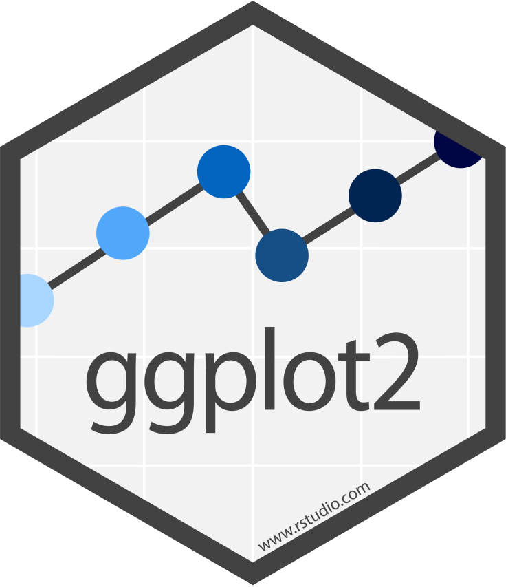

<style>
img.center {
    display: block;
    margin-left: auto;
    margin-right: auto;
}

img.float-left {
    float: left;
    margin: 20px;
}
</style>

```{r libraries, include=FALSE}
library(learnr)
library(gradethis)
library(digest)
```

```{r tidyverse-setup, include=FALSE}
library(tidyverse)
```

```{r setup, include=FALSE}
learnr::tutorial_options(
  exercise.timelimit = 15,
  exercise.checker = gradethis::grade_learnr,
  exercise.eval = FALSE
)
```

# Data Visualization with ggplot2

```{r, echo=FALSE, out.width="75%", out.extra="class='center'"}
knitr::include_graphics("images/data-science-explore.png")
```
<center>
Caption: Image from ["R for Data Science"](https://r4ds.had.co.nz/explore-intro.html)
</center>
<br>
A model of the data life cycle from the free online book ["R for Data Science"](https://r4ds.had.co.nz/explore-intro.html) is shown above. The whirlpool in the middle, besides making you dizzy I'm sure, is one of the most rewarding parts of the process - data exploration! There are some important take home points from the "Explore" portion of the diagram:
 
 (1) Data might require **transformation** before proper **visualization**.
 (2) It is best to visualize your data _before_ you do statistical analysis (also known as statistical modeling).
 (3) Rarely if ever will you complete this cycle only once.
 (4) Iterate towards perfection. In other words, don't worry about perfectly formatted publication quality graphs and results. Exploration should be full of fun and curiosity. Save the publication quality results for the "Communicate" step.

In the previous tutorial, [Data Manipulation with dplyr](https://mdllama.shinyapps.io/Data_Manipulation), you learned about the tidyverse package `dplyr` and how to use it to **Transform** your data. In this tutorial, we will introduce you to the tidyverse package `ggplot2`, showing you how to use it to **Visualize** your data.

## Introduction to ggplot2

```{r, echo=FALSE, out.height="100px",  out.extra="class='float-left'"}

```

> "ggplot2 is a system for declaratively creating graphics, based on The Grammar of Graphics. You provide the data, tell ggplot2 how to map variables to aesthetics, what graphical primitives to use, and it takes care of the details." <br> <span style="float:right;"> - tidyverse.org</span>
<div style="clear: both;"></div>

<div style="clear: both;"></div>

Using `ggplot2` for your data visualization needs is akin to using a powerful photo or image editor, like Adobe Photoshop. When using modern image editors, there is a common process and language: The end result is composed of *layers* of overlapping content, one layer drawn on top of the other, with each layer utilizing aesthetics like color, position, space, and shape. This same language and creation paradigm can be applied to creating plots from data, which is exactly what **The Grammar of Graphics** aims to do. We get the added awesomeness, however, of learning how to map raw data to the visual aesthetics that we see in the final plot.

Most of the time, part of this mapping of data to visual objects requires some type of *data manipulation* or transformation, as Figure 1 illustrates. In order to truly understand and interpret a visual representation of data, one must know exactly how data is modified and mapped to the resulting plot. Some plots, such as *scatter plots*, are a direct mapping of the data to the image, while others like the bar plot may require some data processing before constructing the plot (e.g. computing frequencies of occurrences of levels for a categorical variable).

With The Grammar of Graphics, we break down the creation of a data visualization into 5 main components:

1. **Data**: Data used for the plot
2. **Aesthetics**: Data generates geometric objects via _mapping_ data to general plot aesthetics (space, color, shape, size, etc.)
3. **Geoms**: Geometric objects, drawn in layers, that represent the data (points, lines, rectangles, curves, etc.)
4. **Coordinates**: Coordinate systems and their properties (cartesian, polar, aspect ratios, axes limits, etc.)
5. **Themes**: Non-data elements of the plot (gridlines, ticks, labels, etc.)

As mentioned above, one of the key ideas of _The Grammar of Graphics_ is that visualizations can be composed of multiple layers, with each layer consisting of data, aesthetics, and geometric objects. As mentioned in the 3rd edition of the book [_ggplot2: Elegant Graphics for Data Analysis_](https://ggplot2-book.org/), by Hadley Wickham, Danielle Navarro, and Thomas Lin Pedersen, it is useful to think of each layer of a plot displayed for a purpose:

 (1) Plot **raw data** to show unprocessed patterns and structures in the data.
 (2) Plot **statistical summaries** to show central tendencies, uncertainty quantification, and summarized trends in the data.
 (3) Plot **metadata** to show annotations and helpful content to aid the reader in understanding and interpretation.

We map data to geometric objects through _aesthetics_, which is the focus of the next chapter.

## Aesthetics

**Aesthetics** can be thought of as _dimensions_ of general plot objects. For example, the following rectangle has seven aesthetic dimensions: center coordinate (x and y), width, height, border color, box color, and border width.

```{r, echo=FALSE, out.height="200px",  out.extra="class='center'"}

```

The italicized words inside the parentheses correspond to aesthetic names used in `ggplot2`.

Here's our first `ggplot2` code that can display a rectangle just like this:

```{r, fig.align="center"}
ggplot() + 
  geom_tile(mapping = aes(x = 0, y = 0), 
            width = 20, 
            height = 10,
            color = "green", 
            fill = "red", 
            size = 10)
```

## Geoms

## Coordinates

## Themes
