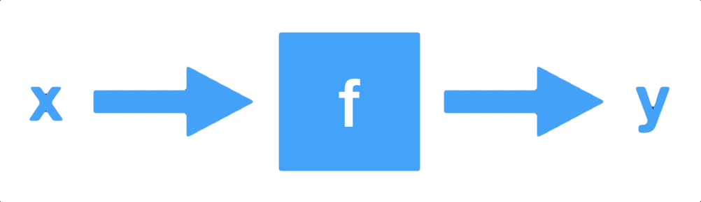
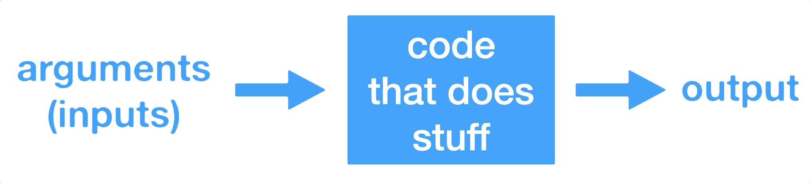
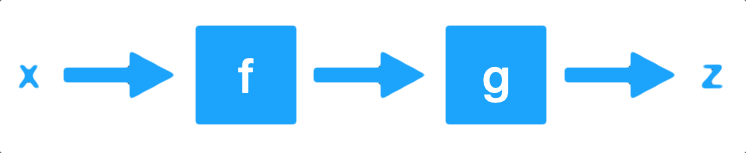
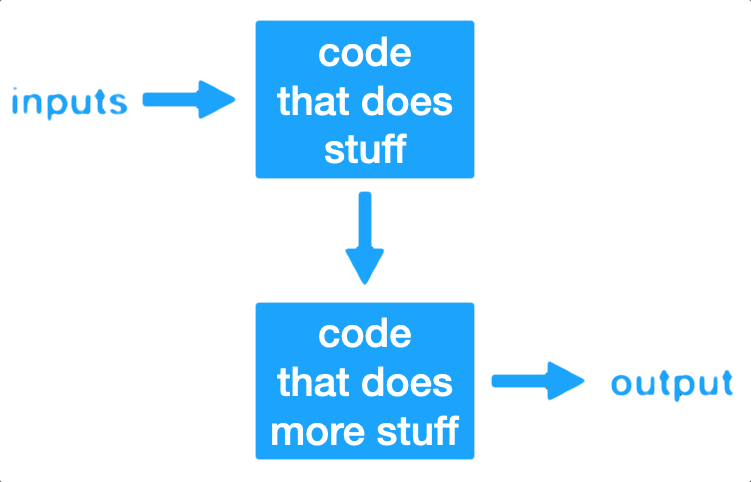

<style>
img.center {
    display: block;
    margin-left: auto;
    margin-right: auto;
}
</style>

```{r libraries, include=FALSE}
library(learnr)
library(gradethis)
library(digest)
```

```{r setup, include=FALSE}
learnr::tutorial_options(
  exercise.timelimit = 15,
  exercise.checker = gradethis::grade_learnr,
  exercise.eval = FALSE
)
```

# Intermediate R

Intermediate R is the next stop on your journey in mastering the R programming language. In this R training, you will learn about conditional statements, loops, and functions to power your own R scripts. Next, make your R code more efficient and readable using the apply functions. This course will allow you to take the next step in advancing your overall knowledge and capabilities while programming in R.

## Chap. 1: Conditionals and control flow

To be TRUE or not be TRUE, that's the question. In this chapter you'll learn about relational operators to see how R objects compare and logical operators to combine logicals. Next, you'll use this knowledge to build conditional statements.

### Equality and inequality

The most basic form of comparison is equality, denoted by "double equals", or `==`. Note the difference here between `==` and `=`: 

 - A single equal `=` is equivalent to the assignment operator `<-`.
 - A double equal `==` denotes a comparison.

When you see the expression `a == b`, think "Is a equal to b?"  The answer will be a Boolean - either `TRUE` (yes) or `FALSE` (no).

An inequality comparison is denoted by `!=`. If you see the expression `a != b`, read it as "Is a not equal to b?" The answer, as with the equality comparison, is a Boolean.

Here are some examples comparing different data types for equality and inequality:

#### Data type: Boolean

```{r}
TRUE == TRUE
TRUE != TRUE
```

```{r}
TRUE == FALSE
TRUE != FALSE
```

#### Data type: String

```{r}
"hello" == "goodbye"
"hello" != "goodbye"
```

#### Data type: Numeric

```{r}
3 == 2
3 != 2
```

The following statements all evaluate to `TRUE` (feel free to run the code).

```{r truthiness, exercise=TRUE}
3 == (2 + 1)
"intermediate" != "r"
TRUE != FALSE
"Rchitect" != "rchitect"
```

Notice from the last expression that R is case sensitive: "R" is not equal to "r". Keep this in mind when solving the exercises in this chapter!

#### Exercise 1: Comparison of logicals
*Write R code to see if* `TRUE` *equals* `FALSE`*.*

```{r truthiness-ex-1, exercise=TRUE}

```

```{r truthiness-ex-1-solution}
TRUE == FALSE
```

```{r truthiness-ex-1-check}
gradethis::grade_code()
```

#### Exercise 2: Comparison of numerics
*Check if* `-6 * 14` *is not equal to* `17 - 101`*.*

```{r truthiness-ex-2, exercise=TRUE}

```

```{r truthiness-ex-2-solution}
-6 * 14 != 17 - 101
```

```{r truthiness-ex-2-check}
gradethis::grade_code()
```

#### Exercise 3: Comparison of character strings
*Compare character strings by asking R whether the strings* `"useR"` *and* `"user"` *are equal.*

```{r truthiness-ex-3, exercise=TRUE}

```

```{r truthiness-ex-3-solution}
"useR" == "user"
```

```{r truthiness-ex-3-check}
gradethis::grade_code()
```

#### Exercise 4: Compare a logical with a numeric
*Find out what happens if you compare logicals to numerics: are* `TRUE` *and* `1` *equal?*

```{r truthiness-ex-4, exercise=TRUE}

```

```{r truthiness-ex-4-solution}
TRUE == 1
```

```{r truthiness-ex-4-check}
gradethis::grade_code("Since `TRUE` coerces to `1` under the hood, `TRUE == 1` evaluates to `TRUE`. Make sure not to mix up `==` (comparison) and `=` (assignment), `==` is needed to check the equality of R objects.")
```

### Greater and less than

Apart from equality operators, we also introduce the less than and greater than operators: `<` and `>`. You can also add an equal sign to express less than or equal to or greater than or equal to, respectively. As with the equality and inequality operators, the result is a Boolean.

Here are some examples:
```{r}
3 < 5
3 > 5
5 >= 3
3 >= 3
```

When comparing strings, alphabetical ordering is enforced!
```{r}
"Hello" > "Goodbye"
```

In the case of Booleans, TRUE is understood as 1, while FALSE is coerced to 0.
```{r}
TRUE < FALSE
```

Have a look at the following R expressions, that all evaluate to `FALSE` (feel free to change them to see what happens):

```{r grtorequ, exercise=TRUE}
(1 + 2) > 4
"dog" < "Cats"
TRUE <= FALSE
```

#### Exercise 1: Comparison of numerics
*Write R code to check whether* `-6 * 5 + 2` *is greater than or equal to* `-10 + 1`*.*

```{r grtorequ-ex-1, exercise=TRUE}

```

```{r grtorequ-ex-1-solution}
-6 * 5 + 2 >= -10 + 1
```

```{r grtorequ-ex-1-check}
gradethis::grade_code()
```

#### Exercise 2: Comparison of character strings
*Write R code to check whether* `"raining"` *is less than or equal to* `"raining dogs"`*.*

```{r grtorequ-ex-2, exercise=TRUE}

```

```{r grtorequ-ex-2-solution}
"raining" <= "raining dogs"
```

```{r grtorequ-ex-2-check}
gradethis::grade_code()
```

#### Exercise 3: Comparison of logicals
*Write R code to check whether* `TRUE` *is greater than* `FALSE`*. Before you run the code, take an educated guess at the answer!*

```{r grtorequ-ex-3, exercise=TRUE}

```

```{r grtorequ-ex-3-solution}
TRUE > FALSE
```

```{r grtorequ-ex-3-check}
gradethis::grade_code("Make sure to have a look at the console output to see if R returns the results you expected.")
```

### Compare vectors

You are already aware that R is very good with vectors. Without having to change anything about the syntax, R's relational operators also work on vectors.

To illustrate, suppose you want to figure out whether your activity on social media platforms have paid off and decide to look at your results for LinkedIn and Facebook. The code below initializes the vectors `linkedin` and `facebook`. Each of the vectors contains the number of profile views your LinkedIn and Facebook profiles had over the last seven days. 

```{r compare-vecs-setup}
linkedin <- c(16, 9, 13, 5, 2, 17, 14)
facebook <- c(17, 7, 5, 16, 8, 13, 14)
```

First, let's print the `linkedin` vector, then on the next line see when your LinkedIn activity was greater than 10.
```{r}
linkedin
linkedin > 10
```

Notice that the resulting comparison vector is a Boolean vector of the same length. The indices or positions that are `TRUE` denote days when your LinkedIn activity was greater than 10. The comparison operators will perform the comparison element-by-element.

If two vectors are of the same length, you can also compare a vector to another vector. This allows us to ask a question like "On what days was my LinkedIn activity greater than or equal to my Facebook activity?" Here's the code for that comparison:

```{r}
facebook <= linkedin
```

Again, you get a Boolean vector of the same length as the two vectors such that the ith value of the resulting vector is equal to `facebook[i] <= linkedin[i]`.

For the following exercises, the vectors `linkedin` and `facebook` will be already initialized and available in memory.

#### Exercise 1: Popular days
*Using relational operators, find a logical answer, i.e.* `TRUE` *or* `FALSE`*, for the following question: On which days did the number of LinkedIn profile views exceed 15?*

```{r compare-vecs-ex-1, exercise=TRUE, exercise.setup="compare-vecs-setup"}
# The linkedin and facebook vectors have already been created for you
```

```{r compare-vecs-ex-1-solution}
linkedin > 15
```

```{r compare-vecs-ex-1-check}
gradethis::grade_code()
```

#### Exercise 2: Quiet days 
*Using relational operators, find a logical answer, i.e.* `TRUE` *or* `FALSE`*, for the following question: When was your LinkedIn profile viewed only 5 times or fewer?*

```{r compare-vecs-ex-2, exercise=TRUE, exercise.setup="compare-vecs-setup"}

```

```{r compare-vecs-ex-2-solution}
linkedin <= 5
```

```{r compare-vecs-ex-2-check}
gradethis::grade_code()
```

#### Exercise 3: LinkedIn more popular than Facebook
*Using relational operators, find a logical answer, i.e.* `TRUE` *or* `FALSE`*, for the following question: When was your LinkedIn profile visited more often than your Facebook profile?*

```{r compare-vecs-ex-3, exercise=TRUE, exercise.setup="compare-vecs-setup"}

```

```{r compare-vecs-ex-3-solution}
linkedin > facebook
```

```{r compare-vecs-ex-3-check}
gradethis::grade_code("Have a look at the console output. Your LinkedIn profile was pretty popular on the sixth day, but less so on the fourth and fifth day.")
```

### Compare matrices

R's ability to deal with different data structures for comparisons does not stop at vectors. Matrices and relational operators also work together seamlessly!

Instead of in vectors (as in the previous exercise), the LinkedIn and Facebook data is now stored in a matrix called `views`. The first row contains the LinkedIn information; the second row the Facebook information. The original vectors `facebook` and `linkedin` are still available as well.

```{r compare-mats-setup}
# The social data has been created for you
linkedin <- c(16, 9, 13, 5, 2, 17, 14)
facebook <- c(17, 7, 5, 16, 8, 13, 14)
views <- matrix(c(linkedin, facebook), nrow = 2, byrow = TRUE)
views
```

#### Exercise 1: When does views equal 13?
*Using the relational operators you've learned so far, try to discover the following: When were the views exactly equal to 13? Use the* `views` *matrix to return a logical matrix.*

```{r compare-mats-ex-1, exercise=TRUE, exercise.setup="compare-mats-setup"}

```

```{r compare-mats-ex-1-solution}
views == 13
```

```{r compare-mats-ex-1-check}
gradethis::grade_code()
```

#### Exercise 2: When is views less than or equal to 14?
*Using the relational operators you've learned so far, try to discover the following: For which days were the number of views less than or equal to 14? Again, have R return a logical matrix.*

```{r compare-mats-ex-2, exercise=TRUE, exercise.setup="compare-mats-setup"}

```

```{r compare-mats-ex-2-solution}
views <= 14
```

```{r compare-mats-ex-2-check}
gradethis::grade_code("This exercise concludes the part on comparators. Now that you know how to query the relation between R objects, the next step will be to use the results to alter the behavior of your programs. Find out all about that in the next video!")
```

### Logical Operators: AND (`&`), OR (`|`) and NOT (`!`)

Whereas relational operators (`<`, `>`, `<=`, `>=`, `==`, `!=`) compare two data types and return a Boolean, logical operators (such as AND, OR, and NOT) take two Booleans and return another Boolean. The notation in R for these logical operators are:

 - `&` is the AND operator
 - `|` is the OR operator
 - `!` is the NOT operator
 
You already saw the `!` notation with `!=`, which is read "not equals".

The logical rules for these operators are:

*A AND B is TRUE if and only if A is TRUE and B is TRUE.  Otherwise, A AND B is FALSE*.
 
```{r}
TRUE & TRUE
TRUE & FALSE
FALSE & TRUE
FALSE & FALSE
```

*A OR B is TRUE if and only if either A is TRUE or B is TRUE.  Otherwise, A OR B is FALSE*
 
```{r}
TRUE | TRUE
TRUE | FALSE
FALSE | TRUE
FALSE | FALSE
```

*NOT FALSE is TRUE and NOT TRUE is FALSE, i.e. the NOT operator simply results in the opposite.*

```{r}
!FALSE
!TRUE
```

You can combine these logical operators with the relational operators to make more complicated expressions.

```{r}
x <- 12
x > 5 & x < 15 # Is x in interval (5, 15)?

x <- 17
x > 5 & x < 15

y <- 4
y < 5 | y > 15 # Is y in intervals (-Inf, 5) or (15, Inf)?

y <- 14
y < 5 | y > 15
```

Note that all these expressions are equivalent:
```{r}
x <- 12

!(x > 5 & x < 15)
!(x > 5) | !(x < 15)
x <= 5 | x >= 15
```

Before you work your way through the next exercises, have a look at the following R expressions. All of them will evaluate to `TRUE`:

```{r and-or, exercise=TRUE}
TRUE & TRUE
FALSE | TRUE
5 <= 5 & 2 < 3
3 < 4 | 7 < 6
```

**Watch out**: `3 < x < 7` to check if `x` is between 3 and 7 will not work; you'll need `3 < x & x < 7` for that.

In this exercise, you'll be working with the `last` variable. This variable equals the last value of the `linkedin` vector that you've worked with previously. The `linkedin` vector represents the number of LinkedIn views your profile had in the last seven days, remember? Both the variables `linkedin` and `last` have already been defined in the editor.

```{r and-or-setup}
# The linkedin and last variable are already defined for you
linkedin <- c(16, 9, 13, 5, 2, 17, 14)
last <- tail(linkedin, 1)
```

#### Exercise 1: Is last under 5 or above 10?
*Write R code to determine if* `last` *is under 5 or above 10.*

```{r and-or-ex-1, exercise=TRUE, exercise.setup="and-or-setup"}

```

```{r and-or-ex-1-solution}
last < 5 | last > 10
```

```{r and-or-ex-1-check}
gradethis::grade_code()
```

#### Exercise 2: Is last between 15 (exclusive) and 20 (inclusive)?
*Write R code to determine if* `last` *is between 15 and 20 (excluding 15 but including 20).*

```{r and-or-ex-2, exercise=TRUE, exercise.setup="and-or-setup"}

```

```{r and-or-ex-2-solution}
last > 15 & last <= 20
```

```{r and-or-ex-2-check}
gradethis::grade_code("Have one last look at the console before proceeding; do the results of the different expressions make sense?")
```

### Logical Operators: Vectorized!

Like relational operators, logical operators work perfectly fine with vectors and matrices. The `&`, `|`, and `!` operators work on vectors and matrices "element-wise". For example, if `A` and `B` are vectors and `C == A & B`, then `C[i] == A[i] & B[i]`. What do you think you would get from the following? Take an educated guess before running the code!

```{r vec-op, exercise=TRUE}
c(TRUE, TRUE, FALSE) & c(TRUE, FALSE, FALSE)
c(TRUE, TRUE, FALSE) | c(TRUE, FALSE, FALSE)
!c(TRUE, TRUE, FALSE)
```

Both the vectors `linkedin` and `facebook` are available again. Also a matrix - `views` - has been defined; its first and second row correspond to the `linkedin` and `facebook` vectors, respectively. Ready for some advanced queries to gain more insights into your social outreach?

```{r and-or-vec-mat-setup}
# The social data (linkedin, facebook, views) has been created for you
linkedin <- c(16, 9, 13, 5, 2, 17, 14)
facebook <- c(17, 7, 5, 16, 8, 13, 14)
views <- matrix(c(linkedin, facebook), nrow = 2, byrow = TRUE)
```

#### Exercise 1: `linkedin` exceeds 10 but `facebook` below 10
*When did LinkedIn views exceed 10 and did Facebook views fail to reach 10 for a particular day? Use the* `linkedin` *and* `facebook` *vectors.*

```{r and-or-vec-mat-ex-1, exercise=TRUE, exercise.setup="and-or-vec-mat-setup"}

```

```{r and-or-vec-mat-ex-1-solution}
linkedin > 10 & facebook < 10
```

```{r and-or-vec-mat-ex-1-check}
gradethis::grade_code("You'll have noticed how easy it is to use logical operators to vectors and matrices. What do these results tell us? The third day of the recordings was the only day where your LinkedIn profile was visited more than 10 times, while your Facebook profile wasn't. Can you draw similar conclusions for the results of the next two exercises?")
```

#### Exercise 2: When were one or both visited at least 12 times?
*When were one or both of your LinkedIn and Facebook profiles visited at least 12 times?*

```{r and-or-vec-mat-ex-2, exercise=TRUE, exercise.setup="and-or-vec-mat-setup"}

```

```{r and-or-vec-mat-ex-2-solution}
linkedin >= 12 | facebook >= 12
```

```{r and-or-vec-mat-ex-2-check}
gradethis::grade_code()
```

#### Exercise 3: When is views between 11 (exclusive) and 14 (inclusive)?
*When is the* `views` *matrix equal to a number between 11 and 14, excluding 11 and including 14?*

```{r and-or-vec-mat-ex-3, exercise=TRUE, exercise.setup="and-or-vec-mat-setup"}

```

```{r and-or-vec-mat-ex-3-solution}
views > 11 & views <= 14
```

```{r and-or-vec-mat-ex-3-check}
gradethis::grade_code()
```

### Reverse the result: !

On top of the `&` and `|` operators, you also learned about the `!` operator, which negates a logical value. To refresh your memory, here are some R expressions that use `!`. They all evaluate to `FALSE`:

```{r not, exercise=TRUE}
!TRUE
!(5 > 3)
!!FALSE
```

```{r not-qu, echo=FALSE}
question(
  sprintf("What would the following set of R expressions return?\n
    x <- 5
    y <- 7
    !(!(x < 4) & !!!(y > 12))
    "),
  answer("TRUE"),
  answer("FALSE", correct = TRUE),
  answer("Running this piece of code would throw an error.")
)
```

### Blend it all together

With the things you've learned by now, you're able to solve pretty cool problems.

Instead of recording the number of views for your own LinkedIn profile, suppose you conducted a survey inside the company you're working for. You've asked every employee with a LinkedIn profile how many visits their profile has had over the past seven days. You stored the results in a data frame called `li_df`. This data frame is available in the workspace; type `li_df` in the console to check it out.

```{r blend-setup, echo=FALSE}
# Constructing the li_df data frame
employee_1 <- c(2, 3, 3, 6, 4, 2, 0)
employee_2 <- c(19, 23, 18, 22, 23, 29, 25)
employee_3 <- c(24, 18, 15, 19, 18, 22, 17)
employee_4 <- c(22, 18, 27, 26, 19, 21, 25)
employee_5 <- c(25, 25, 26, 31, 24, 36, 37)
employee_6 <- c(22, 20, 29, 26, 23, 22, 29)
employee_7 <- c(0, 4, 2, 2, 3, 4, 2)
employee_8 <- c(12, 3, 15, 7, 1, 15, 11)
employee_9 <- c(19, 22, 22, 19, 25, 24, 23)
employee_10 <- c(23, 12, 19, 25, 18, 22, 22)
employee_11 <- c(29, 27, 23, 25, 29, 30, 17)
employee_12 <- c(13, 13, 20, 17, 12, 22, 20)
employee_13 <- c(7, 17, 9, 5, 11, 9, 9)
employee_14 <- c(26, 27, 28, 36, 29, 31, 30)
employee_15 <- c(7, 6, 4, 11, 5, 5, 15)
employee_16 <- c(32, 35, 31, 35, 24, 25, 36)
employee_17 <- c(7, 17, 9, 12, 13, 6, 12)
employee_18 <- c(9, 6, 3, 12, 3, 8, 6)
employee_19 <- c(0, 1, 11, 6, 0, 4, 11)
employee_20 <- c(9, 12, 6, 13, 12, 13, 11)
employee_21 <- c(6, 15, 15, 10, 9, 7, 18)
employee_22 <- c(17, 17, 12, 4, 14, 17, 7)
employee_23 <- c(1, 12, 8, 2, 4, 4, 11)
employee_24 <- c(5, 8, 0, 1, 6, 3, 1)
employee_25 <- c(2, 7, 5, 3, 1, 5, 5)
employee_26 <- c(29, 25, 32, 28, 28, 27, 27)
employee_27 <- c(17, 15, 17, 23, 23, 17, 22)
employee_28 <- c(26, 32, 33, 30, 33, 28, 26)
employee_29 <- c(27, 29, 24, 29, 26, 31, 28)
employee_30 <- c(4, 1, 1, 2, 1, 7, 4)
employee_31 <- c(22, 22, 17, 20, 14, 19, 13)
employee_32 <- c(9, 11, 7, 10, 8, 15, 5)
employee_33 <- c(6, 5, 12, 5, 17, 17, 4)
employee_34 <- c(18, 17, 12, 22, 22, 13, 12)
employee_35 <- c(2, 12, 13, 7, 10, 6, 2)
employee_36 <- c(32, 26, 20, 23, 24, 25, 21)
employee_37 <- c(5, 13, 12, 11, 6, 5, 10)
employee_38 <- c(6, 10, 11, 6, 6, 2, 5)
employee_39 <- c(30, 37, 32, 35, 37, 41, 42)
employee_40 <- c(34, 33, 32, 35, 33, 27, 35)
employee_41 <- c(15, 19, 21, 18, 22, 26, 22)
employee_42 <- c(28, 29, 30, 19, 21, 19, 26)
employee_43 <- c(6, 8, 6, 7, 17, 11, 14)
employee_44 <- c(17, 22, 27, 24, 18, 28, 24)
employee_45 <- c(6, 10, 17, 18, 13, 10, 7)
employee_46 <- c(18, 19, 22, 17, 21, 15, 23)
employee_47 <- c(21, 27, 28, 28, 26, 17, 25)
employee_48 <- c(10, 18, 20, 18, 12, 19, 17)
employee_49 <- c(6, 15, 15, 15, 10, 14, 2)
employee_50 <- c(30, 28, 29, 31, 24, 20, 25)

li_df <- c(employee_1, employee_2, employee_3, employee_4, employee_5, 
           employee_6, employee_7, employee_8, employee_9, employee_10, 
           employee_11, employee_12, employee_13, employee_14, employee_15, 
           employee_16, employee_17, employee_18, employee_19, employee_20, 
           employee_21, employee_22, employee_23, employee_24, employee_25, 
           employee_26, employee_27, employee_28, employee_29, employee_30, 
           employee_31, employee_32, employee_33, employee_34, employee_35, 
           employee_36, employee_37, employee_38, employee_39, employee_40, 
           employee_41, employee_42, employee_43, employee_44, employee_45, 
           employee_46, employee_47, employee_48, employee_49, employee_50)

li_df <- matrix(li_df, nrow = 50, byrow = TRUE)

colnames(li_df) <- c("day1", "day2", "day3", "day4", "day5", "day6", "day7")

li_df <- data.frame(li_df)
```

```{r blend-ex-0, exercise=TRUE, exercise.setup="blend-setup"}

```

#### Exercise 1: Select the second column, named `day2`, from `li_df`: second
*Select the entire second column, named* `day2`*, from the* `li_df` *data frame as a vector and assign it to a new variable* `second`*.*

```{r blend-ex-1, exercise=TRUE, exercise.setup="blend-setup"}

```

```{r blend-ex-1-solution}
second <- li_df[, 2]
```

```{r blend-ex-1-check}
gradethis::grade_result(
  gradethis::pass_if(~identical(second, li_df[, 2]))
)
```

#### Exercise 2: Build a logical vector, TRUE if value in second is extreme: extremes
*Use* `second` *to create a logical vector, that contains* `TRUE` *if the corresponding number of views is strictly greater than 25 or strictly lower than 5 and* `FALSE` *otherwise. Store this logical vector as* `extremes`*.*

```{r blend-ex-2-setup, echo=FALSE}
# Constructing the li_df data frame
employee_1 <- c(2, 3, 3, 6, 4, 2, 0)
employee_2 <- c(19, 23, 18, 22, 23, 29, 25)
employee_3 <- c(24, 18, 15, 19, 18, 22, 17)
employee_4 <- c(22, 18, 27, 26, 19, 21, 25)
employee_5 <- c(25, 25, 26, 31, 24, 36, 37)
employee_6 <- c(22, 20, 29, 26, 23, 22, 29)
employee_7 <- c(0, 4, 2, 2, 3, 4, 2)
employee_8 <- c(12, 3, 15, 7, 1, 15, 11)
employee_9 <- c(19, 22, 22, 19, 25, 24, 23)
employee_10 <- c(23, 12, 19, 25, 18, 22, 22)
employee_11 <- c(29, 27, 23, 25, 29, 30, 17)
employee_12 <- c(13, 13, 20, 17, 12, 22, 20)
employee_13 <- c(7, 17, 9, 5, 11, 9, 9)
employee_14 <- c(26, 27, 28, 36, 29, 31, 30)
employee_15 <- c(7, 6, 4, 11, 5, 5, 15)
employee_16 <- c(32, 35, 31, 35, 24, 25, 36)
employee_17 <- c(7, 17, 9, 12, 13, 6, 12)
employee_18 <- c(9, 6, 3, 12, 3, 8, 6)
employee_19 <- c(0, 1, 11, 6, 0, 4, 11)
employee_20 <- c(9, 12, 6, 13, 12, 13, 11)
employee_21 <- c(6, 15, 15, 10, 9, 7, 18)
employee_22 <- c(17, 17, 12, 4, 14, 17, 7)
employee_23 <- c(1, 12, 8, 2, 4, 4, 11)
employee_24 <- c(5, 8, 0, 1, 6, 3, 1)
employee_25 <- c(2, 7, 5, 3, 1, 5, 5)
employee_26 <- c(29, 25, 32, 28, 28, 27, 27)
employee_27 <- c(17, 15, 17, 23, 23, 17, 22)
employee_28 <- c(26, 32, 33, 30, 33, 28, 26)
employee_29 <- c(27, 29, 24, 29, 26, 31, 28)
employee_30 <- c(4, 1, 1, 2, 1, 7, 4)
employee_31 <- c(22, 22, 17, 20, 14, 19, 13)
employee_32 <- c(9, 11, 7, 10, 8, 15, 5)
employee_33 <- c(6, 5, 12, 5, 17, 17, 4)
employee_34 <- c(18, 17, 12, 22, 22, 13, 12)
employee_35 <- c(2, 12, 13, 7, 10, 6, 2)
employee_36 <- c(32, 26, 20, 23, 24, 25, 21)
employee_37 <- c(5, 13, 12, 11, 6, 5, 10)
employee_38 <- c(6, 10, 11, 6, 6, 2, 5)
employee_39 <- c(30, 37, 32, 35, 37, 41, 42)
employee_40 <- c(34, 33, 32, 35, 33, 27, 35)
employee_41 <- c(15, 19, 21, 18, 22, 26, 22)
employee_42 <- c(28, 29, 30, 19, 21, 19, 26)
employee_43 <- c(6, 8, 6, 7, 17, 11, 14)
employee_44 <- c(17, 22, 27, 24, 18, 28, 24)
employee_45 <- c(6, 10, 17, 18, 13, 10, 7)
employee_46 <- c(18, 19, 22, 17, 21, 15, 23)
employee_47 <- c(21, 27, 28, 28, 26, 17, 25)
employee_48 <- c(10, 18, 20, 18, 12, 19, 17)
employee_49 <- c(6, 15, 15, 15, 10, 14, 2)
employee_50 <- c(30, 28, 29, 31, 24, 20, 25)

li_df <- c(employee_1, employee_2, employee_3, employee_4, employee_5, 
           employee_6, employee_7, employee_8, employee_9, employee_10, 
           employee_11, employee_12, employee_13, employee_14, employee_15, 
           employee_16, employee_17, employee_18, employee_19, employee_20, 
           employee_21, employee_22, employee_23, employee_24, employee_25, 
           employee_26, employee_27, employee_28, employee_29, employee_30, 
           employee_31, employee_32, employee_33, employee_34, employee_35, 
           employee_36, employee_37, employee_38, employee_39, employee_40, 
           employee_41, employee_42, employee_43, employee_44, employee_45, 
           employee_46, employee_47, employee_48, employee_49, employee_50)

li_df <- matrix(li_df, nrow = 50, byrow = TRUE)

colnames(li_df) <- c("day1", "day2", "day3", "day4", "day5", "day6", "day7")

li_df <- data.frame(li_df)

second <- li_df[, 2]
```

```{r blend-ex-2, exercise=TRUE, exercise.setup="blend-ex-2-setup"}

```

```{r blend-ex-2-solution}
extremes <- second > 25 | second < 5
```

```{r blend-ex-2-check}
gradethis::grade_result(
  gradethis::pass_if(~identical(extremes, second > 25 | second < 5))
)
```

#### Exercise 3: Count the number of TRUEs in extremes
*Use* `sum()` *on the* `extremes` *vector to calculate the number of* `TRUE`*s in extremes (i.e. to calculate the number of employees that are either very popular or very low-profile). Simply print this number to the console.*

```{r blend-ex-3-setup, echo=FALSE}
# Constructing the li_df data frame
employee_1 <- c(2, 3, 3, 6, 4, 2, 0)
employee_2 <- c(19, 23, 18, 22, 23, 29, 25)
employee_3 <- c(24, 18, 15, 19, 18, 22, 17)
employee_4 <- c(22, 18, 27, 26, 19, 21, 25)
employee_5 <- c(25, 25, 26, 31, 24, 36, 37)
employee_6 <- c(22, 20, 29, 26, 23, 22, 29)
employee_7 <- c(0, 4, 2, 2, 3, 4, 2)
employee_8 <- c(12, 3, 15, 7, 1, 15, 11)
employee_9 <- c(19, 22, 22, 19, 25, 24, 23)
employee_10 <- c(23, 12, 19, 25, 18, 22, 22)
employee_11 <- c(29, 27, 23, 25, 29, 30, 17)
employee_12 <- c(13, 13, 20, 17, 12, 22, 20)
employee_13 <- c(7, 17, 9, 5, 11, 9, 9)
employee_14 <- c(26, 27, 28, 36, 29, 31, 30)
employee_15 <- c(7, 6, 4, 11, 5, 5, 15)
employee_16 <- c(32, 35, 31, 35, 24, 25, 36)
employee_17 <- c(7, 17, 9, 12, 13, 6, 12)
employee_18 <- c(9, 6, 3, 12, 3, 8, 6)
employee_19 <- c(0, 1, 11, 6, 0, 4, 11)
employee_20 <- c(9, 12, 6, 13, 12, 13, 11)
employee_21 <- c(6, 15, 15, 10, 9, 7, 18)
employee_22 <- c(17, 17, 12, 4, 14, 17, 7)
employee_23 <- c(1, 12, 8, 2, 4, 4, 11)
employee_24 <- c(5, 8, 0, 1, 6, 3, 1)
employee_25 <- c(2, 7, 5, 3, 1, 5, 5)
employee_26 <- c(29, 25, 32, 28, 28, 27, 27)
employee_27 <- c(17, 15, 17, 23, 23, 17, 22)
employee_28 <- c(26, 32, 33, 30, 33, 28, 26)
employee_29 <- c(27, 29, 24, 29, 26, 31, 28)
employee_30 <- c(4, 1, 1, 2, 1, 7, 4)
employee_31 <- c(22, 22, 17, 20, 14, 19, 13)
employee_32 <- c(9, 11, 7, 10, 8, 15, 5)
employee_33 <- c(6, 5, 12, 5, 17, 17, 4)
employee_34 <- c(18, 17, 12, 22, 22, 13, 12)
employee_35 <- c(2, 12, 13, 7, 10, 6, 2)
employee_36 <- c(32, 26, 20, 23, 24, 25, 21)
employee_37 <- c(5, 13, 12, 11, 6, 5, 10)
employee_38 <- c(6, 10, 11, 6, 6, 2, 5)
employee_39 <- c(30, 37, 32, 35, 37, 41, 42)
employee_40 <- c(34, 33, 32, 35, 33, 27, 35)
employee_41 <- c(15, 19, 21, 18, 22, 26, 22)
employee_42 <- c(28, 29, 30, 19, 21, 19, 26)
employee_43 <- c(6, 8, 6, 7, 17, 11, 14)
employee_44 <- c(17, 22, 27, 24, 18, 28, 24)
employee_45 <- c(6, 10, 17, 18, 13, 10, 7)
employee_46 <- c(18, 19, 22, 17, 21, 15, 23)
employee_47 <- c(21, 27, 28, 28, 26, 17, 25)
employee_48 <- c(10, 18, 20, 18, 12, 19, 17)
employee_49 <- c(6, 15, 15, 15, 10, 14, 2)
employee_50 <- c(30, 28, 29, 31, 24, 20, 25)

li_df <- c(employee_1, employee_2, employee_3, employee_4, employee_5, 
           employee_6, employee_7, employee_8, employee_9, employee_10, 
           employee_11, employee_12, employee_13, employee_14, employee_15, 
           employee_16, employee_17, employee_18, employee_19, employee_20, 
           employee_21, employee_22, employee_23, employee_24, employee_25, 
           employee_26, employee_27, employee_28, employee_29, employee_30, 
           employee_31, employee_32, employee_33, employee_34, employee_35, 
           employee_36, employee_37, employee_38, employee_39, employee_40, 
           employee_41, employee_42, employee_43, employee_44, employee_45, 
           employee_46, employee_47, employee_48, employee_49, employee_50)

li_df <- matrix(li_df, nrow = 50, byrow = TRUE)

colnames(li_df) <- c("day1", "day2", "day3", "day4", "day5", "day6", "day7")

li_df <- data.frame(li_df)

second <- li_df[, 2]

extremes <- second > 25 | second < 5
```

```{r blend-ex-3, exercise=TRUE, exercise.setup="blend-ex-3-setup"}

```

```{r blend-ex-3-solution}
sum(extremes)
```

```{r blend-ex-3-check}
gradethis::grade_result(
  gradethis::pass_if(~identical(.result, sum(extremes)))
)
```

#### Challenge: Solve it with a one-liner
*Write one line of R code that performs all of Exercises 1-3.*

```{r blend-ex-4, exercise=TRUE, exercise.setup="blend-setup"}

```

```{r blend-ex-4-solution}
sum(li_df[, 2] > 25 | li_df[, 2] < 5)
```

```{r blend-ex-4-check}
gradethis::grade_code("This one liner illustrates that you may or may not need to store the second column as an intermediate variable if you only need to use it once. Head over to the next section and learn how relational and logical operators can be used to alter the flow of your R scripts.")
```

### Conditional statements: The if statement

Sometimes you have some code that should only be run if a certain condition is met. An *if statement* achieves this, with its syntax in R given by:
```{r, eval=FALSE}
if (condition) {
  # Conditional code that runs only if condition is TRUE
}
```
Run the following code, then change the value of `x` so that the conditional code does not run.
```{r neg-ex, exercise=TRUE}
x <- -3
if (x < 0) {
  print("x is a negative number")
}
```

Remember your vectors with social profile views? Let's look at it from another angle. The `medium` variable gives information about the social website; the `num_views` variable denotes the actual number of views that particular `medium` had on the last day of your recordings. Both these variables have already been defined in the editor.

```{r if-setup}
# Variables related to your last day of recordings
medium <- "LinkedIn"
num_views <- 14
```

#### Exercise 1: Examine the if statement for `medium`
*Examine the* `if` *statement that prints out "Showing LinkedIn information" if the* `medium` *variable equals "LinkedIn".*

```{r if-ex-1, exercise=TRUE, exercise.setup="if-setup"}
if (medium == "LinkedIn") {
  print("Showing LinkedIn information")
}
```

#### Exercise 2: Write the if statement for `num_views`
*Code an* `if` *statement that prints "You're popular!" to the console if the num_views variable exceeds 15.*

```{r if-ex-2, exercise=TRUE, exercise.setup="if-setup"}

```

```{r if-ex-2-solution}
if (num_views > 15) {
  print("You're popular!")
}
```

```{r if-ex-2-check}
gradethis::grade_code("Try to see what happens if you change the `medium` and `num_views` variables and run your code again. Let's further customize these if statements in the next exercise.")
```

### Add an else

You can only use an `else` statement in combination with an `if` statement. The `else` statement does not require a condition; its corresponding code is simply run if all of the preceding conditions in the control structure are `FALSE`. Let's look at the previous example again that printed out `x is a negative number` when `x` was negative:
```{r}
x <- -3
if (x < 0) {
  print("x is a negative number")
}
```
When `x` is non-negative, nothing gets printed. Wouldn't it be better to print something in this case? This is where the `else` statement comes into play. Here is its syntax:
```{r, eval=FALSE}
if (condition) {
  # Run this code if condition is TRUE
} else {
  # Run this code if condition is FALSE
}
```
Now we have another piece of code that gets run only when `condition` is FALSE! Here's the example above with relavent information printed when `x` is non-negative. Run the code, then change the value of `x` so that the code in the `else` block is run.
```{r else-ex, exercise=TRUE}
x <- -3
if (x < 0) {
  print("x is a negative number")
} else {
  print("x is either a positive number or zero")
}
```

*It's important that the* `else` *keyword comes on the same line as the closing bracket of the* `if` *part!*

In the next exercises, both `if` statements that you coded in previous exercises will be available in the editor. It's now up to you to extend them with the appropriate `else` statements!

We'll start with the same setup as before:
```{r else-setup}
# Variables related to your last day of recordings
medium <- "LinkedIn"
num_views <- 14
```

#### Exercise 1: Control structure for `medium`
*Add an else statement such that "Unknown medium" gets printed out to the console when the if-condition on* `medium` *does not hold.*

```{r else-ex-1, exercise=TRUE, exercise.setup="else-setup"}
if (medium == "LinkedIn") {
  print("Showing LinkedIn information")
}
```

```{r else-ex-1-solution}
if (medium == "LinkedIn") {
  print("Showing LinkedIn information")
} else {
  print("Unknown medium")
}
```

```{r else-ex-1-check}
gradethis::grade_code()
```

#### Exercise 2: Control structure for num_views
*Add an else statement such that R prints out "Try to be more visible!" when the if-condition on* `num_views` *is not met.*

```{r else-ex-2, exercise=TRUE, exercise.setup="else-setup"}
if (num_views > 15) {
  print("You're popular!")
}
```

```{r else-ex-2-solution}
if (num_views > 15) {
  print("You're popular!")
} else {
  print("Try to be more visible!")
}
```

```{r else-ex-2-check}
gradethis::grade_code("You also had Facebook information available, remember? Time to add some more statements to our control structures using `else if`!")
```

### Customize further: else if

The `else if` statement allows you to further customize your control structure. You can add as many `else if` statements as you like. Keep in mind that R ignores the remainder of the control structure once a condition has been found that is `TRUE` and the corresponding expressions have been executed. Here's an overview of the syntax:

```{r, eval=FALSE}
if (condition1) {
  # Run this code if condition1 is TRUE
} else if (condition2) {
  # Run this code if condition1 is FALSE and condition2 is TRUE
} else if (condition3) {
  # Run this code if both condition1 and condition2 are FALSE but condition3 is TRUE
} else {
  # Run this code otherwise, i.e. all of the above conditions are FALSE
}
```
Using our previous example checking the values of `x`, what if we wanted to separate out the case when `x` was zero? This is an example where the `else if` statement can be helpful. Here's the example - as before, run it and change the value of `x` so that each case occurs (i.e. x is positive, zero, and negative). *Note: You may get an error that says "unexpected symbol 'if'" - this is a bug! Please ignore it.*
```{r else-if-ex, exercise=TRUE}
x <- -3
if (x < 0) {
  print("x is a negative number")
} else if (x == 0) {
  print("x is zero")
} else {
  print("x is either a positive number or zero")
}
```
*It's important that the* `else if` *keywords comes on the same line as the closing bracket of the previous part of the control construct!*

Let's do one more example before jumping into some exercises. This example introduces you to the `%%` operator, which is called the *modulo* or *remainder* operator. Remember your fractions? Here's a quick refresher:
$$
\frac{5}{3} = 1 \ \textrm{with remainder} \ 2 \ = 1\frac{2}{3}
$$
The modulo, or remainder, operator `%%` gives us the remainder after division! Run the code below illustrating the example above - feel free to try other numbers!
```{r modulo-ex, exercise=TRUE}
5 %% 3
```
*Note that you can use the modulo operator to test if a number is divisible by another number. If a number x is divisible by another number y, then the remainder will be 0. Change the two numbers in the code editor below so that the remainder is zero.*
```{r modulo-ex-other, exercise=TRUE}
5 %% 3
```

```{r modulo-ex-other-check}
gradethis::grade_result(
  gradethis::pass_if(~identical(.result, 0))
)
```

Here is one more example showing combining the modulo operator with a if/else if/else code block. Again, feel free to change `x` to see how the results changes.
```{r if-else-elseif-ex, exercise=TRUE}
x <- 6

if (x %% 2 == 0) {
  print("x is divisible by 2")
} else if (x %% 3 == 0) {
  print("x is divisible by 3")
} else {
  print("x is not divisible by 2 nor by 3...")
}
```

Time for some more exercises! We start again with the following variables pre-defined:
```{r else-if-setup}
# Variables related to your last day of recordings
medium <- "LinkedIn"
num_views <- 14
```

#### Exercise 1: Control structure for medium
*Add code to both control structures such that R prints out "Showing Facebook information" if* `medium` *is equal to "Facebook". Remember that R is case sensitive! Feel free to change the variable* `medium` *to see how the control structure responds. The existing code should be extended in the* `else if` *statement. No existing code should be modified.*

```{r else-if-ex-1, exercise=TRUE, exercise.setup="else-if-setup"}
if (medium == "LinkedIn") {
  print("Showing LinkedIn information")
} else {
  print("Unknown medium")
}
```

```{r else-if-ex-1-solution}
if (medium == "LinkedIn") {
  print("Showing LinkedIn information")
} else if (medium == "Facebook") {
  print("Showing Facebook information")
} else {
  print("Unknown medium")
}
```

```{r else-if-ex-1-check}
gradethis::grade_code()
```

#### Exercise 2: Control structure for num_views
*Add code to both control structures such that "Your number of views is average" is printed if* `num_views` *is between 15 (inclusive) and 10 (exclusive). Feel free to change the variable* `num_views` *to see how the control structure responds. The existing code should be extended in the* `else if` *statement. No existing code should be modified.*

```{r else-if-ex-2, exercise=TRUE, exercise.setup="else-if-setup"}
if (num_views > 15) {
  print("You're popular!")
} else {
  print("Try to be more visible!")
}
```

```{r else-if-ex-2-solution}
if (num_views > 15) {
  print("You're popular!")
} else if (num_views <= 15 & num_views > 10) {
  print("Your number of views is average")
} else {
  print("Try to be more visible!")
}
```

```{r else-if-ex-2-check}
gradethis::grade_code("Because R abandons the control flow as soon as it finds a condition that is met, you can simplify the condition for the `else if` part in the second construct to `num_views > 10`.")
```

### Else if 2.0

You can do anything you want inside if-else constructs. You can even put in another set of conditional statements. Examine the following code chunk:

```{r, eval=FALSE}
if (number < 10) {
  if (number < 5) {
    result <- "extra small"
  } else {
    result <- "small"
  }
} else if (number < 100) {
  result <- "medium"
} else {
  result <- "large"
}
print(result)
```

```{r if-else-qu, echo=FALSE}
question("Select all true statements below.",
  answer('If `number` is set to 6, "small" gets printed to the console.', correct = TRUE),
  answer('If `number` is set to 100, R prints out "medium".'),
  answer('If `number` is set to 4, "extra small" gets printed out to the console.', correct = TRUE),
  answer('If `number` is set to 2500, R will generate an error, as `result` will not be defined.')
)
```

**If you got this one right, the next exercise will be a piece of cake.**

### Take control!

In this exercise, you will combine everything that you've learned so far: relational operators, logical operators and control constructs. You'll need it all!

In the editor, we've coded two values beforehand: `li` and `fb`, denoting the number of profile views your LinkedIn and Facebook profile had on the last day of recordings. Go through the instructions to create R code that generates a 'social media score', `sms`, based on the values of `li` and `fb`.

```{r control-setup}
# Variables related to your last day of recordings
li <- 15
fb <- 9
```

#### Exercise 1: Control-flow construct
*Finish the control-flow construct with the following behavior:*

* *If both* `li` *and* `fb` *are 15 or higher, set* `sms` *equal to double the sum of* `li` *and* `fb`*.*
* *If both* `li` *and* `fb` *are strictly below 10, set* `sms` *equal to half the sum of* `li` *and* `fb`*.*
* *In all other cases, set* `sms` *equal to* `li + fb`*.*
* *Finally, print the resulting* `sms` *variable to the console.*

```{r control-ex-1, exercise=TRUE, exercise.setup="control-setup"}

```

```{r control-ex-1-solution}
if (li >= 15 & fb >= 15) {
  sms <- 2 * (li + fb)
} else if (li < 10 & fb < 10) {
  sms <- 0.5 * (li + fb)
} else {
  sms <- li + fb
}

sms
```

```{r control-ex-1-check}
gradethis::grade_code("Feel free to play around some more with your solution by changing the values of `li` and `fb`.")
```

### Congratulations! You've finished Chapter 1!

**You have finished the chapter "Conditionals and control flow"!**

Please enter your name and then copy-and-paste the text in the box to the assignment on Blackboard.

```{r chap-1-ui, echo=FALSE}
textInput("name1", "Your name")
verbatimTextOutput("turnin1")
```

```{r chap-1-server, context="server"}
output$turnin1 <- renderText({
  stamp <- paste("Finished Chapter 1:", Sys.time(), input$name1)
  paste0(stamp, "\n",
         digest::digest(stamp, "md5", serialize=FALSE))
})
```

## Chap. 2: Loops

Loops can come in handy on numerous occasions. `while` loops are like repeated if statements; the `for` loop is designed to iterate over all elements in a sequence. Learn all about them in this chapter.

### Write a while loop

`while` loops consist of a condition and a code block, just like an `if` statement. In `while` loops, however, the code block gets run *as long as* the condition is TRUE. Here's the R syntax for a `while` loop.
```{r, eval=FALSE}
while (condition) {
  # Run this code block while the condition is TRUE
}
```
*Note: The code block will run over and over and over ... again until condition becomes FALSE. Thus, something must change within the code block that can change the condition from TRUE to FALSE. If not, then you are guaranteed to have an infinite loop!*

No programmer makes it through loops unscathed. At some point, you will have an infinite loop occur. Don't worry - the world doesn't implode and your computer will be fine. In this tutorial, if you accidentally have an infinite loop, the "Run Code" button will have a spinning icon for about 30 seconds, then the process will be terminated. Let's go ahead and get your first infinite loop out of the way to show you it isn't the end of the world. Run the following infinite loop.
```{r infinite-loop, exercise=TRUE}
while (TRUE) {
  # I'm an infinite loop. Somebody stop me!!!
}
```
Here's an example that will not have an infinite loop. Try to guess how many times the code block within the loop will run.
```{r finite-loop, exercise=TRUE}
ctr <- 1

while (ctr <= 7) {
  print(paste("ctr is set to", ctr))
  ctr <- ctr + 1
}

ctr # What is ctr when the loop is complete?
```

Remember: the `condition` part of this recipe should become `FALSE` at some point during the execution. Otherwise, the `while` loop will go on indefinitely.

Time for some exercises!

#### Exercise: Write a while loop
*Have a look at the code below; it initializes the* `speed` *variables and already provides a* `while` *loop template to get you started. Code a* `while` *loop with the following characteristics:*

* *The condition of the* `while` *loop should check if* `speed` *is higher than 30.*
* *Inside the body of the* `while` *loop, print out* `"Slow down!"`*.*
* *Inside the body of the* `while` *loop, decrease the* `speed` *by 7 units. This step is crucial; otherwise your* `while` *loop will go to infinity and beyond!*

```{r loop-ex, exercise=TRUE}
# Initialize the speed variable
speed <- 64

# Code the while loop
while (condition) {
  
}

# Print out the speed variable
speed
```

```{r loop-ex-solution}
# Initialize the speed variable
speed <- 64

# Code the while loop
while (speed > 30) {
  print("Slow down!")
  speed <- speed - 7
}

# Print out the speed variable
speed
```

```{r loop-ex-check}
gradethis::grade_code("Proceed to the next exercise.")
```

### Throw in more conditionals

In the previous exercise, you simulated the interaction between a driver and a driver's assistant: When the speed was too high, "Slow down!" got printed out to the console, resulting in a decrease of your speed by 7 units.

There are several ways in which you could make your driver's assistant more advanced. For example, the assistant could give you different messages based on your speed or provide you with a current speed at a given moment.

#### Exercise: Throw in more conditionals
*A* `while` *loop similar to the one you've coded in the previous exercise is already available in the editor. It prints out your current speed, but there's no code that decreases the* `speed` *variable yet, which is pretty dangerous. Can you make the appropriate changes?*

* *If the speed is greater than 48, have R print out "Slow down big time!", and decrease the speed by* `11`*.*
* *Otherwise, have R simply print out "Slow down!", and decrease the speed by* `6`*.*

```{r more-ex, exercise=TRUE}
# Initialize the speed variable
speed <- 64

# Extend/adapt the while loop
while (speed > 30) {
  print(paste("Your speed is", speed))
  if (speed > 48) {
  } else {
  }
}
```

```{r more-ex-solution}
# Initialize the speed variable
speed <- 64

# Extend/adapt the while loop
while (speed > 30) {
  print(paste("Your speed is", speed))
  if (speed > 48) {
    print("Slow down big time!")
    speed <- speed - 11
  } else {
    print("Slow down!")
    speed <- speed - 6
  }
}
```

```{r more-ex-check}
gradethis::grade_code("To further improve our driver assistant model, head over to the next exercise!")
```

### Stop the while loop with break

There is a `break` command that can "break" you out of the loop, even if the `while` condition is not TRUE. **Before you run the code below, guess how many times a result is printed.**
```{r break-example, exercise=TRUE}
ctr <- 1

while (ctr <= 7) {
  if (ctr %% 5 == 0) {
    break # Break out of loop if ctr is divisible by 5
  }
  print(paste("ctr is set to", ctr))
  ctr <- ctr + 1
}
```

Getting back to the previous example, there are some very rare situations in which severe speeding is necessary: what if a hurricane is approaching and you have to get away as quickly as possible? You don't want the driver's assistant sending you speeding notifications in that scenario, right?

This seems like a great opportunity to include the `break` statement in the `while` loop you've been working on. The `break` statement is a control statement. When R encounters it, the `while` loop is abandoned completely.

#### Exercise: Stop the while loop with break
*Adapt the* `while` *loop such that it is abandoned when the* `speed` *of the vehicle is greater than 80. This time, the* `speed` *variable has been initialized to 88; keep it that way.*

```{r break-ex, exercise=TRUE}
# Initialize the speed variable
speed <- 88

while (speed > 30) {
  print(paste("Your speed is", speed))

  # Break the while loop when speed exceeds 80

  if (speed > 48) {
    print("Slow down big time!")
    speed <- speed - 11
  } else {
    print("Slow down!")
    speed <- speed - 6
  }
}
```

```{r break-ex-solution}
# Initialize the speed variable
speed <- 88

while (speed > 30) {
  print(paste("Your speed is", speed))

  # Break the while loop when speed exceeds 80
  if (speed > 80) {
    break
  }

  if (speed > 48) {
    print("Slow down big time!")
    speed <- speed - 11
  } else {
    print("Slow down!")
    speed <- speed - 6
  }
}
```

```{r break-ex-check}
gradethis::grade_code("Now that you've correctly solved this exercise, feel free to play around with different values of `speed` to see how the `while` loop handles the different cases.")
```

### Build a while loop from scratch

The previous exercises guided you through developing a pretty advanced `while` loop, containing a `break` statement and different messages and updates as determined by control flow constructs. If you manage to solve this comprehensive exercise using a `while` loop, you're totally ready for the next topic: the `for` loop.

#### Exercise: Build a while loop from scratch
*Finish the* `while` *loop so that it:*

* *Prints out the triple of* `i`*, so* `3 * i`*, at each run.*
* *Loop is abandoned with a* `break` *if the triple of* `i` *is divisible by 8, but still prints out this triple before breaking.*

```{r while-scratch-ex, exercise=TRUE}
# Initialize i as 1 
i <- 1

# Code the while loop
while (i <= 10) {
  
  i <- i + 1
}
```

```{r while-scratch-ex-solution}
# Initialize i as 1 
i <- 1

# Code the while loop
while (i <= 10) {
  print(3 * i)
  if (3 * i %% 8 == 0) {
    break
  }
  i <- i + 1
}
```

```{r while-scratch-ex-check}
gradethis::grade_result(
  gradethis::pass_if(~identical(i, 8))
)
```

### For loops

As mentioned above, the `for` loop is useful to repeat a code block for every index or value in a vector or list. The `for` loop has the following syntax in R.
```{r, eval=FALSE}
for (var in seq) {
  # Run this code block for every var in the seq vector
}
```

#### Looping over a vector

Here's a working example of looping over a vector. If you run the code, every city in the `cities` vector will be printed on its own line.
```{r city-for-loop, exercise=TRUE}
cities <- c("New York", "Paris", "London", "Tokyo", "Rio de Janeiro", "Cape Town")

for (city in cities) {
  print(city)
}
```
The `city` variable in the `for` loop above is sometimes called a **dummy variable**.

#### Looping over a list

You can also use a `for` loop to loop over a list. Note that the only change in the code below is changing the concatenation function `c` to the list creation function `list`.
```{r city-list-for-loop}
cities <- list("New York", "Paris", "London", "Tokyo", "Rio de Janeiro", "Cape Town")

for (city in cities) {
  print(city)
}
```

#### Breaking out of a for loop

Just as you can use a `break` statement to prematurely break out of a `while` loop, you can use a `break` statement to prematurely break out of a `for` loop as well. Guess when the following code will stop printing.
```{r break-for-loop, exercise=TRUE}
cities <- list("New York", "Paris", "London", "Tokyo", "Rio de Janeiro", "Cape Town")

for (city in cities) {
  if (nchar(city) == 6) {
    break # This will break the loop if the number of characters in city is 6
  }
  print(city)
}
```

#### Skipping values in a for loop

Sometimes, instead of breaking out of a loop when a condition is met, you just want to make sure the code block is not run when a certain condition is met, *but you want to continue the loop*. This is where the `next` statement comes into play. What do you think the output will be for the following code?
```{r next-for-loop-ex, exercise=TRUE}
cities <- list("New York", "Paris", "London", "Tokyo", "Rio de Janeiro", "Cape Town")

for (city in cities) {
  if (nchar(city) == 6) {
    next # skip to next iteration
  }
  print(city)
}
```

It looks like London is not printed! This code will skip ALL cities that consist of 6 characters. To test this, add another city in the list above that consists of 6 characters - it shouldn't be printed when you run the code.

#### For loops (version 2): Looping with indices instead of values

In version 1 of `for` loops above, we iterated over the **values** of vectors and lists. In version 2 of `for` loops, we'll iterate over the **indices** of vectors and lists. Here's the equivalent `for` loop that iterates over the cities, but uses the indices instead.
```{r index-for-loop-ex}
cities <- c("New York", "Paris", "London", "Tokyo", "Rio de Janeiro", "Cape Town")

for (i in 1:length(cities)) { # 1:6 = c(1,2,3,4,5,6)
  print(cities[i])
}
```
Note that inside the code block, you refer to the variable `i` to get the current index in the loop, and to get the value at index `i` you need to use the subsetted value of the `cities` vector given by `cities[i]`.

This version of the `for` loop is particularly helpful when the code in the code block needs the value *and* the index in the vector. For example:
```{r index-and-value-ex, exercise=TRUE}
cities <- c("New York", "Paris", "London", "Tokyo", "Rio de Janeiro", "Cape Town")

for (i in 1:length(cities)) {
  print(paste(cities[i], "is on position", i, "in the cities vector."))
}
```

#### Wrap-up: `for` loops

Version 1 of the `for` loop (looping over values) is:
 
 - (+) Concise
 - (+) Easy to read
 - (-) No access to looping index

Version 2 of the `for` loop (looping over indices) is:

 - (-) Harder to read and write
 - (+) More versatile as you have access to the looping index

Here we show them in code side-by-side for easy comparison:
```{r, eval=FALSE}
primes <- c(2, 3, 5, 7, 11, 13)

# loop version 1
for (p in primes) {           # + Concise
  print(p)                    # + Easy to read
}                             # - No access to looping index

# loop version 2
for (i in 1:length(primes)) { # - Harder to read and write
  print(primes[i])            # + More versatile
}
```

Alright, time to practice!

Remember our `linkedin` vector? It's a vector that contains the number of views your LinkedIn profile had in the last seven days. The `linkedin` vector has already been defined in the editor on the right so that you can fully focus on the instructions!

#### Exercise: Loop over a vector
*Write a* `for` *loop that iterates over all the elements of* `linkedin` *and prints out every element separately. Do this in two ways: using the **loop version 1** and the **loop version 2** in the example code above.*

```{r vector-loop-ex, exercise=TRUE}
# The linkedin vector has already been defined for you
linkedin <- c(16, 9, 13, 5, 2, 17, 14)

# Loop version 1

# Loop version 2

```

```{r vector-loop-ex-solution}
# The linkedin vector has already been defined for you
linkedin <- c(16, 9, 13, 5, 2, 17, 14)

# Loop version 1
for (view in linkedin) {
  print(view)
}

# Loop version 2
for (i in 1:length(linkedin)) {
  print(linkedin[i])
}
```

```{r vector-loop-ex-check}
gradethis::grade_code("Please go to the next exercise.")
```

### Loop over a list

Looping over a list is just as easy and convenient as looping over a vector. There are again two different approaches here:

```{r, eval=FALSE}
primes_list <- list(2, 3, 5, 7, 11, 13)

# loop version 2
for (p in primes_list) {
  print(p)
}

# loop version 2
for (i in 1:length(primes_list)) {
  print(primes_list[[i]])
}
```

Notice that you need double square brackets - `[[ ]]` - to select the list elements in loop version 2.

Suppose you have a list of all sorts of information on New York City: its population size, the names of the boroughs, and whether it is the capital of the United States. We've already prepared a list `nyc` with all this information in the editor (source: Wikipedia).

#### Exercise: Loop over a list
*As in the previous exercise, loop over the nyc list in two different ways to print its elements:*

* *Loop directly over the* `nyc` *list (loop version 1).*
* *Define a looping index and do subsetting using double brackets (loop version 2).*

```{r list-loop-ex, exercise=TRUE}
# The nyc list is already specified
nyc <- list(pop = 8405837, 
            boroughs = c("Manhattan", "Bronx", "Brooklyn", "Queens", "Staten Island"), 
            capital = FALSE)

# Loop version 1

# Loop version 2

```

```{r list-loop-ex-solution}
# The nyc list is already specified
nyc <- list(pop = 8405837, 
            boroughs = c("Manhattan", "Bronx", "Brooklyn", "Queens", "Staten Island"), 
            capital = FALSE)

# Loop version 1
for (element in nyc) {
  print(element)
}

# Loop version 2
for (i in 1:length(nyc)) {
  print(nyc[[i]])
}
```

```{r list-loop-ex-check}
gradethis::grade_code("We mentioned that `for` loops can also be used for matrices. Let's put that to a test in the next exercise.")
```

### Loop over a matrix

In your workspace below, we create a matrix `ttt`, that represents the status of a tic-tac-toe game. It contains the values "X", "O" and "NA". Print out `ttt` in the console so you can have a closer look. On row 1 and column 1, there's "O", while on row 3 and column 2 there's "NA".

```{r matrix-loop-setup, exercise = TRUE}
# Constructing tic-tac-toe matrix
ttt <- matrix(c("O", "NA", "X", "NA", "O", "O", "X", "NA", "X"), 
              nrow = 3, 
              byrow = TRUE)

# Print ttt here
```

To solve this exercise, you'll need a `for` loop inside a `for` loop, often called a nested loop. Doing this in R is a breeze! Simply use the following recipe:

```{r, eval=FALSE}
for (var1 in seq1) {
  for (var2 in seq2) {
    expr
  }
}
```

#### Exercise: Loop over a matrix
*Finish the nested* `for` *loops to go over the elements in* `ttt`*:*

* *The outer loop should loop over the rows, with loop index* `i` *(use* `1:nrow(ttt)`*).*
* *The inner loop should loop over the columns, with loop index* `j` *(use* `1:ncol(ttt)`*).*
* *Inside the inner loop, make use of* `print()` *and* `paste()` *to print out information in the following format: "On row i and column j the board contains x", where* `x` *is the value on that position.*

```{r matrix-loop-ex, exercise=TRUE, exercise.setup="matrix-loop-setup"}
# Define the double for loop

```

```{r matrix-loop-ex-solution}
# Define the double for loop
for (i in 1:nrow(ttt)) {
  for (j in 1:ncol(ttt)) {
    print(paste("On row", i, "and column", j, "the board contains", ttt[i,j]))
  }
}
```

```{r matrix-loop-ex-check}
gradethis::grade_code("You're sufficiently comfortable with basic `for` looping, so it's time to step it up a notch!")
```

### Mix it up with control flow

Let's return to the *LinkedIn* profile views data, stored in a vector `linkedin`. In the first exercise on `for` loops you already did a simple printout of each element in this vector. A little more in-depth interpretation of this data wouldn't hurt, right? Time to throw in some conditionals! As with the `while` loop, you can use the `if` and `else` statements inside the `for` loop.

#### Exercise: Mix it up with control flow
*Add code to the* `for` *loop that loops over the elements of the* `linkedin` *vector:*

* *If the vector element's value exceeds 10, print out "You're popular!".*
* *If the vector element's value does not exceed 10, print out "Be more visible!"*

```{r flow-loop, exercise=TRUE}
# The linkedin vector has already been defined for you
linkedin <- c(16, 9, 13, 5, 2, 17, 14)

# Code the for loop with conditionals
for (li in linkedin) {
  
  print(li)
}
```

```{r flow-loop-solution}
# The linkedin vector has already been defined for you
linkedin <- c(16, 9, 13, 5, 2, 17, 14)

# Code the for loop with conditionals
for (li in linkedin) {
  if (li > 10) {
    print("You're popular!")
  } else {
    print("Be more visible!")
  }
  print(li)
}
```

```{r flow-loop-check}
gradethis::grade_code("In the next exercise, you'll customize this `for` loop even further with `break` and `next` statements.")
```

### Next, you break it

In the editor below you'll find a possible solution to the previous exercise. The code loops over the `linkedin` vector and prints out different messages depending on the values of `li`.

In this exercise, you will use the `break` and `next` statements:

* The `break` statement abandons the active loop: the remaining code in the loop is skipped and the loop is not iterated over anymore.
* The `next` statement skips the remainder of the code in the loop, but continues the iteration.

#### Exercise: Next, you break it
*Extend the* `for` *loop with two new, separate* `if` *tests in the editor as follows:*

* *If the vector element's value exceeds 16, print out "This is ridiculous, I'm outta here!" and have R abandon the* `for` *loop (*`break`*).*
* *If the value is lower than 5, print out "This is too embarrassing!" and fast-forward to the next iteration (*`next`*).*

```{r break-for-ex, exercise=TRUE}
# The linkedin vector has already been defined for you
linkedin <- c(16, 9, 13, 5, 2, 17, 14)

# Extend the for loop
for (li in linkedin) {
  if (li > 10) {
    print("You're popular!")
  } else {
    print("Be more visible!")
  }
  # Add if statement with break
  
  # Add if statement with next
  
  print(li)
}
```

```{r break-for-ex-solution}
# The linkedin vector has already been defined for you
linkedin <- c(16, 9, 13, 5, 2, 17, 14)

# Extend the for loop
for (li in linkedin) {
  if (li > 10) {
    print("You're popular!")
  } else {
    print("Be more visible!")
  }
  # Add if statement with break
  if(li > 16){
    print("This is ridiculous, I'm outta here!")
    break
  }
  # Add if statement with next
  if(li < 5){
    print("This is too embarrassing!")
    next
  }
  print(li)
}
```

```{r break-for-ex-check}
gradethis::grade_code("`for`, `break`, `next`? We name it, you can do it!")
```

### Build a for loop from scratch

This exercise will not introduce any new concepts on `for` loops.

In the editor on the right, we already went ahead and defined a variable `rquote`. This variable has been split up into a vector that contains separate letters and has been stored in a vector `chars` with the `strsplit()` function.

Can you write code that counts the number of r's that come before the first u in `rquote`?

#### Exercise: Build a for loop from scratch
*Initialize the variable* `rcount`*, as 0. Finish the* `for` *loop:*

* *if char equals* `"r"`*, increase the value of* `rcount` *by 1.*
* *if char equals* `"u"`*, leave the* `for` *loop entirely with a* `break`*.*
* *Finally, print out the variable* `rcount` *to the console to see if your code is correct.*

```{r build-loop-ex, exercise=TRUE}
# Pre-defined variables
rquote <- "r's internals are irrefutably intriguing"
chars <- strsplit(rquote, split = "")[[1]]

# Initialize rcount

# Finish the for loop
for (char in chars) {
  
}

# Print out rcount

```

```{r build-loop-ex-solution}
# Pre-defined variables
rquote <- "r's internals are irrefutably intriguing"
chars <- strsplit(rquote, split = "")[[1]]

# Initialize rcount
rcount <- 0

# Finish the for loop
for (char in chars) {
  if(char == "r") {
    rcount <- rcount + 1
  }
  if(char == "u") {
    break
  }
}

# Print out rcount
rcount
```

```{r build-loop-ex-check}
gradethis::grade_code("This exercise concludes the chapter on `while` and `for` loops.")
```

### Congratulations! You've finished Chapter 2!

**You have finished the chapter "Loops"!**

Please enter your name and then copy-and-paste the text in the box to the assignment on Blackboard.

```{r chap-2-ui, echo=FALSE}
textInput("name2", "Your name")
verbatimTextOutput("turnin2")
```

```{r chap-2-server, context="server"}
output$turnin2 <- renderText({
  stamp <- paste("Finished Chapter 2:", Sys.time(), input$name2)
  paste0(stamp, "\n",
         digest::digest(stamp, "md5", serialize=FALSE))
})
```

## Chap. 3: Functions

Functions are an extremely important concept in almost every programming language; R is not different. After learning what a function is and how you can use one, you'll take full control by writing your own functions.

### Definitions

You've likely already seen functions in your math classes. For example, $y = f(x)$ denotes a relationship that assigns the output value $y$ from the input value $x$. In this example, the function $f$ only takes one input value, but functions can be generalized to accept multiple input values. You may have seen this function box image (or something similar):

```{r, echo=FALSE, out.width="50%", out.extra="class='center'"}

```

In mathematics, functions are mathematical equations, like $f(x) = 2x^2$, that describe what you do to $x$ to get $y$ using mathematical operations. An R function that performs the same mathematical operations as $f$ looks like this:

```{r eval-f-setup}
f <- function(x) {
  return(2*x^2)
}
```

Note the `return` at the end which signifies that the function `f` should have an explicit output. Not all code functions need to have an explicit output. Also, the `return` is technically not necessary. Whatever is on the last line of the function will automatically get returned as output. Let's evaluate the R function `f` with different inputs. Guess the value before calling the function based on the equivalent mathematical function $f(x) = 2x^2$. Feel free to change the input values!

```{r eval-f, exercise=TRUE, exercise.setup="eval-f-setup"}
f(2)
f(4)
```

Similar to mathematical functions, R functions expect a certain type of input. Make sure you know what *data type* the input should be in order for the function to work. Does our function `f` work for Boolean data types, for example?

```{r bool-input, echo=FALSE}
question(
  sprintf("What would the value of `f(TRUE)` be?"),
  answer("TRUE"),
  answer("FALSE"),
  answer("2", correct=TRUE),
  answer("0"),
  answer("The function won't work and will throw an error.")
)
```

Now try it out! Evaluate `f` with input `TRUE` and `FALSE`.

```{r bool-input-ex, exercise=TRUE, exercise.setup="eval-f-setup"}

```

This works because R will *coerce* Boolean values to numerical values when in an arithmetical statement.

```{r vec-input, echo=FALSE}
question(
  sprintf("What do you think will happen if I call `f` on an input vector, like `f(c(2, 4))`?"),
  answer("It will return 40."),
  answer("It will return the vector `c(8, 32)`", correct=TRUE),
  answer("The function won't work and will throw an error.")
)
```

Many R functions that work on single numbers will also work on vectors by performing the function element-wise on each element of the vector. 

Try and evaluate the function `f` on different vectors.

```{r vec-input-ex, exercise=TRUE, exercise.setup="eval-f-setup"}

```

In general, an R function may have multiple inputs (called **arguments**) and only one output.

```{r, echo=FALSE, out.height="75px", out.extra="class='center'"}

```

Besides being able to create our own function in R, it is important to learn how to use the plethora of existing R functions available to you. That is the subject of the next section.

### Function documentation

Before even thinking of using an R function, you should clarify which arguments it expects. All the relevant details such as a description, usage, and arguments can be found in the documentation. To consult the documentation on the `sd()` function, for example, you can use one of following R commands:

```{r, eval=FALSE}
help(sd)
?sd
```

Try one of these commands yourself in the console below to see what happens.

```{r help-doc, exercise=TRUE}

```

Another much more direct way to see just the arguments of the `sd()` function is the `args()` function. Try it out in the console:

```{r args-func, exercise=TRUE}
args(sd)
```

Note the difference between the first argument `x` and the last argument `na.rm`. The last argument has a **default value**, meaning that you do not have to specify that argument in your call to the function. If you don't specify it, the default will be used (e.g. `na.rm` is `FALSE` by default, which means don't remove missing values by default). Since the first argument `x` does not have a default value, it is **required** - if you don't give it a value, the function will likely not work.

So how do you specify function arguments when there are more than one? You can refer to function arguments by **position** and by **name**.

```{r sd-args}
values <- c(1, 5, 6, 7)
sd(values)     # Specify by position
sd(x = values) # Specify by name
```

You can even do a combination of both. To illustrate this, let's look at an example that has an `NA` ("not a number") in one of the values. The value `NA` is useful to represent a missing value in your data.

```{r sd-args-na}
values <- c(1, 5, 6, NA)
sd(values)
```

Note what happens by default when there is a missing value - `sd` returns NA! This is important to alert the data scientist that there might be missing values in your data.  If you decide that omitting missing values in your calculation of the standard deviation is okay, then you can specify the second argument `na.rm` and set it to `TRUE`. Here are multiple ways to do that.

```{r sd-args-na-2, eval=FALSE}
sd(values, TRUE)             # Specify both arguments by position
sd(values, na.rm = TRUE)     # Specify na.rm by name
sd(x = values, na.rm = TRUE) # Specify both by name
sd(na.rm = TRUE, x = values) # Specify both by name, but reversed order
```

The last command shows that named arguments can be specified in any order, as long as the ones specified by position are in the correct position. In this case, none were specified by position so we could put them in any order we wanted!

In the next exercises, you'll be learning how to use the `mean()` function with increasing complexity. The first thing you'll have to do is get acquainted with the `mean()` function.

#### Exercise 1: Consult the documentation on the mean() function
*Consult the documentation on the* `mean()` *function:* `?mean` *or* `help(mean)`*.*

```{r mean-help, exercise=TRUE}

```

```{r mean-help-hint}
?mean
# or
help(mean)
```

#### Exercise 2: Inspect the arguments of the mean() function
*Inspect the arguments of the* `mean()` *function using the* `args()` *function.*

```{r mean-args, exercise=TRUE}

```

```{r mean-args-solution}
args(mean)
```

```{r mean-args-check}
gradethis::grade_code("That wasn't too hard, was it? Take a look at the documentation and head over to the next exercise.")
```

### Use a function

The documentation on the `mean()` function gives us quite some information:

* The `mean()` function computes the arithmetic mean.
* The most general method takes multiple arguments: `x` and `...`.
* The `x` argument should be a vector containing numeric, logical or time-related information.

Remember that R can match arguments both by position and by name. Can you still remember the difference? You'll find out in this exercise!

Once more, you'll be working with the view counts of your social network profiles for the past 7 days. These are stored in the `linkedin` and `facebook` vectors and have already been defined in the editor below.

```{r arg-pos-vs-name-setup}
linkedin <- c(16, 9, 13, 5, 2, 17, 14)
facebook <- c(17, 7, 5, 16, 8, 13, 14)
```

#### Exercise 1: Calculate average number of views
*Calculate the average number of views for both* `linkedin` *and* `facebook` *and assign the result to* `avg_li` *and* `avg_fb`*, respectively. Experiment with different types of argument matching!*

```{r arg-pos-vs-name-ex-1, exercise=TRUE, exercise.setup="arg-pos-vs-name-setup"}

```

```{r arg-pos-vs-name-ex-1-solution}
avg_li <- mean(linkedin)
avg_fb <- mean(facebook)
```

```{r arg-pos-vs-name-ex-1-check}
gradethis::grade_code()
```

#### Exercise 2: Print average number of views
*Print out both* `avg_li` *and* `avg_fb`*.*

```{r arg-pos-vs-name-ex-2-setup, echo=FALSE}
linkedin <- c(16, 9, 13, 5, 2, 17, 14)
facebook <- c(17, 7, 5, 16, 8, 13, 14)
avg_li <- mean(linkedin)
avg_fb <- mean(facebook)
```

```{r arg-pos-vs-name-ex-2, exercise=TRUE, exercise.setup="arg-pos-vs-name-ex-2-setup"}

```

```{r arg-pos-vs-name-ex-2-solution}
avg_li
avg_fb
```

```{r arg-pos-vs-name-ex-2-check}
gradethis::grade_code("I'm sure you've already called more advanced R functions in your history as a programmer. Now you also know what actually happens under the hood.")
```

### Use a function: Optional arguments

Check the documentation on the `mean()` function again, paying particular attention to the **Usage** section:

```{r use-func-2, exercise=TRUE}
?mean
```

The Usage section of the documentation includes two versions of the `mean()` function. The first usage,

```{r, eval=FALSE}
mean(x, ...)
```

is the most general usage of the mean function. The 'Default S3 method', however, is:

```{r, eval=FALSE}
mean(x, trim = 0, na.rm = FALSE, ...)
```

The `...` is called *dot-dot-dot*, or *ellipsis*. It is a way for R to pass arguments along without the function having to name them explicitly.

For the next exercise, just work with the second usage of the mean function. Notice that both `trim` and `na.rm` have default values. Again, this makes them **optional arguments**.

#### Exercise 1: Calculate the mean of the sum
*Calculate the mean of the element-wise sum of* `linkedin` *and* `facebook` *and assign the result to* `avg_sum`*.*

```{r arg-mean-ex-1, exercise=TRUE, exercise.setup="arg-pos-vs-name-setup"}

```

```{r arg-mean-ex-1-solution}
avg_sum <- mean(linkedin + facebook)
```

```{r arg-mean-ex-1-check}
gradethis::grade_result(
  gradethis::pass_if(~identical(avg_sum, mean(linkedin + facebook)))
)
```

#### Exercise 2: Calculate the trimmed mean of the sum
*Calculate the mean once more, but this time set the* `trim` *argument equal to 0.2 and assign the result to* `avg_sum_trimmed`*.*

```{r arg-mean-ex-2, exercise=TRUE, exercise.setup="arg-pos-vs-name-setup"}

```

```{r arg-mean-ex-2-solution}
avg_sum_trimmed <- mean(linkedin + facebook, trim = 0.2)
```

```{r arg-mean-ex-2-check}
gradethis::grade_result(
  gradethis::pass_if(~identical(avg_sum_trimmed, mean(linkedin + facebook, trim = 0.2)))
)
```

#### Exercise 3: Inspect both new variables
*Print out both* `avg_sum` *and* `avg_sum_trimmed`*; can you spot the difference?*

```{r arg-mean-ex-3-setup, echo=FALSE}
linkedin <- c(16, 9, 13, 5, 2, 17, 14)
facebook <- c(17, 7, 5, 16, 8, 13, 14)
avg_sum <- mean(linkedin + facebook)
avg_sum_trimmed <- mean(linkedin + facebook, trim = 0.2)
```

```{r arg-mean-ex-3, exercise=TRUE, exercise.setup="arg-mean-ex-3-setup"}

```

```{r arg-mean-ex-3-solution}
avg_sum
avg_sum_trimmed
```

```{r arg-mean-ex-3-check}
gradethis::grade_code("When the `trim` argument is not zero, it chops off a fraction (equal to `trim`) of the vector you pass as argument `x`.")
```

### Use a function: Missing values

Previously, we guided you through the example of specifying arguments of the `sd()` function. The `sd()` function has an optional argument, `na.rm` that specified whether or not to remove missing values from the input vector before calculating the standard deviation.

If you've had a good look at the documentation, you'll know by now that the `mean()` function also has this argument, `na.rm`, and it does the exact same thing. By default, it is set to `FALSE`, as the Usage of the `Default S3 method` shows:

```{r, eval=FALSE}
mean(x, trim = 0, na.rm = FALSE, ...)
```

Let's see what happens if your vectors `linkedin` and `facebook` contain missing values (`NA`). Here are the previous `linkedin` and `facebook` vectors, now with some missing values inserted.

```{r missing-values-setup}
linkedin <- c(16, 9, 13, 5, NA, 17, 14)
facebook <- c(17, NA, 5, 16, 8, 13, 14)
```

#### Exercise 1: Basic average of linkedin
*Calculate the average number of LinkedIn profile views, without specifying any optional arguments. Simply print the result to the console.*

```{r missing-values-ex-1, exercise=TRUE, exercise.setup="missing-values-setup"}

```

```{r missing-values-ex-1-solution}
mean(linkedin)
```

```{r missing-values-ex-1-check}
gradethis::grade_result(
  gradethis::pass_if(~identical(.result, mean(linkedin)))
)
```

#### Exercise 2: Advanced average of linkedin
*Calculate the average number of LinkedIn profile views, but this time tell R to strip missing values from the input vector.*

```{r missing-values-ex-2, exercise=TRUE, exercise.setup="missing-values-setup"}

```

```{r missing-values-ex-2-solution}
mean(linkedin, na.rm = TRUE)
```

```{r missing-values-ex-2-check}
gradethis::grade_result(
  gradethis::pass_if(~identical(.result, mean(linkedin, na.rm = TRUE)))
)
```

### Functions inside functions

You might remember that you can compose mathematical functions, where the output of one function is the input of another. If you have a function $y = f(x)$ and another function $z = g(y)$, then you can talk about the **composite function** $(g \circ f)(x) = g(f(x))$.

```{r, echo=FALSE, out.height="75px",  out.extra="class='center'"}

```

You can also compose functions in R using a similar syntax by embedding one function inside another.

```{r, echo=FALSE, out.width="50%",  out.extra="class='center'"}

```

Here's an example of composing the functions `paste()` and `print()` that you've seen in a previous exercise:

```{r}
speed <- 31
print(paste("Your speed is", speed))
```

Notice that both the `print()` and `paste()` functions use the ellipsis - `...` - as an argument. Can you figure out how they're used?

For the next exercise, we'll start again with the `linkedin` and `facebook` vectors that contain missing values.

```{r compose-funcs-setup}
linkedin <- c(16, 9, 13, 5, NA, 17, 14)
facebook <- c(17, NA, 5, 16, 8, 13, 14)
```

#### Exercise 1: Calculate the mean absolute deviation
*Use* `abs()` *on* `linkedin - facebook` *to get the absolute differences between the daily Linkedin and Facebook profile views. Next, use this function call inside* `mean()` *to calculate the Mean Absolute Deviation. In the* `mean()` *call, make sure to specify* `na.rm` *to treat missing values correctly!*

```{r compose-funcs, exercise=TRUE, exercise.setup="compose-funcs-setup"}

```

```{r compose-funcs-solution}
mean(abs(linkedin - facebook), na.rm = TRUE)
```

```{r compose-funcs-check}
gradethis::grade_code()
```

### Required, or optional?

By now, you will probably have a good understanding of the difference between required and optional arguments. Let's refresh this difference by having one last look at the `mean()` function:

```{r, eval=FALSE}
mean(x, trim = 0, na.rm = FALSE, ...)
```

`x` is required; if you do not specify it, R will throw an error. `trim` and `na.rm` are optional arguments: they have a default value which is used if the arguments are not explicitly specified.

Check the arguments for the `read.table()` function in the following console to answer the next question.

```{r required-optional-exercise, exercise=TRUE}

```

```{r required-optional-exercise-hint}
args(read.table)
```

```{r required-optional-question, echo=FALSE}
question("Which of the following statements about the `read.table()` function are true?",
  answer("`header`, `sep` and `quote` are all optional arguments.", correct=TRUE),
  answer("`row.names` and `fileEncoding` don't have default values."),
  answer('`read.table("myfile.txt", "-", TRUE)` will throw an error.', correct=TRUE),
  answer('`read.table("myfile.txt", sep = "-", header = TRUE)` will throw an error.')
)
```

Using functions that are already available in R is pretty straightforward, but how about writing your own functions to supercharge your R programs?

### Write your own function

Wow, things are getting serious... You're about to write your own function! You already saw a function `f` that was created in the beginning of this chapter to perform computationally the same operations as the mathematical function $f(x) = 2x^2$. Before you have a go at creating your own function, have a look at the following function template:

```{r, eval=FALSE}
my_fun <- function(arg1, arg2) {
  body
}
```

Notice that this recipe uses the assignment operator (`<-`) just as if you were assigning a vector to a variable for example. This is not a coincidence. Creating a function in R basically is the assignment of a function object to a variable! In the recipe above, you're creating a new R variable `my_fun`, that becomes available in the workspace as soon as you execute the definition. From then on, you can use the `my_fun` as a function.

#### Exercise 1: Create a function pow_two()
*Create a function* `pow_two()`*: it takes one argument* `x` *and returns that number squared (that number times itself).*

```{r create-func-ex-1, exercise=TRUE}

```

```{r create-func-ex-1-solution}
pow_two <- function(x) {
  x * x
}
```

```{r create-func-ex-1-check}
gradethis::grade_code()
```

#### Exercise 2: Use the function
*Call this newly defined function with* `12` *as input.*

```{r create-func-ex-2-setup}
pow_two <- function(x) {
  x * x
}
```

```{r create-func-ex-2, exercise=TRUE, exercise.setup="create-func-ex-2-setup"}

```

```{r create-func-ex-2-solution}
pow_two(12)
```

```{r create-func-ex-2-check}
gradethis::grade_result(
  gradethis::pass_if(~identical(.result, pow_two(12)))
)
```

#### Exercise 3: Create a function sum_abs()
*Next, create a function* `sum_abs()`*, that takes two arguments* `a` *and* `b` *and returns the sum of the absolute values of both arguments.*

```{r create-func-ex-3, exercise=TRUE}

```

```{r create-func-ex-3-solution}
sum_abs <- function(a, b) {
  abs(a) + abs(b)  
}
```

```{r create-func-ex-3-check}
gradethis::grade_code()
```

#### Exercise 4: Use the function
* *Finally, call the function* `sum_abs()` *with arguments* `-2` *and* `3` *afterwards.*

```{r create-func-ex-4-setup}
sum_abs <- function(a, b) {
  abs(a) + abs(b)  
}
```

```{r create-func-ex-4, exercise=TRUE, exercise.setup="create-func-ex-4-setup"}

```

```{r create-func-ex-4-solution}
sum_abs(-2, 3)
```

```{r create-func-ex-4-check}
gradethis::grade_result(
  gradethis::pass_if(~identical(.result, sum_abs(-2, 3)))
)
```

### Write your own function: No arguments

There are situations in which your function does not require an input. Let's say you want to write a function that gives us the random outcome of throwing a fair die:

```{r}
throw_die <- function() {
  number <- sample(1:6, size = 1)
  number
}

throw_die()
```

In the next exercise, you will code a function that doesn't take any arguments!

#### Exercise 1: Define the function hello()
*Define a function,* `hello()`*. It prints out "Hi there!" and returns* `TRUE`*. It has no arguments.*

```{r define-hello-ex-1, exercise=TRUE}

```

```{r define-hello-ex-1-solution}
hello <- function() {
  print("Hi there!")
  return(TRUE)
}
```

```{r define-hello-ex-1-check}
gradethis::grade_code("Remember, the return() function exits the function with its argument as the output. The last line could just be `TRUE`, and `TRUE` would be returned as output by default - it is usually best practice to be explicit however and use return().")
```

#### Exercise 2: Call the function hello()
*Call the function* `hello()`*, without specifying arguments of course.*

```{r define-hello-ex-1-setup}
hello <- function() {
  print("Hi there!")
  return(TRUE)
}
```

```{r define-hello-ex-2, exercise=TRUE, exercise.setup="define-hello-ex-1-setup"}

```

```{r define-hello-ex-2-solution}
hello()
```

```{r define-hello-ex-2-check}
gradethis::grade_code()
```

### Write your own function: Default values

Do you still remember the difference between an argument with and without default values? Have another look at the `sd()` function by typing `?sd` in the console. The usage section shows the following information:

```{r, eval=FALSE}
sd(x, na.rm = FALSE)
```

This tells us that `x` has to be defined for the `sd()` function to be called correctly. However, `na.rm` already has a default value and not specifying this argument won't cause an error.

You can define default argument values in your own R functions as well. You can use the following recipe to do so:

```{r, eval=FALSE}
my_fun <- function(arg1, arg2 = val2) {
  body
}
```

#### Exercise: Finish the `pow_two()` function
*The editor below contains an extended version of the `pow_two()` function from before. Can you finish it?*

* *Add an optional argument, named* `print_info`*, that is* `TRUE` *by default.*
* *Wrap an* `if` *construct around the* `print()` *function: this function should only be executed if* `print_info` *is* `TRUE`*.*
* *Feel free to experiment with the* `pow_two()` *function you've just coded.*

```{r finish-pow-two, exercise=TRUE}
pow_two <- function(x) {
  y <- x * x
  print(paste(x, "to the power two equals", y))
  return(y)
}
```

```{r finish-pow-two-solution}
pow_two <- function(x, print_info = TRUE) {
  y <- x * x
  if (print_info == TRUE){
    print(paste(x, "to the power two equals", y))
  }
  return(y)
}
```

```{r finish-pow-two-check}
gradethis::grade_code("Have you tried calling this `pow_two()` function? Try `pow_two(5)`, `pow_two(5, TRUE)` and `pow_two(5, FALSE)`. Which ones give different results?")
```

### Function scoping

An issue that we have not discussed yet is function scoping. It implies that variables that are defined inside a function are not accessible outside that function. Try running the following code and see if you understand the results:

```{r scoping-ex, exercise=TRUE}
pow_two <- function(x) {
  y <- x * x
  return(y)
}

pow_two(4)
y
x
```

`y` was defined inside the `pow_two()` function and therefore it is not accessible outside of that function. This is also true for the function's arguments of course - `x` in this case.

Consider the following chunk of code:

```{r two_dice, exercise=TRUE}
two_dice <- function() {
  possibilities <- 1:6
  dice1 <- sample(possibilities, size = 1)
  dice2 <- sample(possibilities, size = 1)
  dice1 + dice2
}
```

```{r scoping-qu, echo=FALSE}
question(
  "Which statement is correct about the function `two_dice()`? Feel free to check each option in the code editor above if you are unsure.",
  answer("Executing `two_dice()` causes an error."),
  answer("Executing `res <- two_dice()` makes the contents of `dice1` and `dice2` available outside the function."),
  answer("Whatever the way of calling the `two_dice()` function, R won't have access to `dice1` and `dice2` outside the function.", correct=TRUE)
)
```

If you're familiar with other programming languages, you might wonder whether R passes arguments *by value* or *by reference*. Find out in the next exercise!

### R passes arguments by value

The title gives it away already: R passes arguments by value. What does this mean? Simply put, it means that an R function cannot change the variable that you input to that function. Let's look at a simple example (try it in the editor):

```{r pass-by-value, exercise=TRUE}
triple <- function(x) {
  x <- 3*x
  x
}
    
a <- 5
triple(a)
a
```

Inside the `triple()` function, the argument `x` gets overwritten with its value times three. Afterwards this new `x` is returned. If you call this function with a variable `a` set equal to 5, you obtain 15. But did the value of `a` change? If R were to pass `a` to `triple()` *by reference*, the override of the `x` *inside* the function would ripple through to the variable `a`, outside the function. However, R passes *by value*, so the R objects you pass to a function can never change unless you do an explicit assignment. `a` remains equal to 5, even after calling `triple(a)`. Basically, you can think of R as *making a copy* of the value of `a` and assigning it to the argument `x`.

For the next question, consider the following chunk of code:
```{r, eval=FALSE}
increment <- function(x, inc = 1) {
  x <- x + inc
  x
}
    
count <- 5
a <- increment(count, 2)
b <- increment(count)
count <- increment(count, 2)
```

```{r increment, echo=FALSE}
question(
  "Can you tell which one of the following statements is false about the above piece of code?",
  answer("`a` and `b` equal 7 and 6 respectively after executing this code block.", correct=TRUE),
  answer("After the first call of `increment()`, where `a` is defined, `a` equals 7 and count equals 5.", correct=TRUE),
  answer("In the end, `count` will equal 10."),
  answer("In the last expression, the value of `count` was actually changed because of the explicit assignment.", correct=TRUE)
)
```

Given that R passes arguments *by value* and not *by reference*, the value of `count` is not changed after the first two calls of `increment()`. Only in the final expression, where `count` is re-assigned explicitly, does the value of `count` change.

### R you functional?

Now that you've acquired some skills in defining functions with different types of arguments and return values, you should try to create more advanced functions. As you've noticed in the previous exercises, it's perfectly possible to add control-flow constructs, loops and even other functions to your function body.

Remember our social media example? The vectors `linkedin` and `facebook` are already defined in the workspace so you can get your hands dirty straight away. As a first step, you will be writing a function that can interpret a single value of this vector. In the next exercise, you will write another function that can handle an entire vector at once.

```{r interpret-func-setup}
linkedin <- c(16, 9, 13, 5, 2, 17, 14)
facebook <- c(17, 7, 5, 16, 8, 13, 14)
```

#### Exercise: Define the interpret function
* *Finish the function definition for* `interpret()`*, that interprets the number of profile views on a single day:*
* *The function takes one argument,* `num_views`*.*
* *If* `num_views` *is greater than 15, the function prints out "You're popular!" to the console and returns* `num_views`*.*
* *Else, the function prints out "Try to be more visible!" and returns 0.*
* *Finally, call the* `interpret()` *function twice: on the first value of the* `linkedin` *vector and on the second element of the* `facebook` *vector.*

```{r interpret-func-ex, exercise=TRUE, exercise.setup="interpret-func-setup"}
interpret <- function( ) {
  # body
}

# Call the interpret function twice

```

```{r interpret-func-ex-solution}
interpret <- function(num_views) {
  if (num_views > 15) {
    print("You're popular!")
    return(num_views)
  } else {
    print("Try to be more visible!")
    return(0)
  }
}

# Call the interpret function twice
interpret(linkedin[1])
interpret(facebook[2])
```

```{r interpret-func-ex-check}
gradethis::grade_code("The annoying thing here is that `interpret()` only takes one argument. Proceed to the next exercise to implement something more useful.")
```

### R you functional? Inception-style!

A possible implementation of the `interpret()` function is already available in the editor. In this exercise you'll be writing another function that will use the `interpret()` function to interpret all the data from your daily profile views inside a vector. Furthermore, your function will return the sum of views on popular days, if asked for. A `for` loop is ideal for iterating over all the vector elements. The ability to return the sum of views on popular days is something you can code through a function argument with a default value.

As before, the `linkedin` and `facebook` vectors are available to you.

```{r interpret-all-func-setup}
linkedin <- c(16, 9, 13, 5, 2, 17, 14)
facebook <- c(17, 7, 5, 16, 8, 13, 14)
```

#### Exercise 1: Define the `interpret_all()` function
*Finish the template for the* `interpret_all()` *function:*

* *Make* `return_sum` *an optional argument, that is* `TRUE` *by default.*
* *Inside the* `for` *loop, iterate over all* `views`*: on every iteration, add the result of* `interpret(v)` *to* `count`*. Remember that* `interpret(v)` *returns* `v` *for popular days, and* `0` *otherwise. At the same time,* `interpret(v)` *will also do some printouts.*
* *Create an* `if` *construct so that if* `return_sum` *is* `TRUE`*, return* `count` *and else, return* `NULL`*.*

*Call this newly defined function on both* `linkedin` *and* `facebook`*.*

```{r interpret-all-func-ex, exercise=TRUE, exercise.setup="interpret-all-func-setup"}
interpret <- function(num_views) {
  if (num_views > 15) {
    print("You're popular!")
    return(num_views)
  } else {
    print("Try to be more visible!")
    return(0)
  }
}

# Define the interpret_all() function
# views: vector with data to interpret
# return_sum: return total number of views on popular days?
interpret_all <- function(views, return_sum) {
  count <- 0
  
  for (v in views) {
    
  }
  
  # Insert if-else statement on the next line
  
}

# Call the interpret_all() function on both linkedin and facebook

```

```{r interpret-all-func-ex-solution}
interpret <- function(num_views) {
  if (num_views > 15) {
    print("You're popular!")
    return(num_views)
  } else {
    print("Try to be more visible!")
    return(0)
  }
}

# Define the interpret_all() function
# views: vector with data to interpret
# return_sum: return total number of views on popular days?
interpret_all <- function(views, return_sum = TRUE) {
  count <- 0

  for (v in views) {
    count <- count + interpret(v)
  }

  # Insert if-else statement on the next line
  if (return_sum == TRUE) {
    return(count)
  } else {
    return(NULL)
  }
}

# Call the interpret_all() function on both linkedin and facebook
interpret_all(linkedin)
interpret_all(facebook)
```

```{r interpret-all-func-ex-check}
gradethis::grade_code("Have a look at the results; it appears that the sum of `views` on popular days are the same for Facebook and LinkedIn, what a coincidence! Your different social profiles must be fairly balanced.")
```

### Are R functions black boxes?

Sometimes functions can be referred to as "black boxes" when you use them but are unable to see their code. A very useful thing to know in R is that for many functions you can easily see their code by printing the function name, or variable, *without parentheses*. For example:

```{r}
print(sd)
```

Try it now! 

```{r peek-into-funcs-setup, echo=FALSE}
interpret <- function(num_views) {
  if (num_views > 15) {
    print("You're popular!")
    return(num_views)
  } else {
    print("Try to be more visible!")
    return(0)
  }
}

# Define the interpret_all() function
# views: vector with data to interpret
# return_sum: return total number of views on popular days?
interpret_all <- function(views, return_sum = TRUE) {
  count <- 0

  for (v in views) {
    count <- count + interpret(v)
  }

  # Insert if-else statement on the next line
  if (return_sum == TRUE) {
    return(count)
  } else {
    return(NULL)
  }
}
```

#### Exercise: Peeking into function code
*The* `interpret` *and* `interpret_all` *functions from the previous exercise are loaded in memory. Use the* `print` *command to show their code!*

```{r peek-into-funcs, exercise=TRUE, exercise.setup="peek-into-funcs-setup"}

```

```{r peek-into-funcs-solution}
print(interpret)
print(interpret_all)
```

### Functions really are variables!

To drive home the point that functions really are variables (i.e. they are variables with data type "function"), we will revisit a rather embarrassing point in American history known as the [Indiana Pi Bill](https://en.wikipedia.org/wiki/Indiana_Pi_Bill). Here's how the Wikipedia article describes it:

> The Indiana Pi Bill is the popular name for bill #246 of the 1897 sitting of the Indiana General Assembly, one of the most notorious attempts to establish mathematical truth by legislative fiat.

The legislation had the title "A Bill for an act introducing a new mathematical truth and offered as a contribution to education to be used only by the State of Indiana free of cost by paying any royalties whatever on the same, provided it is accepted and adopted by the official action of the Legislature of 1897."  In any case, the bill (and the mathematical "alternative facts" that it contained) implied that the value of $\pi$ was 3.2.

Suppose we had the following extremely simple function inspired by this lovely story. Rather than using 3.2 for $\pi$, we'll round to the nearest hundredth using the very useful `signif` function.

```{r indiana-pi-setup}
indiana_pi <- function() {
  return(signif(pi, digits=3))
}
```

Rather than re-code the function, let's rename it to something more appropriate.

#### Exercise: Stupify!
*The function* `indiana_pi` *is already available in your workspace. Assign the function to a new variable named* `round_to_hundredth` *and run the function to make sure it "works".*

```{r indiana-pi-ex, exercise=TRUE, exercise.setup="indiana-pi-setup"}

```

```{r indiana-pi-ex-solution}
round_to_hundredth <- indiana_pi
round_to_hundredth()
```

```{r indiana-pi-ex-check}
gradethis::grade_code()
```

### Leci n'est pas une pipe

```{r, echo=FALSE, out.width="50%", out.extra="class='center'"}
knitr::include_graphics("images/MagrittePipe.jpg")
```

**The Treachery of Images** is a painting by surrealist painter René Magritte. It was the inspiration (at least in name and design) for one of the most helpful functions/operators in R for data science called *the pipe operator* and denoted `%>%`. This operator is included in the R package `magrittr`, which has the following awesome hex sticker for its package.

```{r, echo=FALSE, out.width="30%", out.extra="class='center'"}
knitr::include_graphics("images/unnamed.png")
```

The inspiration for a pipe operator comes about when thinking about how much data processing must be done with data: import data, clean data, rename variables, filter observations, select variables, calculate statistics, ... If each one of these steps is an R function, where the output of one step becomes the input of another, your code can become quickly unreadable as an onion of function calls, with layer-upon-layer of parenthetical embedded statements.  Here's an example using some functions in the tidyverse that we'll learn more about later.

```{r, message=FALSE}
library(tidyverse)

summarize(group_by(filter(select(read_csv("https://whitlockschluter.zoology.ubc.ca/wp-content/data/chapter03/chap03q14VasopressinVoles.csv"), c(treatment, percent)), percent >= 50), treatment), mean(percent))
```

What the heck is going on?!?! What a mess. The situation can be improved a bit by some proper formatting of the code (remember, indentations and new lines are your friends - let your code breathe!)

```{r, message=FALSE, eval=FALSE}
library(tidyverse)

summarize(
  group_by(
    filter(
      select(
        read_csv("https://whitlockschluter.zoology.ubc.ca/wp-content/data/chapter03/chap03q14VasopressinVoles.csv"), 
        c(treatment, percent)), 
      percent >= 50), 
    treatment), 
  mean(percent)
)
```

That's a little better. We can more easily see the functions that are being called, but it's still hard to see which arguments go with which function (`percent >= 50` goes with `select` or `filter`?) Indentation helps, but still difficult to read. Also, to see the proper order that the functions are called, you have to start in the inside of the "onion" and work your way out. Very confusing! What if we had an operator that matched more our "function box" image?

```{r, echo=FALSE, out.width="50%", out.extra="class='center'"}

```

We do! That's exactly what the pipe operator `%>%` gives us. In the image above, replace the arrows with the pipe operator. The image of a pipe illustrates that data flows through the functions as input and comes out as output. Here's the same code from above, but now we use the pipe operator.

```{r, message=FALSE}
read_csv("https://whitlockschluter.zoology.ubc.ca/wp-content/data/chapter03/chap03q14VasopressinVoles.csv") %>%
  select(c(treatment, percent)) %>%
  filter(percent >= 50) %>%
  group_by(treatment) %>%
  summarize(mean(percent))
```

So much easier! Now you can actually read the code from left-to-right (or top-to-bottom), and the function arguments are exactly with the function they belong to. 

"But wait!", some of you might be saying. "If a function has multiple arguments, how does the pipe operator know which argument to assign the input on the left to??" Great question! *The pipe operator will assign the left object (the input) to the __first argument__ of the function on the right of the pipe.* As an example, the following two statements are equivalent:

```{r, eval=FALSE}
# This command...
filter(mydata, percent >= 50)

# ...is equivalent to this one...
mydata %>% filter(percent >= 50)
```
For the following exercise, we will consider Exercise 32 in Chapter 2 of Whitlock \& Schluter's textbook "The Analysis of Biological Data".

> More than 10% of people carry the parasite *Toxoplasma gondhii*. The following table gives data from Prague on 15- to 29-year old drivers who had been involved in an accident. The table gives the number of drivers who were infected with *Toxoplasma gondhii* and who were uninfected. These numbers are compared with a control sample of 249 drivers of the same age living in the same area who had not been in an accident.

```{r toxo-table, echo=FALSE}
read.csv("https://whitlockschluter.zoology.ubc.ca/wp-content/data/chapter02/chap02q32ToxoplasmaAccidents.csv") %>% table()
```

#### Exercise 1: I love mosaic plots!

 * *First, use `read.csv` to load in the data from their website using the URL https://whitlockschluter.zoology.ubc.ca/wp-content/data/chapter02/chap02q32ToxoplasmaAccidents.csv and store in the variable `toxoData`.*
 * *Next, use the `table` command to recreate the table above and store the result in the variable `toxoTable`.*
 * *Finally, use the `mosaicplot` command with `toxoTable` as the argument to create a mosaic plot.*

```{r}
```

### Congratulations! You have finished Chapter 3!

**You have finished the chapter "Functions"!**

Please enter your name and then copy-and-paste the text in the box to the assignment on Blackboard.

```{r chap-3-ui, echo=FALSE}
textInput("name3", "Your name")
verbatimTextOutput("turnin3")
```

```{r chap-3-server, context="server"}
output$turnin3 <- renderText({
  stamp <- paste("Finished Chapter 3:", Sys.time(), input$name3)
  paste0(stamp, "\n",
         digest::digest(stamp, "md5", serialize=FALSE))
})
```

